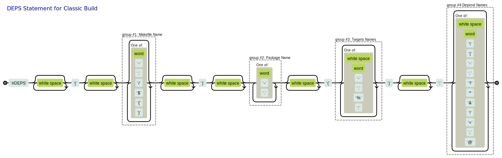
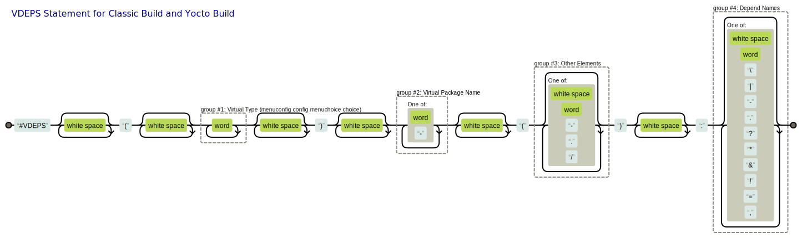

# CBuild-ng Compilation System

[中文版](./README_zh-cn.md)

## Overview

The CBuild-ng compilation system is a more powerful and flexible build system than Buildroot, faster and succincter than Yocto, easier to understand and use than Buildroot and Yocto. It doesn't have a steep learning curve and doesn't re-define a new language, the total core codes are about 4000 lines which are composed of Python / Shell / Makefile scripts.<br>
CBuild-ng supports both `Classic Build` and `Yocto Build`, and it encapsulates a make command layer and a menuconfig configuration layer for Yocto to make it easier to use.<br>
The CBuild compilation system is mainly composed of three parts: task analysis and processing tools, Makefile compilation templates (IMake), and network and cache processing tools.<br>
The biggest difference between CBuild-ng and [CBuild](https://github.com/lengjingzju/cbuild) is that Classic Build introduces the concept of'WORKDIR ', each package prepares dependencies, compile, and install in the specific directory under its own `WORKDIR`, and the dependencies between packages and sysroot are handled by an automatically generated top-level Makefile.
<br>

* Task Analysis Processing Tools: Analyzes all tasks and automatically generates system Kconfig and Makefile
    * All tasks are analyzed and assembled by Python script `gen_build_chain.py`
        * It automatically collects rules and parameters for all tasks, selects which tasks to run and configures task parameters through `make menuconfig`
    * Each task rule is declared by a dependency statement, which supports a large number of dependent rules
        * Supports automatic generation of real package rules for task execution and virtual package rules for managing tasks
        * Supports automatic generation of ordinary structure (config), hierarchy structure (menuconfig), choice structure (choice), etc
        * Supports automatic generation of strong dependence (depends on), weak dependence (if... endif), condition dependence, strong selection (select), weak selection (imply), selection (condA||condB), etc
    * The task file is a Makefile script executed by `make`
    * Supports automatic generation of task dependency picture with some useful properties such as color to see whether the task is selected, etc (`gen_depends_image.sh`)
<br>

* Makefile compilation Templates (IMake): Provides compilation templates of driver, library and application
    * Users only need to fill in a few variables to complete the compiled script of a project
    * Supports the generation of latest cross-compilation toolchain (`process_machine.sh` `toolchain/Makefile`)
    * Supports both Classic Build mode and Yocto Build mode, both native-compilation and cross-compilation in one Makefile (`inc.env.mk`)
    * Supports the generation of multiple libraries, executables or drivers in one Makefile
    * Supports automatic analysis of header files as compilation dependencies, and specifies CFLAGS for source files separately
    * Supports specifying output path (`make O=xxx`), installation path (`make DESTDIR=xxx`), dependency sysroot (`make DEPDIR=xxx`)
    * Provides a template for compiling static libraries, shared libraries, and executables, and supports mixed compilation of C (`*.c`), C++ (`*.cc *.cp *.cxx *.cpp *.CPP *.c++ *.C`) and assembly (`*.S *.s *.asm`) (`inc.app.mk`)
    * Provides a template for compiling drivers, and supports mixed compilation of C (`*.c`) and assembly (`*.S`) (`inc.mod.mk`)
    * Provides a template for installation, which is compliant with [GNUInstallDirs](https://www.gnu.org/prep/standards/html_node/Directory-Variables.html) standard (`inc.ins.mk`)
    * Provides a template for configuring parameters with Kbuild (`inc.conf.mk`)
    * Provides a template for calling original `Makefile, CMake, Autotools, Meson, ...` compilation (`inc.rule.mk`)
<br>

* Network and Cache ... Processing Tools: Handles the download, patching, compilation, and installation of packages, and supports download mirror and cache mirror
    * Provides a convenient and reliable patching mechanism (`exec_patch.sh`)
    * Provides a automatic pull network package tool (`fetch_package.sh`)
        * Supports downloading packages from http (attributes: md5), git (attributes: branch tag rev) and svn (attributes: rev)
        * Supports downloading packages from the mirror server
    * Provides a compilation cache tool, re-compile doesn't need to compile from code, directly fetch the result from the local area or the mirror server  (`process_cache.sh`)
    * Provides a convenient rule template, it supports caching compilation (`inc.rule.mk`)
    * Provides a rich open source software (OSS) layer, and OSS packages are increasing
    * Provides a tool to generate a HTML file which contains descriptive information for all packages (`gen_package_infos.py`)
<br>

* Test cases can be viewed in [examples.md](./examples/examples.md)


## Performance Test

* Test scenario: 300 packages of an SDK 8-thread local file system compilation

    | Build Method            | Time Usage of First Build | Time Usage of Re-Build | Output Filesystem Occupancy |
    | ----------------------- | ------------ | ------------ | ---------------- |
    | CBuild-ng Classic Build | 5m1.790s     | 0m49.785s    | 1.8G             |
    | CBuild Classic Build    | 5m13.526s    | 0m59.156s    | 2.7G             |
    | Yocto Build with cache  | 15m42.554s   | 3m31.520s    | 7.4G+            |

* Test Result: Compared with Yocto Build, CBuild-ng Classic Build compilation time is reduced by 2/3, and output filesystem occupancy is reduced by 3/4


## Open Source Contributions

This project has contributed 2 commits to the Linux Kernel Community so far, which have been merged into the Linux kernel mainline.

* [kconfig: fix failing to generate auto.conf](https://git.kernel.org/pub/scm/linux/kernel/git/masahiroy/linux-kbuild.git/commit/?h=fixes&id=1b9e740a81f91ae338b29ed70455719804957b80)

    ```sh
    commit 1b9e740a81f91ae338b29ed70455719804957b80
    Author: Jing Leng <jleng@ambarella.com>
    Date:   Fri Feb 11 17:27:36 2022 +0800

        kconfig: fix failing to generate auto.conf

        When the KCONFIG_AUTOCONFIG is specified (e.g. export \
        KCONFIG_AUTOCONFIG=output/config/auto.conf), the directory of
        include/config/ will not be created, so kconfig can't create deps
        files in it and auto.conf can't be generated.
    ```

* [kbuild: Fix include path in scripts/Makefile.modpost](https://git.kernel.org/pub/scm/linux/kernel/git/masahiroy/linux-kbuild.git/commit/?h=fixes&id=23a0cb8e3225122496bfa79172005c587c2d64bf)

    ```sh
    commit 23a0cb8e3225122496bfa79172005c587c2d64bf
    Author: Jing Leng <jleng@ambarella.com>
    Date:   Tue May 17 18:51:28 2022 +0800

        kbuild: Fix include path in scripts/Makefile.modpost

        When building an external module, if users don't need to separate the
        compilation output and source code, they run the following command:
        "make -C $(LINUX_SRC_DIR) M=$(PWD)". At this point, "$(KBUILD_EXTMOD)"
        and "$(src)" are the same.

        If they need to separate them, they run "make -C $(KERNEL_SRC_DIR)
        O=$(KERNEL_OUT_DIR) M=$(OUT_DIR) src=$(PWD)". Before running the
        command, they need to copy "Kbuild" or "Makefile" to "$(OUT_DIR)" to
        prevent compilation failure.

        So the kernel should change the included path to avoid the copy operation.
    ```


## Task Analysis Processing gen_build_chain.py

### System Framework

* Classic Build Framework:
    * The compilation scripts of the applications and drivers are composed of `Makefile + DEPS-statement`
    * The build chain is assembled through dependencies defined by DEPS-statement (package-level dependency)
    * DEPS-statement basically only needs to define dependencies, following the assembly rules defined by CBuild
    * The script analyzes the DEPS-statement of all packages and automatically generates the compilation chain of all packages
        * All packages are compiled individually, and users can enter the package folder and enter `make` to compile
    * Supports managed Kconfig or managing Kconfig by itself.
        * The managed Kconfig must be placed in the same directory as the DEPS-statement file
        * There is no need to manually specify the parent-child inclusion relationship, the script automatically analyzes and assembles it
* Yocto Build Framework:
    * The compilation scripts of the applications and drivers are composed of `Makefile + Recipe`
    * The build chain is assembled through dependencies defined by `DEPENDS` / `RDEPENDS` and extended `EXTRADEPS` in the recipe (package-level dependency)
    * The custom's recipes basically only need to define dependencies, following the assembly rules defined by Yocto
    * Extends Yocto: the script analyzes the recipe's name of all packages and the DEPENDS variable in the recipe of custom package to automatically generate the compilation chain of all packages
    * Extends Yocto: Supports weak dependencies, and can modify rootfs (add packages, delete packages, modify configuration, etc.) through `make menuconfig`


### Command Options of Build Chain

* Command Description
    * Parentheses indicate that it is optional, otherwise it is required
    * Classic Build automatically generates Kconfig and Makefile in one step
    * Yocto Build requires two steps to automatically generate Kconfig and Image recipes respectively

    ```sh
    # Classic Build
    gen_build_chain.py -m MAKEFILE_OUT -k KCONFIG_OUT [-t TARGET_OUT] -d DEP_NAME [-v VIR_NAME] [-c CONF_NAME] -s SEARCH_DIRS [-i IGNORE_DIRS] [-g GO_ON_DIRS] [-l MAX_LAYER_DEPTH] [-w KEYWORDS] [-p PREPEND_FLAG] [-u UNIQUE_PACKAGES]

    # Yocto Build Step1
    gen_build_chain.py -k KCONFIG_OUT -t TARGET_OUT [-v VIR_NAME] [-c CONF_NAME] [-i IGNORE_DIRS] [-l MAX_LAYER_DEPTH] [-w KEYWORDS] [-p PREPEND_FLAG] [-u USER_METAS]

    # Yocto Build Step2
    gen_build_chain.py -t TARGET_PATH -c DOT_CONFIG_NAME -o RECIPE_IMAGE_NAME [-p PATCH_PKG_PATH] [-i IGNORE_RECIPES]
    ```

* Command Options of Classic Build
    * `-m <Makefile Path>`: Specifies the auto-generated Makefile pathname
        * Users can use a top-level Makefile to contain the auto-generated Makefile, and set all target call `make $(ENV_BUILD_JOBS) MAKEFLAGS= all_targets`   to multi-threaded compilation of all packages
        * The compilation time of each package can be counted `make time_statistics`
    * `-k <Kconfig Path>`: Specifies the auto-generated Kconfig pathname
    * `-t <Target Path>`: Specifies the auto-generated target pathname which stores package name , dependencies and source path list
    * `-d <Search Depend Name>`: Specifies the dependency filename (containing DEPS-statement) to search, the dependency file can contain multiple DEPS-statement(not recommended)
    * `-c <Search Kconfig Name>`: Specifies the Kconfig filename (containing configuration) to search
        * The order to search (in the same directory as the dependency file):
            * The file with the same filename as the package name and the same suffix as the Kconfig file in the same directory as the dependency file
            * The Kconfig filename in the same directory as the dependency file
    * `-v <Search Virtual Depend Name>`: Specifies the virtual dependency filename (containing VDEPS-statement) to search
    * `-s <Search Directories>`: Specifies the searched directory pathnames (containing VDEPS-statement) to search, and multiple directories are separated by colon
    * `-i <Ignore Directories>`: Specifies the ignored directory names, and multiple directories are separated by colon
    * `-g <Go On Directories>`: Specifies the continued directory pathnames, and multiple directories are separated by colon
        * If the current directory contains the dependency filename, the current directory does not have a `continue` file and `Go On Directories` is not specified or the current directory is not in it, the script will not continue to search sub-directories of the current directory
    * `-l <Max Layer Depth>`: Sets the maximum number of levels of the menuconfig, 0 for tile, 1 for 2-levels, ...
    * `-w <Keyword Directories>`: Sets the ignored level names of the menuconfig, and the multiple names set are separated by colon
        * If the directory name in the path matches the set value, the levels of this path is subtracted by one
    * `-p <Prepend Flag>`: Set the prefix of the configuration item in the auto-generated Kconfig
        * If users run `conf` / `mconf` without prefix (`CONFIG_=""`), this flag needs to be set to 1
    * `-u <Unique Packages>`: Specify the packages which do not have native-compilation when they are dependencies of native package, and the multiple names set are separated by colon
<br>

* Command Options of Yocto Build Step1
    * `-k <Kconfig Path>`: Specifies the auto-generated Kconfig pathname
    * `-t <Target Path>`: Specifies the auto-generated target pathname which stores package name , dependencies and source path list
    * `-c <Search Kconfig Name>`: Specifies the Kconfig filename (containing configuration) to search
        * The order to search:
            * The file with the same filename as the package name and the suffix of `.bbconfig` in the same directory as the recipe file
            * The file with the same filename as the package name and the same suffix as the Kconfig file in the directory specified by the `EXTERNALSRC` in the recipe append file
            * The Kconfig filename in the directory specified by the `EXTERNALSRC` in the recipe append file
    * `-v <Search Virtual Depend Name>`: Specifies the virtual dependency filename (containing VDEPS-statement) to search
    * `-i <Ignore Directories>`: Specifies the ignored directory names, and multiple directories are separated by colon
    * `-l <Max Layer Depth>`: Sets the maximum number of levels of the menuconfig, 0 for tile, 1 for 2-levels, ...
    * `-w <Keyword Directories>`: Sets the ignored level names of the menuconfig, and the multiple names set are separated by colon
        * If the directory name in the path matches the set value, the levels of this path is subtracted by one
    * `-p <Prepend Flag>`: Set the prefix of the configuration item in the auto-generated Kconfig
        * If users run `conf` / `mconf` without prefix (option: `CONFIG_=""`), this flag needs to be set to 1
    * `-u <User Metas>`: Specifies the user layers, and the multiple layers set are separated by colon
        *  Only analyze package dependencies,  packages in the user layers will analyze dependencies, be selected by default, support special dependencies and virtual dependencies
<br>

* Command Options of Yocto Build Step2
    * `-t <Target Path>`: Specifies the auto-generated target pathname which stores package name , dependencies and source path list by step1
    * `-c <Search Kconfig Path>`: Specifies the `.config` pathname generated by `make xxx_config`
    * `-o <Output Recipe Path>`: Specifies the recipe inc pathname which stores packages installed to rootfs
    * `-p <Output patch/unpatch Path>`: Specifies the patch inc pathname which stores patch/unpatch packages
    * `-i <Ignore Recipes>`: Specifies the ignored recipes, and multiple recipes are separated by colon


### Dependency of Classic Build

* Dependency Rule: `#DEPS(Makefile_Name) Target_Name(Other_Target_Names): Depend_Names`

    

* Included Dependency Rule: `#INCDEPS: Subdir_Names`

    

* Rule Description
    * Makefile_Name: The Makefile script to compile (can be empty), if it's not empty, make runs the specified makefile (`make -f Makefile_Name`)
        * The Makefile must contain three targets of `all` `clean` and `install`
        * The Makefile name can include a path (i.e. a slash `/`), which supports directly finding subpackages under subfolders
            * For example: `test1/` `test2/wrapper.mk`
            * Users can also use INCDEPS-statement to continue to find dependency files under sub-folders
                * For example: `#INCDEPS: test1 test2/test22`
                * Sub-dirs supports environment variable substitution, for example, `${ENV_BUILD_SOC}` will be replaced with the value of the environment variable `ENV_BUILD_SOC`
            * Users can also add a `continue` file to the current directory to continue to find dependency files under sub-folders
        * The Makefile name can include environment variables, for examples `${ENV_TOP_DIR}/xxx/Makefile`, there is no need to put the rule file in the source directory at this point
    * Target_Name: The package name ID
        * The keyword of `ignore` is a special ID that indicates no package, which is used to ignore the search of the current directory (`#DEPS() ignore():`)
    * Other_Target_Names: Other targets of the current package, multiple targets are separated by space (can be empty), there are following keywords:
        * Package Type Keywords
            * unified   : The main feature is that the `all` target of the package calls both compilation and installation
                * It is automatically appended when matching `include inc.rule.mk`, no manual setting required
                * `unified` package automatically appends the keywords of `singletask` and `distclean`, and it supports the keyword of `cache`
            * direct    : The main feature is that the `all` target of the package only calls compilation
                * It is the default package type, no manual setting required
                * `direct` package automatically appends the keyword of `isysroot` if the keyword of `noisysroot` is not specified
            * empty     : The main feature is that the package is empty and only defines dependency relationships, without executing commands such as compile, install, and release
                * Need to manually set `empty`
        * Package Target Keywords
            * all install clean: Ignores the necessary targets, adding or not has no effect on the parsing results
            * distclean : Completely cleans the compile output (including configuration)
            * prepare   : Indicates running `make prepare` before `make`
                * It is generally used to load the default configuration to .config when .config does not exist
            * release   : Indicates running `make release` when installing to fakeroot
                * This target doesn't need to install headers and static libraries
                * When the release target is not present, It will run `make install` when installing to fakeroot rootfs
        * Package Attributes Keywords
            * norelease : Indicates that the package has no files installed into fakeroot, e.g. the package only outputs header files and/or static libraries
            * psysroot  : Indicates preparing sysroot in WORKDIR instead of using global sysroot
            * isysroot  : Indicates that the top-level Makefile installs installations to `$(WORKDIR)/image` at the same time when it runs the compilation task
                * At this time, `dis_isysroot` in `gen_build_chain.py` should be set to `False`
            * noisysroot: Indicates that the top-level Makefile doesn't install installations to `$(WORKDIR)/image` at the same time when it runs the compilation task
            * finally   : Indicates that this package compilation is after all other packages, it is generally used to generate rootfs
            * native    : Indicates both cross-compilation package and native-compilation package are defined at the same time
            * cache     : Indicates that package supports cache mechanism
                * It is automatically appended when matching `CACHE_BUIILD=y`, no manual setting required
            * singletask: Indicates compiling with only a single task
            * union     : Indicates multiple packages sharing one Makefile
                * At this point, the targets of `prepare` `all` `install` `clean` `release` ... shound renamed as `<package_name>-xxx`
        * Special Syntax Format
            * `subtarget1:subtarget2:...::dep1:dep2:...`: Explicitly specifies dependencies for child targets
                * Double colons `::` separate the list of child targets and the list of dependencies
                * Single colon `:` separates the child internal targets and the internal dependencies, and the dependencies list can be empty
    * Depend_Names: The dependency package name ID, and multiple dependencies are separated by space (can be empty)
        * Depend_Names supports multiple lines with using `\` at the end of the line

Note: The IDs (Target_Name / Depend_Names) only can consist of lowercase letters, numbers, dashes; Other_Target_Names doesn't have such requirement, wildcard symbol is accepted (`%`)

* Commands of Classic Build
    * `make <package>`: Compiles the given package with dependency packages compiled first
    * `make <package>_single`: Only compiles the given package without dependency packages compiled
    * `make <package>_install_single`: Only install the given package to the global sysroot directory
    * `make <package>_psysroot_single`: Only prepare the dependencies of the given package to the private sysroot directory (the target `psysroot` should be defined in the `Other_Target_Names`)
    * `make <package>_<target>`: Compiles the target of the given package with dependency packages compiled first
    * `make <package>_<target>_single`: Only compiles the target of the given package without dependency packages compiled

Note: The single type commands only exist in the packages with dependencies


### Dependency of Yocto Build

* The dependencies of Yocto Build are defined in the recipe
    * `DEPENDS`: compilation dependencies
        * Note: Yocto uses some host commands and may also need to specify native dependency (`<package>-native`), for example: `bash-native`
    * `RDEPENDS:${PN}`: running dependencies
        * The dependency packages which install shared libraries should be set to RDEPENDS, otherwise the compilation will fail or the dependency packages will not added to rootfs
    * `EXTRADEPS`: extra dependencies externed by CBuild-ng
        * If EXTRADEPS contains weak dependencies, the recipe should class `inherit weakdep`
            * `weakdep.bbclass` will analyze `.config` in the ENV_CFG_ROOT, set `DEPENDS` and `RDEPENDS:${PN}` according to whether this item is selected or not
    * `PACKAGECONFIG`: Dynamically sets dependency packages which install pkg-config (`xxx/usr/lib/pkgconfig/xxx.pc`)


### Virtual Dependency of Classic Build / Yocto Build

* Virtual Dependency Rule: `#VDEPS(Virtual_Type) Target_Name(Other_Infos): Depend_Names`

    

* Virtual_Type : Required, the type of thevirtual package, there are 4 types so far
    * `menuconfig`  : Indicates that a virtual `menuconfig` package is generated, all packages in the current directory (including sub-directories) strongly depend on this package
    * `config`      : Indicates that a virtual `config` package is generated
    * `menuchoice`  : Indicates that a virtual `choice` package is generated, all packages in the current directory (including subdirectories) will become sub-options under this package
    * `choice`      : Indicates that a virtual `choice` package is generated, all packages packages listed in the Other_Infos will become sub-options under this package
* Virtual_Name      : Required, the name ID of the virtual package
* Other_Infos       : Optional
    * For all types, an optional pathname which begins with `/` indicates that it acts on the specified sub-directory instead of the current directory
        * The pathname entry can be a virtual path, for example: `/virtual` (virtual can be any word), in this case, the virtual item appears in the current directory  instead of the upper directory
    * For the `choice` type, a space-separated list of packages becomes a sub-options under the choice, and the first package is selected by default
    * For the `menuchoice` type, the specified package is selected by default
* Depend_Names      : Optional, the list of dependencies with the same as the Depend_Names in the DEPS-statement
    * Depend_Names supports multiple lines with using `\` at the end of the line
    * For example, users can set `unselect` for `menuconfig` and `config` types

Note: The virtual packages will not participate in compilation, but is used to organize and manage the actual packages, Classic Build and Yocto Build has the same virtual dependency rules


### Special Dependency

* Virtual Package
    * `*depname`    : Indicates that this dependent package is a virtual package
        * After removing `*`, the remaining depname can also have special characters and will continue to be resolved, for example: `*&&depname`
<br>

* Keyword
    * `unselect`    : Indicates that this package is not compiled by default (`default n`), otherwise it is compiled by default (`default y`)
    * `nokconfig`   : Indicates that this package doesn't contain Kconfig
        * When there are multiple packages in the same directory, and only one package has Kconfig, then this package doesn't need to set `nokconfig`, and other packages should set it
    * `kconfig`     : Indicates that multiple packages share the same Kconfig, generally, the cross/native compilation package of the same software share the same Kconfig
<br>

* Special Character
    * `!depname`                    : Indicates that this package and the depname package are conflict, they cann't be enabled at the same time (`depends on !depname`)
    * `&depname` or `&&depname`     : Indicates that this package weakly / strongly selects the depname package (`imply depname` / `select depname`)
        * `&` indicate that when this package is selected, depname is also automatically selected, and depname can be manually unselected
        * `&&` indicate that when this package is selected, depname is also automatically selected, and depname cann't be manually unselected
    * `?depname` or `??depname`     : Indicates that this package weakly depends on the depname package (`if .. endif`)
        * `?` indicates that the depname package doesn't install shared libraries (compile-time dependencies)
        * `??` indicates that the depname package installs shared libraries or ... (compile-time and run-time dependencies)
        * Weak dependency means that even if the depname package isn’t selected or doesn't exist, current package also can be selected and compiled
    * `depa|depb` or `depa||depb`   : Indicates that this package weakly depends on the depa package or depb packageor ... (`depA||depB`)
        * Weak dependency means that there should be at least one depx package to be enabled, current package can be selected and compiled
        * Omitting the preceding word of `|` is implicitly deduced using either a prebuild package or a source package
            * For example: `||libtest` is implicitly deduced as `prebuild-libtest||libtest`
        * The difference between `|` and `||` refers to `?`

    *  `& ?`                        : `&` can be used in combination with `?` , it doesn't require a combination order, and indicates selection and weak dependency
        * For example: `&&??depname` or `??&&depname` indicates weak dependency and strong selection, `??&depname` or `&??depname` indicates weak dependency and weak selection
    *  `& |`                        : `&` can be used in combination with `|` , it indicates or-selection and weak dependency
        * It is suitable for selecting one of the prebuild package or the source package with weak dependency
        * Omitting the preceding word of last `|` is implicitly deduced using either a prebuild package or a source package
        * For example: `&&||libtest` is implicitly deduced as `&&*build-libtest||prebuild-libtest||libtest`
            * It means that the first virtual packages is strongly selected, and the next two actual packages are weakly dependencies
    * `depname@condition` or `depname@@condition` : If condition is set to y and depname is selected, this package will depend on the depname package (Classic Build)
    * Additional Notes              :
        * For Classic Build, there is no difference between `?` and `??`, there is no difference between `|` and `||`, there is no difference between `@` and `@@`
        * For Yocto Build, `?` `|` `@` only set `DEPENDS`, `??` `||` `@@` set both `DEPENDS` and `RDEPENDS:${PN}`
<br>

* Environment Variable
    * ENVNAME=val1,val2             : Indicates that this package depends on the environment variable ENVNAME whose value is equal to val1 or equal to val2
    * ENVNAME!=val1,val2            : Indicates that this package depends on the environment variable ENVNAME whose value is not equal to val1 and not equal to val2

Note: Special dependencies are set to the `Depend_Names` of DEPS-statement in Classic Build, the variable `EXTRADEPS` in the recipe in Yocto Build


### Dependency Diagram gen_depends_image.sh

* Usage
    * Script Parameters: `gen_depends_image.sh <package> <store_path> <package_list_file> <config_file>`
        * package                   : Package name
        * store_path                : The folder path where the generated pictures are stored
        * package_list_file         : Package list file generated by gen_build_chain.py (`-t` option by gen_build_chain.py)
        * config_file               : The path of `.config`
    * Command: `make <package>-deps`
<br>

* Generated Picture Description
    * Classic Build
        * Solid Line                : Strong dependency
        * Dashed Line               : Weak dependency
        * Double Line               : Prebuild and srcbuild either, or patch and unpatch either
        * Green Line                : The package is selected in .config
        * Red Line                  : The package is not selected in .config
        * The top-level package box color
            * Green Box             : The package is selected in .config
            * Red Box               : The package is not selected in .config
    * Yocto Build
        * Green Box                 : User package, which is selected in .config
        * Red Box                   : User package, which is not selected in .config
        * Basket Box                : Community package (layers not specified in the `-u` option of gen_build_chain.py)


## Environment Configuration

* There are `3x2=6` ways to export the environment
     * The first parameter is the flag
         * No flag means cross-compilation, and exports environment variables related to Linux cross-compilation
         * The `app` flag indicates cross-compilation and does not export Linux cross-compilation related environment variables for application development.
         * The `host` flag indicates native-compilation, does not export Linux cross-compilation related environment variables, and does not export the cross-compiler
     * board means development board
         * When the export environment does not fill in the board, the serial number will pop up to let the users select the development board.
         * The development board must have corresponding configuration items in the `scripts/bin/process_machine.sh` script
         * The development board must have a corresponding configuration folder under the `board` folder
         * `generic` is special. There is no configuration item in the `process_machine.sh` script. But there is a configuration folder under `board`, which is only used for native-compilation.

    ```sh
    lengjing@lengjing:~/data/cbuild-ng$ source scripts/build.env
    lengjing@lengjing:~/data/cbuild-ng$ source scripts/build.env <board>
    lengjing@lengjing:~/data/cbuild-ng$ source scripts/build.env app
    lengjing@lengjing:~/data/cbuild-ng$ source scripts/build.env app <board>
    lengjing@lengjing:~/data/cbuild-ng$ source scripts/build.env host
    lengjing@lengjing:~/data/cbuild-ng$ source scripts/build.env host <board>
    ```


### Initialize Compilation Environment

* Initialize the compilation environment

    ```sh
    lengjing@lengjing:~/data/cbuild-ng$ source scripts/build.env host generic
    ============================================================
    ENV_BUILD_MODE   : classic
    ENV_BUILD_JOBS   : -j8
    ENV_TOP_DIR      : /home/lengjing/data/cbuild-ng
    ENV_MAKE_DIR     : /home/lengjing/data/cbuild-ng/scripts/core
    ENV_TOOL_DIR     : /home/lengjing/data/cbuild-ng/scripts/bin
    ENV_DOWN_DIR     : /home/lengjing/data/cbuild-ng/output/mirror-cache/downloads
    ENV_CACHE_DIR    : /home/lengjing/data/cbuild-ng/output/mirror-cache/build-cache
    ENV_MIRROR_URL   : http://127.0.0.1:8888
    ENV_TOP_OUT      : /home/lengjing/data/cbuild-ng/output
    ENV_CROSS_ROOT   : /home/lengjing/data/cbuild-ng/output/x86_64-host
    ENV_CFG_ROOT     : /home/lengjing/data/cbuild-ng/output/x86_64-host/config
    ENV_NATIVE_ROOT  : /home/lengjing/data/cbuild-ng/output/x86_64-native
    ============================================================
    ```

* Initialize the cross-compilation environment with SOC

    ```sh
    lengjing@lengjing:~/data/cbuild-ng$ source scripts/build.env cortex-a53
    ============================================================
    ENV_BUILD_MODE   : classic
    ENV_BUILD_JOBS   : -j8
    ENV_BUILD_SOC    : cortex-a53
    ENV_BUILD_TOOL   : /home/lengjing/data/cbuild-ng/output/toolchain/cortex-a53-toolchain-gcc12.2.0-linux5.15/bin/aarch64-linux-gnu-
    ENV_TOP_DIR      : /home/lengjing/data/cbuild-ng
    ENV_MAKE_DIR     : /home/lengjing/data/cbuild-ng/scripts/core
    ENV_TOOL_DIR     : /home/lengjing/data/cbuild-ng/scripts/bin
    ENV_DOWN_DIR     : /home/lengjing/data/cbuild-ng/output/mirror-cache/downloads
    ENV_CACHE_DIR    : /home/lengjing/data/cbuild-ng/output/mirror-cache/build-cache
    ENV_MIRROR_URL   : http://127.0.0.1:8888
    ENV_TOP_OUT      : /home/lengjing/data/cbuild-ng/output
    ENV_CROSS_ROOT   : /home/lengjing/data/cbuild-ng/output/cortex-a53
    ENV_CFG_ROOT     : /home/lengjing/data/cbuild-ng/output/cortex-a53/config
    ENV_NATIVE_ROOT  : /home/lengjing/data/cbuild-ng/output/x86_64-native
    KERNEL_ARCH      : arm64
    KERNEL_VER       : 5.15.88
    KERNEL_SRC       : /home/lengjing/data/cbuild-ng/output/kernel/linux-5.15.88
    KERNEL_OUT       : /home/lengjing/data/cbuild-ng/output/cortex-a53/objects/linux-5.15.88/build
    ============================================================
    ```

* Build cross-compilation toolchain

    ```sh
    lengjing@lengjing:~/data/cbuild-ng$ source scripts/build.env cortex-a53
    lengjing@lengjing:~/data/cbuild-ng$ make -C scripts/toolchain
    ```

Note: Users need to fill in the SOC-related parameters in the `process_machine.sh`. At present, only `cortex-a53` and `cortex-a9` ... are exemplified in this file.


### Environment Variables Description

* ENV_BUILD_MODE    : Specifies the build mode: `classic`, Classic Build, separate source code and compilation output; `yocto`, Yocto Build
* ENV_BUILD_JOBS    : Specifies the number of compilation threads
* ENV_BUILD_SOC     : Specifies the cross-compilation SOC, build system obtains a series of parameters related to the SOC through the `process_machine.sh` script
* ENV_BUILD_TOOL    : Specifies the cross-compiler prefix
<br>

* KERNEL_ARCH       : Specifies the ARCH for cross-compilation of linux modules
* KERNEL_VER        : Linux kernel version
* KERNEL_SRC        : Linux kernel source code path
* KERNEL_OUT        : Linux kernel compilation output path
<br>

* ENV_TOP_DIR       : The root directory
* ENV_MAKE_DIR      : The compilation templates directory
* ENV_TOOL_DIR      : The script tools directory
* ENV_DOWN_DIR      : The path where the download package is saved
* ENV_CACHE_DIR     : The path where the compilation cache is saved
* ENV_MIRROR_URL    : The mirror URL for source code and build cache
    * Users can use the command `python -m http.server <port>` to quickly create an HTTP server
<br>

* ENV_TOP_OUT       : The root output directory
* ENV_CFG_ROOT      : The auto-generated files directory, such as global Kconfig and Makefile, various statistical files, etc are saved in it
* ENV_CROSS_ROOT    : The root output directory for cross-compilation packages
* ENV_NATIVE_ROOT   : The root output directory for native-compilation packages

Note: bitbake cann't directly use the environment variables of the current shell in Yocto Build, so the custom environment variables should be exported from the recipe

* MFLAG             : Silent make mode, its default value is `-s` when doing `make all`, empty when making a single package
    * When it is set to empty, more compilation messages will be displayed
* TOLOG             : Compilation output redirection, its default value is `1>/dev/null` when MFLAG is `-s`
    * When it is set to empty, more messages will be displayed


## Compilation Template

* I also call the compilation templates as IMake compilation, it has two meanings:
    * Include Makefile: Compile with including templates
    * I have the make: Anyone with a certain foundation can fully master and modify this compilation tool
* If users want to put the template in the source directory, it is recommended to put `inc.makes` and set the variable of `INC_MAKES`
* The default behavior of `inc.makes` only includes inc.env.mk and inc.ins.mk
* `INC_MAKES` can be set to a combination of `disenv` `conf` `app` `mod` `disins`:
    * disenv: Excluding inc.env.mk
    * conf  : Including inc.conf.mk
    * app   : Including inc.app.mk
    * mod   : Including inc.mod.mk
    * disins: Excluding inc.ins.mk


### Environment Template inc.env.mk

* `inc.env.mk` is shared by application compilation and driver compilation
* In Classic Build, it is used to set the compilation output directory, set and export the cross-compilation environment or the local compilation environment
* In Yocto Build, the compilation output directory and cross-compilation environment are set and exported by recipes


#### Functions of Environment Template

* `$(call link_hdrs)`   : Automatically sets CFLAGS that looks for header files based on variable `SEARCH_HDRS`
* `$(call link_libs)`   : Automatically sets CFLAGS that looks for libraries
* `$(call install_lics)`: Installs license files to `/usr/local/license/$(PACKAGE_NAME)`


#### Variables of Environment Template

* PACKAGE_NAME      : Package name (consistent with `Target_Name` in the DEPS-statement, without `-native`)
* PACKAGE_ID        : Read-only, the actual package name, its value is equal to `PACKAGE_NAME` of cross-compilation package or `$(PACKAGE_NAME)-native` of native-compilation package
* INSTALL_HDR       : Headers installation sub-folder, its default value is equal to `PACKAGE_NAME`
* PACKAGE_DEPS      : The package's dependency list, which may be removed in the future
* SEARCH_HDRS       : Sub-folders to search headers, its default value is equal to `PACKAGE_DEPS`
<br>

* ENV_OPTIMIZER     : CC optimization option, it has three options:
    * release       : the default value od OPTIMIZER_FLAG is `-O2`
    * speed         : the default value od OPTIMIZER_FLAG is `-O3`
    * debug         : the default value od OPTIMIZER_FLAG is `-O0 -g -ggdb`
* OPTIMIZER_FLAG    : CC optimization value
<br>

* WORKDIR           : Top-level work directory
    * Its default value is equal to `$(ENV_CROSS_ROOT)/objects/$(PACKAGE_NAME)` in the cross-compilation or `$(ENV_NATIVE_ROOT)/objects/$(PACKAGE_NAME)` in the native-compilation
    * The default values of OBJ_PREFIX / INS_PREFIX / DEP_PREFIX / PATH_PREFIX are defined under WORKDIR
* OBJ_PREFIX        : Top-level compilation output directory
* OBJ_SUBDIR        : Compilation output subdirectory, it is generally used for Makefiles with multiple independent submodules
    * Its default value can be changed by `make O=xxx`
* INS_PREFIX        : Top-level installation directory
    * Its default value can be changed by `make DESTDIR=xxx`
    * Its default value will be changed When installing to global sysroot, preparing dependencies, and installing to rootfs by top-level Makefile in Classic Build
* INS_TOPDIR        : Classic Build installs to INS_TOPDIR for the first time, and installs again from INS_TOPDIR to the changed INS_PREFIX
* INS_SUBDIR        : The installation subdirectory when Classic Build compiles with `CMake` `Autotools` and `Meson`, the default value is `/usr`, then the real installation directory is `$(INS_TOPDIR)$(INS_SUBDIR)`
* DEP_PREFIX        : Top-level dependency lookup directory
    * Its default value can be changed by `make DEPDIR=xxx`
* PATH_PREFIX       : Top-level tool lookup directory
* SYS_PREFIX        : Global top-level compilation output and installation directory, only for Classic Build
<br>

* NATIVE_DEPEND     : Sets it to y when cross-compilation package depends on native-compilation packages
    * The value is set by top-level Makefile generated by `gen_build_chain.by` or Recipe(`cbuild.bbclass`)
* NATIVE_BUILD      : When set to y, indicates native-compilation
    * The value is set by top-level Makefile generated by `gen_build_chain.by` or Recipe
* GLOBAL_SYSROOT    : When set to y, indicates using dependency sysroot in global sysroot `SYS_PREFIX` instead of the directory under WORKDIR
* PREPARE_SYSROOT   : Prepares dependency sysroot in the `WORKDIR` directory, only for Classic Build (command is `$(MAKE) $(PREPARE_SYSROOT)`)
* DIS_PC_EXPORT     : Whether to disable exporting the environment of the [pkg-config](https://manpages.debian.org/testing/pkg-config/pkg-config.1.en.html)
* CC_TOOL           : If it is set to clang, it uses clang/llvm to compile (preliminary support), otherwise it uses gcc by default


### Installation Template inc.ins.mk

* `inc.ins.mk` is shared by application compilation and driver compilation
* The Installation directories are basically consistent with the [GNUInstallDirs](https://www.gnu.org/prep/standards/html_node/Directory-Variables.html) standard
    * `base_*dir` and `hdrdir` don't belong to the GNUInstallDirs standard
    * The root installation directory is `$(INS_PREFIX)`


#### Functions and Targets of Installation Template

* `$(eval $(call install_obj,<ID>))`: Generates Makefile rules for installation to the specified directory
    * ID: The directory name with `dir` removed
    * Makefile Target: `install_<lowercase id>s`
    * Variable name to specify files / folders to install: `INSTALL_<uppercase ID>S`

* Defined Makefile Rules
    * Directory names are defined in `inc.env.mk`

    | Directory Name   | Directory Value               | Files and Folders to Install | Makefile Target        |
    | ---------------- | ----------------------------- | ---------------------------- | ---------------------- |
    | `base_bindir`    | `/bin`                        | `$(INSTALL_BASE_BINS)`       | `install_base_bins`    |
    | `base_sbindir`   | `/sbin`                       | `$(INSTALL_BASE_SBINS)`      | `install_base_sbins`   |
    | `base_libdir`    | `/lib`                        | `$(INSTALL_BASE_LIBS)`       | `install_base_libs`    |
    | `bindir`         | `/usr/bin`                    | `$(INSTALL_BINS)`            | `install_bins`         |
    | `sbindir`        | `/usr/sbin`                   | `$(INSTALL_SBINS)`           | `install_sbins`        |
    | `libdir`         | `/usr/lib`                    | `$(INSTALL_LIBS)`            | `install_libs`         |
    | `libexecdir`     | `/usr/libexec`                | `$(INSTALL_LIBEXECS)`        | `install_libexecs`     |
    | `hdrdir`         | `/usr/include/$(INSTALL_HDR)` | `$(INSTALL_HDRS)`            | `install_hdrs`         |
    | `includedir`     | `/usr/include`                | `$(INSTALL_INCLUDES)`        | `install_includes`     |
    | `datadir`        | `/usr/share`                  | `$(INSTALL_DATAS)`           | `install_datas`        |
    | `infodir`        | `$(datadir)/info`             | `$(INSTALL_INFOS)`           | `install_infos`        |
    | `localedir`      | `$(datadir)/locale`           | `$(INSTALL_LOCALES)`         | `install_locales`      |
    | `mandir`         | `$(datadir)/man`              | `$(INSTALL_MANS)`            | `install_mans`         |
    | `docdir`         | `$(datadir)/doc`              | `$(INSTALL_DOCS)`            | `install_docs`         |
    | `sysconfdir`     | `/etc`                        | `$(INSTALL_SYSCONFS)`        | `install_sysconfs`     |
    | `servicedir`     | `/srv`                        | `$(INSTALL_SERVICES)`        | `install_services`     |
    | `sharedstatedir` | `/com`                        | `$(INSTALL_SHAREDSTATES)`    | `install_sharedstates` |
    | `localstatedir`  | `/var`                        | `$(INSTALL_LOCALSTATES)`     | `install_localstates`  |
    | `runstatedir`    | `/run`                        | `$(INSTALL_RUNSTATES)`       | `install_runstates`    |

* Default Directories
    * When compiling applications, the compilation-generated executables are added to the variable `BIN_TARGETS`, the default value of `INSTALL_BINARIES` has been assigned to `$(BIN_TARGETS)`
    * When compiling applications, the compilation-generated libraries are added to the variable `LIB_TARGETS`, the default value of `INSTALL_LIBRARIES` has been assigned to `$(LIB_TARGETS)`

    ``` makefile
    INSTALL_BASE_BINARIES  ?= $(INSTALL_BINARIES)
    INSTALL_BASE_BINS      ?= $(INSTALL_BASE_BINARIES)
    INSTALL_BINS           ?= $(INSTALL_BINARIES)
    INSTALL_BASE_LIBRARIES ?= $(INSTALL_LIBRARIES)
    INSTALL_BASE_LIBS      ?= $(INSTALL_BASE_LIBRARIES)
    INSTALL_LIBS           ?= $(INSTALL_LIBRARIES)
    INSTALL_HDRS           ?= $(INSTALL_HEADERS)
    ```

* `$(eval $(call install_ext,<ID>))`: Generates Makefile pattern rules for installation to the specified sub-directory in the specified directory
    * ID: The directory name with `dir` removed
    * Makefile Pattern Target: `install_<lowercase id>s_%`, `%` matches lowercase letters etc
    * Variable Name for Installation: `INSTALL_<uppercase ID>S_<xxx>`, xxx is same as the pattern in the Target
        * The preceded items are the files / folders to install, and the last item (must begins with a slash `/`) is the installation destination

* Defined Makefile Pattern Rules
    * Note: The Makefile pattern rules of `install_todir_xxx` and `install_tofile_xxx` are not defined by `install_ext`
        * `install_todir_xxx`: Installs the specified files and folders to the specified sub-directory in the root installation directory
        * `install_tofile_xxx`: Installs the specified file to the specified file in the root installation directory

    | Directory Name   | Installation Directory            | Variable Name for Installation | Makefile Pattern Target |
    | ---------------- | --------------------------------- | ------------------------------ | ----------------------- |
    | `includedir`     | `/usr/include<specified sub-dir>` | `$(INSTALL_INCLUDES_<xxx>)`    | `install_includes_%`    |
    | `datadir`        | `/usr/share<specified sub-dir>`   | `$(INSTALL_DATAS_<xxx>)`       | `install_datas_%`       |
    | `sysconfdir`     | `/etc<specified sub-dir>`         | `$(INSTALL_SYSCONFS_<xxx>)`    | `install_sysconfs_%`    |
    | ` `              | `<specified sub-dir>`             | `$(INSTALL_TODIR_<xxx>)`       | `install_todir_%`       |
    | ` `              | `<specified file>`                | `$(INSTALL_TOFILE_<xxx>)`      | `install_tofile_%`      |

* Examples of Pattern Rules
    * Create 2 blank files testa and testb, and the content of Makefile is as follows:

        ```makefile
        INSTALL_DATAS_test = testa testb /testa/testb
        INSTALL_TODIR_test = testa testb /usr/local/bin
        INSTALL_TOFILE_testa = testa /etc/a.conf
        INSTALL_TOFILE_testb = testa /etc/b.conf

        all: install_datas_test install_todir_test install_tofile_testa install_tofile_testb
        include $(ENV_MAKE_DIR)/inc.ins.mk
        ```

    *  The installation file tree after `make`:

        ```
        image
        ├── etc
        │   ├── a.conf
        │   └── b.conf
        └── usr
            ├── local
            │   └── bin
            │       ├── testa
            │       └── testb
            └── share
                └── testa
                    └── testb
                        ├── testa
                        └── testb
        ```


### Application Template inc.app.mk

* `inc.app.mk` is used to compile shared libraries, static libraries, and executables

#### Targets of Application Template

* LIBA_NAME: library name when compiling a single static library
    * The compilation-generated library will be added to the variable `LIB_TARGETS`
* LIBSO_NAME: library name when compiling a single shared library
    * `LIBSO_NAME` can be set to the format of  `<library name> <major version> <minor version> <patch version>, for example:
        * `LIBSO_NAME = libtest.so 1 2 3` : the compilation-generated library is `libtest.so.1.2.3`, and the symbolic links are `libtest.so` and `libtest.so.1`
        * `LIBSO_NAME = libtest.so 1 2`   : the compilation-generated library is `libtest.so.1.2`  , and the symbolic links are `libtest.so` and `libtest.so.1`
        * `LIBSO_NAME = libtest.so 1`     : the compilation-generated library is `libtest.so.1`    , and the symbolic link is `libtest.so`
        * `LIBSO_NAME = libtest.so`       : the compilation-generated library is `libtest.so`      , and there is no symbolic link
    * If the `LIBSO_NAME` contains the version numbers, the default soname is `<library name>.<major version>`
        * The soname can be overridden by LDFLAGS, for example: `LDFLAGS += -Wl,-soname=libxxxx.so`
    * The compilation-generated library will be added to the variable `LIB_TARGETS`
* BIN_NAME: executable name when compiling a single executable
    * The compilation-generated executable will be added to the variable `BIN_TARGETS`


#### Functions of Application Template

* add-liba-build: Creates a rule for compiling static library
    * `$(eval $(call add-liba-build,<static library name>,<source files>))`
    * `$(eval $(call add-liba-build,<static library name>,<source files>,<appended static library paths>))`
        * It will append the content of dependent static libraries to the generated static library
    * `$(eval $(call add-liba-build,<static library name>,<source files>,<appended static library paths>,<private CFLAGS>))`
    * `$(eval $(call add-liba-build,<static library name>,<source files>,<appended static library paths>,<private CFLAGS>,<extra dependencies>))`
* add-libso-build: Creates a rule for compiling shared library
    * `$(eval $(call add-libso-build,<shared library name>,<source files>))`
        * `<shared library name>` can be set to the format of `<library name> <major version> <minor version> <patch version>, refer to `LIBSO_NAME`
    * `$(eval $(call add-libso-build,<shared library name>,<source files>,<link parameters>))`
        * Note that the commas in the function should be overridden with the comma variable, for example: `$(eval $(call add-libso-build,<shared library name>,<source files>,-Wl$(comma)-soname=libxxxx.so))`
    * `$(eval $(call add-libso-build,<shared library name>,<source files>,<link parameters>,<private CFLAGS>))`
    * `$(eval $(call add-libso-build,<shared library name>,<source files>,<link parameters>,<private CFLAGS>,<extra dependencies>))`
* add-bin-build: Creates a rule for compiling executable
    * `$(eval $(call add-bin-build,<executable name>,<source files>))`
    * `$(eval $(call add-bin-build,<executable name>,<source files>,<link parameters>))`
    * `$(eval $(call add-bin-build,<executable name>,<source files>,<link parameters>,<private CFLAGS>))`
    * `$(eval $(call add-bin-build,<executable name>,<source files>,<link parameters>,<private CFLAGS>,<extra dependencies>))`
* set_flags: Sets the compilation flags for the specified source codes
    * `$(call set_flags,<Flag Type>,<source files>,<value>)`
        * `Flag Type` can be `CFLAGS` and `AFLAGS`
        * For example: `$(call set_flags,CFLAGS,main.c src/read.c src/write.c,-D_FILE_OFFSET_BITS=64 -D_LARGEFILE_SOURCE -D_LARGEFILE64_SOURCE)`
* set_links: Sets linked libraries with adding `-l`. It is used to force link the static library when a library provides both static and shared libraries
    * `$(call set_links,<static libraries>)`
    * `$(call set_links,<static libraries>,<shared libraries>)`

Note: The reason for providing the above functions is that multiple libraries or executables can be compiled in a single Makefile


#### Variables of Application Template

* SRC_PATH: The directory where the source codes are located in the package, its default value is `.`
    * Users can also specify multiple (non-cross) source code directories in the package, for example: `SRC_PATH = src1 src2 src3`
    * $(SRC_PATH) and $(SRC_PATH)/include are also header folders to search
* IGNORE_PATH: The ignored directory names when searching, its default value is `.git scripts output`
* REG_SUFFIX: The source code suffixes to search, its default value is `c cpp S`
    * The value can be choosen from `c`, `$(CXX_SUFFIX)` and `$(ASM_SUFFIX)`
        * CXX_SUFFIX: File suffixes C++ of type, its default value is `cc cp cxx cpp CPP c++ C`
        * ASM_SUFFIX: File suffixes of assembly type, its default value is `S s asm`
    * Users can add support for other suffixes, for example:
        * Add support for cxx (cxx has been added to CXX_SUFFIX)
            ```makefile
            REG_SUFFIX = c cpp S cxx
            include $(ENV_MAKE_DIR)/inc.app.mk
            ```
        * Add support for CXX (CXX has not been added to CXX_SUFFIX)
            ```makefile
            REG_SUFFIX = c cpp S CXX
            CXX_SUFFIX = cc cp cxx cpp CPP c++ C CXX
            include $(ENV_MAKE_DIR)/inc.app.mk
            $(eval $(call compile_obj,CXX,$$(CXX)))
            ```
* USING_CXX_BUILD_C: When set to y, indicates compiling `*.c` files with CXX compiler
* SRCS: All source code files, its default value is all files with suffix of `REG_SUFFIX` in the `SRC_PATH`
    * If users specifies `SRCS`, they can also set `SRC_PATH`, and `IGNORE_PATH` is ignored
<br>

* CPFLAGS: Sets the global compilation flags for C and C++
* CFLAGS: Sets the global compilation flags for C (standard)
* CXXFLAGS: Sets the global compilation flags for C++ (standard)
* AFLAGS: Sets the global assembly flags (standard)
* LDFLAGS: Sets the global link flags (standard)
* IMAKE_CPFLAGS: Passes the global compilation flags for C and C++ from make or environment
* IMAKE_LDFLAGS: Passes the global link flags from make or environment


### Configuration Template inc.conf.mk

* `inc.conf.mk` provides a configuration method with Konfig

#### Targets of Configuration Template

* loadconfig: Loads the default configuration specified by `DEF_CONFIG` if `.config` does not exist
* defconfig: Restores the default configuration specified by `DEF_CONFIG`
* menuconfig: Opens graphical configuration
* cleanconfig: Cleans the configuration and the kconfig output
* xxx_config: Loads the special configuration `xxx_config` in `CONFIG_SAVE_PATH` as the current configuration
* xxx_saveconfig: Saves the current configuration to `xxx_config` in `CONFIG_SAVE_PATH`
* xxx_defonfig: Loads the special configuration `xxx_defconfig` in `CONFIG_SAVE_PATH` as the current configuration
* xxx_savedefconfig: Saves the current configuration to `xxx_defconfig` in `CONFIG_SAVE_PATH`


#### Variables of Configuration Template

* CONF_WORKDIR: Configures output path, keep it as default
* CONF_SRC: The source directory of the kconfig project, its default value is `$(ENV_TOP_DIR)/scripts/kconfig`
* CONF_PATH: The installation directory of the kconfig tools
* CONF_PREFIX: Sets the variables that `conf`/`mconf` runs, mainly the following two settings:
    * `srctree=<path_name>` : The relative directory of the `source` command in the Kconfig files, if `srctree` is not specified, the default relative directory is the directory where `conf`/`mconf` runs
    * `CONFIG_="<prefix>"`  : The prefix of configuration items in the auto-generated `.config` and `config.h`, if `CONFIG_` is not specified, the default prefix is `CONFIG_`; if is set as `CONFIG_=""`, there is no prefix in the item name.
* CONF_HEADER: Sets the include macro `#ifndef xxx ... #define xxx ... #endif` used in the auto-generated `config.h`, its default value is `__<upper of $(PACKAGE_NAME)>_CONFIG_H__`
    * The `config.h` does not contains include macro by default, it is added by `sed` command
* KCONFIG: The configuration parameter file, its default is `Kconfig`
* CONF_SAVE_PATH: The directory where the configuration file is obtained and saved, its default is `config` directory in the package folder
* CONF_APPEND_CMD:  Appends the commands to run when the configuration is changed


#### scripts/kconfig Project

* The source code comes entirely from the `scripts/kconfig` of linux-5.18
* CBuild adds additional support  `CONFIG_PATH` `AUTOCONFIG_PATH` `AUTOHEADER_PATH` which are originally passed in as environment variables


### Driver Template inc.mod.mk

* `inc.mod.mk` is used to compile drivers (external linux modules)

#### Makefile Part of Driver Template (when KERNELRELEASE is empty)

* Targets of Makefile Part
    * modules: Compiles the driver
    * modules_clean: Cleans the compilation output
    * modules_install: Installs the kernel modules (`*.ko`)
        * The installation destination directory is `$(INS_PREFIX)/lib/modules/<kernel_release>/extra/`
    * symvers_install: Installs `Module.symvers` symbol file, this target is set as a dependency of `install_hdrs`
<br>

* Variables of Makefile Part
    * MOD_PATH: The source path of Kbuild, its default value is current directory
    * MOD_MAKES: Users can specify some information to compile the module
    * KERNEL_SRC: Linux kernel source code path (required)
    * KERNEL_OUT: Linux kernel compilation output path (required when compiling linux kernel with `make -O $(KERNEL_OUT)`)


#### Kbuild Part of Driver Template (when KERNELRELEASE has value)

* Targets of Kbuild Part
    * MOD_NAME: Module names, which can be multiple module names separated by space
<br>

* Variables of Kbuild Part
    * IGNORE_PATH: The ignored directory names when searching, its default value is `.git scripts output`
    * SRCS: All source code files, its default value is all files with suffix of `REG_SUFFIX` (`*.c` `*.S`) in the `$(src)`
    * `ccflags-y` `asflags-y` `ldflags-y`: The parameters for kernel module compilation, assembly and linking
    * IMAKE_CCFLAGS: Passes the kernel module compilation flags from make or environment
<br>

* Functions of Kbuild Part
    * `$(call translate_obj,<source files>)`: Converts the source code fileset name to the format required by KBUILD, regardless of whether the source code starts with *.o$(src)/
    * `$(call set_flags,<Flag Type>,<source files>,<value>)`: Sets the compilation flags for the specified source codes, `Flag Type` can be `CFLAGS` and `AFLAGS`
<br>

* Other Notes
    * If `MOD_NAME` contains multiple module names, users need to fill in the objects for each module, for example:

        ```makefile
        MOD_NAME = mod1 mod2
        mod1-y = a1.o b1.o c1.o
        mod2-y = a2.o b2.o c2.o
        ```

    * When using source code and compilation output separation, `inc.mod.mk` needs to copy Kbuild or Makefile to the `OBJ_PREFIX` directory first
        * If the following patch in `scripts/Makefile.modpost` of linux kernel is applied,  copy operation can be skipped ()
            * This patch has been merged with the linux-5.19  and the latest version of the LTS linux
        ```makefile
        -include $(if $(wildcard $(KBUILD_EXTMOD)/Kbuild), \
        -             $(KBUILD_EXTMOD)/Kbuild, $(KBUILD_EXTMOD)/Makefile)
        +include $(if $(wildcard $(src)/Kbuild), $(src)/Kbuild, $(src)/Makefile)
        ```


## Download Patch Compile and Cache

* Only for Classic Build, uses the rule template `inc.rule.mk` for unified processing

### Download fetch_package.sh

* Usage: `fetch_package.sh <method> <urls> <package> [outdir] [outname]`
    * method: Download method, currently only supports 4 methods:
        * tar: Package downloaded with `wget` and extracted with `tar`, suffix of the package file can be `tar.gz`, `tar.bz2`, `tar.xz`, `tar`, and so on
        * zip: Package downloaded with `wget` and extracted with `unzip`, suffix of the package file can be `gz`, `zip`, and so on
        * git: Package downloaded with `git clone`
        * svn: Package downloaded with `svn checkout`

        * git: Package downloaded with `wget` from `$package-git-xxx.tar.gz` on the mirror server, or downloaded with `git clone`
        * svn: Package downloaded with `wget` from `$package-svn-xxx.tar.gz` on the mirror server, or downloaded with `svn checkout`
    * urls: Download URLs
        * tar/zip: It is better to set `md5` at the same time, for example:
            * `https://xxx/xxx.tar.xz;md5=yyy`
        * git: It is better to set `branch` / `tag` / `rev` (revision) at the same time (`tag` and `rev` should not be set at the same time), for example:
            * `https://xxx/xxx.git;branch=xxx;tag=yyy`
            * `https://xxx/xxx.git;branch=xxx;rev=yyy`
            * `https://xxx/xxx.git;tag=yyy`
            * `https://xxx/xxx.git;rev=yyy`
        * svn: It is better to set `rev` at the same time, for example:
            * `https://xxx/xxx;rev=yyy`
    * package: The saved filename for `tar` / `zip`, or the saved dirname for `git` / `svn`, and the saved path is `ENV_DOWN_DIR`
    * outdir: The path to extract to or copy to
    * outname: The folder name of the package under `outdir`
    * Note: `fetch_package.sh` preferentially tries to download the package from the mirror URL specified by `ENV_MIRROR_URL` instead of the original URL
    * Note: When outdir and outname are not specified, tt only downloads the package, doesn't copy or decompress the package to the output
<br>

* Variables in `inc.rule.mk`
    * FETCH_METHOD  : Download method choosen from `tar` `zip` `git` `svn`, its default value is `tar`
    * SRC_URLS      : Download URLs, it contains `url` `branch` `rev` `tag` `md5`, its default value is generated according to the following variables:
        * SRC_URL   : pure URL
        * SRC_BRANCH: branch for `git`
        * SRC_TAG   : tag for `git`
        * SRC_REV   : rev (revision) for `git` or `svn`
        * SRC_MD5   : md5 for `tar` or `zip`
    * SRC_PATH      : Source code path
        * Network source code
            * When `FETCH_METHOD` is `git` / `svn`, the default value of `SRC_SHARED` is y, which can be set to n, and the default value is `$(ENV_DOWN_DIR)/$(SRC_DIR)`
            * When `FETCH_METHOD` is `tar` / `zip`, the value of `SRC_SHARED` is fixed to n, and the default value is `$(WORKDIR)/$(SRC_DIR)`
            * When `SRC_SHARED`is y, there is no need to copy the source code to the output directory, which can save storage space
        * Local source code
            * If the SRC_URL is not set, the default value is current directory
    * WORKDIR       : The path to extract to or copy to
    * SRC_NAME      : Saved filename or dirname for download package
<br>

* Functions in `inc.rule.mk`
    * do_fetch      : If SRC_URL is set, automatically pulls code from the network and extracts it to the output directory when starting compilation
<br>

* Targets in in `inc.rule.mk`
    * dofetch       : Only downloads package from internet or mirror server
    * setdev        : Set development mode
        * In development mode, if the source code folder is in the compilation output folder, the source code folder in `output/mirror-cache/download` will not be copied to the compilation output folder, so that the source code can be modified in the compilation output folder for debugging during development.
        * If there is cached compilation, please run the `setforce` target in development mode and do not cache compilation.
    * unsetdev      : Cancel development mode
    * status        : Get the current package status. If the download type is a git, it also gets the package path, branch, last commit, and current modification status
        * `dev`: development mode; `force`: forced compilation mode


### Patch exec_patch.sh

* Usage: `exec_patch.sh <method> <patch_srcs> <patch_dst>`
    * method: There are only two values: `patch` for patching, `unpatch` for removing patch
    * patch_srcs: The path of the patch files or directories
    * patch_dst: The path of the source code to be patched
<br>

* Variables in `inc.rule.mk`
    * PATCH_FOLDER  : The patch which stores patches
    * SRC_PATH      : The source code path to patch
<br>

* Functions in `inc.rule.mk`
    * do_patch      : If PATCH_FOLDER is set, automatically applies the patches to the source code directory when starting compilation
<br>

* Extension: Choose whether to patch or not
    * Creates two new packages: patch package (`<package to be patched>-patch-<ID>`) and unpatch package (`<package to be patched>-unpatch-<ID>`)
    * The source package weakly depends on these two packages, Sets `xxx-patch-xxx|xxx-unpatch-xxx` to the `Depend_Names` of DEPS-statement for the source package
    * Creates virtual package `#VDEPS(choice) xxx-patch-xxx-choice(xxx-unpatch-xxx xxx-patch-xxx):`
    * All patch/unpatch packages share the same Makefile as follows:

    ```makefile
    PATCH_SCRIPT        := $(ENV_TOOL_DIR)/exec_patch.sh
    PATCH_PACKAGE       := xxx  # package name to be patched
    PATCH_TOPATH        := xxx  # package folder to be patched

    PATCH_FOLDER        := xxx  # patch folder where store patches
    PATCH_NAME_xxx      := 0001-xxx.patch # patch package ID (xxx)
    PATCH_NAME_yyy      := 0001-yyy.patch 0002-yyy.patch # another patch package ID (xxx)

    $(PATCH_PACKAGE)-unpatch-all:
    	@$(PATCH_SCRIPT) unpatch $(PATCH_FOLDER) $(PATCH_TOPATH)
    	@echo "Unpatch $(PATCH_TOPATH) Done."

    $(PATCH_PACKAGE)-patch-%-all:
    	@$(PATCH_SCRIPT) patch "$(patsubst %,$(PATCH_FOLDER)/%,$(PATCH_NAME_$(patsubst $(PATCH_PACKAGE)-patch-%-all,%,$@)))" $(PATCH_TOPATH)
    	@echo "Build $(patsubst %-all,%,$@) Done."

    $(PATCH_PACKAGE)-unpatch-%-all:
    	@$(PATCH_SCRIPT) unpatch "$(patsubst %,$(PATCH_FOLDER)/%,$(PATCH_NAME_$(patsubst $(PATCH_PACKAGE)-unpatch-%-all,%,$@)))" $(PATCH_TOPATH)
    	@echo "Build $(patsubst %-all,%,$@) Done."

    %-clean:
    	@

    %-install:
    	@
    ```

### Compile and Install

* Variables in `inc.rule.mk`
    * BUILD_JOBS    : Multi-threaded compilation parameter, its default value is `$(ENV_BUILD_JOBS)`
    * MAKE_FNAME    : Current Makefile name, its default value is `mk.deps`
    * MAKE_FLAGS    : The extra flags for `make` / `ninja` command (meson compiles with ninja)
    * COMPILE_TOOL  : It provides the following compilation methods:
        * autotools : `configure` command will run before `MAKES` command, related variables:
            * AUTOTOOLS_FLAGS   : Users can set extra flags for `configure` compilation
            * AUTOTOOLS_CROSS   : Read-only, cross-compilation flags for `configure` command
        * cmake     : `cmake` command will run before `MAKES` command
            * CMAKE_FLAGS       : Users can set extra flags for `cmake` command, related variables:
            * CMAKE_CROSS       : Read-only, cross-compilation flags for `cmake` command
        * meson     : `meson` command will run before `MAKES` command, related variables:
            * MESON_FLAGS       : Users can set extra flags for `meson` command
            * do_meson_cfg      : Meson uses a ini file to configure cross-compilation, this function will modify the default configuration
            * MESON_WRAP_MODE   : Sets the wrap mode, its default value is `--wrap-mode=nodownload` (prevents meson downloads dependency packages)
    * INS_CHOICE    : The configuration of installation directory for `autotools` `cmake` `meson`
    * INS_FULLER    : Indicates whether to set the installation directory in detail for `autotools` `cmake` `meson`
        * When the installation files have `/etc` and so on, it needs to be set to "y".
    * INS_FULLER    : Indicates whether to set the run installation directory
<br>

* Targets in in `inc.rule.mk`
    * psysroot      : Prepares dependencies under WORKDIR
    * all           : The default target
        * `all` calls `cachebuild` or `nocachebuild`, then they call `build`
    * nocachebuild  : Compiles without cache mechanism
    * cachebuild    : Compiles with cache mechanism, `CACHE_BUIILD=y` must be set in the `#DEPS` file
    * build         : Performs the entire process of downloading, patching, configuring, compiling, and installing to `$(WORKDIR)/image` ...
        * `prepend` `compile` `append` are sub-targets of `build`
        * If `CUSTOM_TARGETS` contains `build`, it will run user's `build` target
    * prepend       : Executes operations before compilation
        * If `CUSTOM_TARGETS` contains `prepend`, it will run user's `prepend` target
    * compile       : Executes compilation
        * If `CUSTOM_TARGETS` contains `compile`, it will run user's `compile` target
    * append        : Executes operations after compilation
        * If `CUSTOM_TARGETS` contains `append`, it will run user's `append` target
    * clean         : Executes cleanup
        * If `CUSTOM_TARGETS` contains `clean`, it will run user's `clean` target
    * distclean     : Executes complete cleanup
        * If `CUSTOM_TARGETS` contains `distclean`, it will run user's `distclean` target
    * install       : Executes installation
        * If `CUSTOM_TARGETS` contains `install`, it will run user's `install` target


### Cache process_cache.sh

* Usage: Runs `process_cache.sh -h`

* Principle of Cache
    * Validates elements that affect the compilation result, sets the checksum as a part of the cache file name
    * The elements are: compilation scripts, patches, output of dependency packages, package archives or local source files ...
    * Note that never add the output files to the validation
<br>

* Variables in `inc.rule.mk`
    * CACHE_BUILD   : Specifies the package is compiled with cache mechanism when set to `y`
    * CACHE_SRCFILE : Saves filename or dirname for download package, its default value is `$(SRC_NAME)`
        * If the download attributes are set, the default value is space
    * CACHE_OUTPATH : Output root path, its default value is `$(WORKDIR)`
    * CACHE_INSPATH : Installation root path, its default value is `$(INS_TOPDIR)`
    * CACHE_STATUS  : The file to create when the cache is matched
    * CACHE_GRADE   : Cache grade number, which determines the prefix of the compilation cache file, its default value is 2
        * There are generally four levels of cache grades: `soc_name` `cpu_name` `arch_name` `cpu_family`
            * For example: If the soc is v9 (cortex-a55), then the cache grades are `v9 cortex-a55 armv8-a aarch64`
    * CACHE_CHECKSUM: Extra files and directories to verify, `mk.deps` file is added to the value by default
        * The directory supports the following syntax: `<search directories>:<search strings>:<ignored dirnames>:<ignored strings>`, sub-items can be separated by a vertical line`|` :
            * For example: `"srca|srcb:*.c|*.h|Makefile:test:*.o|*.d"`, `"src:*.c|*.h|*.cpp|*.hpp"`
    * CACHE_DEPENDS : Package dependencies, its default value is space (automatically analyzes dependencies)
        * If the package doesn't have any dependencies, it is better to set the value to `none`
    * CACHE_APPENDS : Extra strings to verify, such as dynamical configurations
    * CACHE_URL     : Download URLs, its default value is `[$(FETCH_METHOD)]$(SRC_URLS)` when downloading package in the script
    * CACHE_VERBOSE : Whether to generate log file, its default value is `1`(Generates log), the log file is `$(CACHE_OUTPATH)/$(CACHE_PACKAGE)-cache.log`
<br>

* Targets in in `inc.rule.mk`
    * checksum      : Checks whether cache is matched
    * setforce      : Sets force compilation flag
    * set1force     : Sets one-time force compilation flag
    * unsetforce    : Removes force compilation flag and compilation cache


### License gen_package_infos.py

* Usage: Runs `gen_package_infos.py -h`
<br>

* Variables
    * PACKAGE_NAME: The package name
    * LICENSE: The package license ID
    * VERSION: The package version, there are three ways to obtain the package version
        * Use the actual version string directly
        * Written in the process_machine.sh script, obtained by running the script, similar to `VERSION = $(shell $(MACHINE_SCRIPT) gcc_version)`, the keyword used for parsing is `<PACKAGE_NAME>_version`
        * Through menuconfig configuration, multiple versions are supported, similar to `VERSION = $(shell echo $(CONFIG_GCC_VERSION))`, the keyword used for parsing is `VERSION`
    * HOMEPAGE: The package official URL
        * If HOMEPAGE is not defined, it means it is a local package, and the description information will display the `Location` column
    * DESCRIPTION: The package description
    * LICFILE: The license source file, it has 4 kinds of types
        * undefined: If `LICENSE` is compliant with [SPDX](https://spdx.org/licenses/), it will link to the license description URL in SPDX
        * `https://xxx` or `http://xxx`: It will link to the specific URL
        * `common://xxx`: It will link to the shared license installation folder
        * `file://xxx` or `file:xxx;line=m-n;dst=xxx`: It will install the specific files to `/usr/share/license/$(PACKAGE_NAME)`
            * This type can specify multiple files at the same time
            * `line=m-n`: Indicates extracting m to n lines to install instead of installing the entire file (optional)
            * `dst=xxx`: Indicates renaming the installed license file (optional)
    * LICPATH: The starting directory of the source file to find for `file://` type, its default value is `$(SRC_PATH)`
    * LICDEST: The root directory to install licenses, its default value is `$(INS_PREFIX)`


## Configure CBuild-ng Environment

The compilation environment can be a host environment or a docker environment, taking `Ubuntu 20.04` as an example.


### Use Host Environment

* Just install the following software packages on the host:

```sh
$ sudo apt install gcc binutils gdb clang llvm cmake automake autotools-dev autoconf \
    pkg-config bison flex yasm libncurses-dev libtool graphviz python3-pip \
    git subversion curl wget rsync vim gawk texinfo gettext openssl libssl-dev autopoint
$ sudo pip3 install meson -i https://pypi.tuna.tsinghua.edu.cn/simple
$ sudo pip3 install ninja -i https://pypi.tuna.tsinghua.edu.cn/simple
$ sudo pip3 install requests -i https://pypi.tuna.tsinghua.edu.cn/simple
```


### Use Docker Environment

* Install docker(host side)
    * The latest version：https://get.docker.com
    * The test version：https://test.docker.com

    ```sh
    $ curl -fsSL https://test.docker.com -o docker.sh
    $ sudo sh docker.sh
    $ sudo usermod -aG docker $USER
    ```

* Pull and test the Ubuntu 20.04 docker container(host side)
    * You can also use the command `sudo docker pull ubuntu:20.04` to only pull

    ```sh
    $ sudo docker run ubuntu:20.04 /bin/echo "Hello world"
    ```

* Enter docker(host side) of interactive Ubuntu 20.04
    * -i: Allow command interaction with the container
    * -t: Specify a pseudo terminal or terminal
    * -v <host directory>:<container directory>: Map host directory
    * -u <username>: Run docker with the specified user ID
    * --add-host=host.docker.internal:host-gateway: Map host network (Requires docker v20.10 and higher)
        * At this time, `172.17.0.1 host.docker.internal` can be seen in `/etc/hosts` of the docker system
    * --name "xxx": Specify the name of the container in docker
    * ubuntu:20.04: `REPOSITORY` and `TAG` of docker container, users can also use `IMAGE ID`

    ```sh
    $ MAPDIR=`pwd` # The root directory of CBuild-ng
    $ sudo docker run -i -t -v $MAPDIR:$MAPDIR --add-host=host.docker.internal:host-gateway ubuntu:20.04 bash
    ```

* Configure some convenient operations on the docker machine (docker machine)
     * Create user `cbuild` with id `1000` (1000 is usually the id of the host setting user)

         ```sh
         $ groupadd -r -g 1000 cbuild
         $ useradd -r -m -g 1000 -u 1000 cbuild
         ```

     * Tab command completion, users also need to search for bash-completion in `/etc/bash.bashrc` and remove the comments

         ```sh
         $ apt install bash-completion
         ```

     * Solve Chinese garbled characters

         ```sh
         apt install locales
         locale-gen en_US.UTF-8
         locale-gen zh_CN.UTF-8
         echo "export LANG=en_US.UTF-8" >> ~/.bashrc
         ```

* Install CBuild-ng compilation environment(docker side)

    ```sh
    $ apt install gcc binutils gdb clang llvm cmake automake autotools-dev autoconf \
        pkg-config bison flex yasm libncurses-dev libtool graphviz time python3-pip \
        git subversion curl wget rsync vim gawk texinfo gettext openssl libssl-dev autopoint
    $ pip3 install meson -i https://pypi.tuna.tsinghua.edu.cn/simple
    $ pip3 install ninja -i https://pypi.tuna.tsinghua.edu.cn/simple
    $ pip3 install requests -i https://pypi.tuna.tsinghua.edu.cn/simple
    ```

* Submit and save the docker image (host side)
    * -a <name>: Specify the name of the submitter
    * -m <information>: fill in the description information of this submission
    * ca69951b2455: Run `docker ps` will list container ID
    * cbuild:0.0.1: The saved `REPOSITORY` and `TAG`
    * Note: Do not exit the docker machine when saving

    ```sh
    $ sudo docker ps
    CONTAINER ID   IMAGE          COMMAND   CREATED       STATUS       PORTS     NAMES
    ca69951b2455   ubuntu:20.04   "bash"    3 hours ago   Up 3 hours             hopeful_mayer
    $ sudo docker commit -a "lengjing" -m "cbuild based on Ubuntu 20.04" ca69951b2455 cbuild:0.0.1
    $ sudo docker images
    REPOSITORY   TAG       IMAGE ID       CREATED             SIZE
    cbuild       0.0.1     664510d1047d   4 hours ago         1.21GB
    ubuntu       20.04     83a4bf3bb050   2 weeks ago         72.8MB
    ```

* Exit the docker machine and enter again(host side)
    * Exit the docker machine, enter `exit` or use the shortcut key `Ctrl+D` in the docker machine
    * At this time, docker uses the `REPOSITORY` and `TAG` just submitted

    ```sh
    $ MAPDIR=`pwd` # The root directory of CBuild-ng
    $ sudo docker run -i -t -v $MAPDIR:$MAPDIR --add-host=host.docker.internal:host-gateway -u cbuild cbuild:0.0.1 bash
    ```

* Test CBuild-ng(docker side)

    ```sh
    $ cd $MAPDIR
    $ source scripts/build.env
    $ make menuconfig
    ```

* Export/Import docker image(host side)
    * `docker save <REPOSITORY>:<TAG> -o <exported filename>`：Export
    * `docker load -i <the docker image file exported earlier>`：Import

    ```sh
    $ sudo docker save cbuild:0.0.1 -o cbuild_0.0.1.img
    $ sudo docker load -i cbuild_0.0.1.img
    ```


## Classic Build Compile OSS Layer

* The number of OSS packages is increasing, and at present there are more than 50 packages
* Compilation Commands:
    * `make time_statistics`: Compiles all packages one by one, and counts the compilation time of each package
        * Each OSS package in the time statistics file has three lines: line 1 is to prepare the sysroot for dependencies, line 2 is to compile, and line 3 is to install to the global sysroot
    * `make`: Multi-threadedly compiles all packages
    * `make all_fetches`: Only downloads source code of all packages which contain `SRC_URL` one by one
    * `make all_caches`: Downloads and compiles all cache packages one by one
    * `make all_statuses`: View the path, branch, last commit, and current modification status of all git download packages
<br>

* Compiles the cross-compilation toolchain, for example cortex-a78

    ```sh
    lengjing@lengjing:~/data/cbuild-ng$ source scripts/build.env cortex-a78
    ...
    lengjing@lengjing:~/data/cbuild-ng$ make toolchain
    make[1]: Entering directory '/home/lengjing/data/cbuild-ng/scripts/toolchain'
    make[2]: Entering directory '/home/lengjing/data/cbuild-ng/scripts/toolchain'
    /home/lengjing/data/cbuild-ng/scripts/bin/fetch_package.sh tar "http://ftp.gnu.org/gnu/gmp/gmp-6.2.1.tar.xz" gmp-6.2.1.tar.xz /home/lengjing/data/cbuild-ng/output/x86_64-native/toolchain/cortex-a78-toolchain-gcc12.2.0-linux5.15/srcs gmp-6.2.1
    wget http://ftp.gnu.org/gnu/gmp/gmp-6.2.1.tar.xz to /home/lengjing/data/cbuild-ng/output/mirror-cache/downloads/gmp-6.2.1.tar.xz
    untar /home/lengjing/data/cbuild-ng/output/mirror-cache/downloads/gmp-6.2.1.tar.xz to /home/lengjing/data/cbuild-ng/output/x86_64-native/toolchain/cortex-a78-toolchain-gcc12.2.0-linux5.15/srcs
    /home/lengjing/data/cbuild-ng/scripts/bin/fetch_package.sh tar "http://ftp.gnu.org/gnu/mpfr/mpfr-4.2.0.tar.xz" mpfr-4.2.0.tar.xz /home/lengjing/data/cbuild-ng/output/x86_64-native/toolchain/cortex-a78-toolchain-gcc12.2.0-linux5.15/srcs mpfr-4.2.0
    wget http://ftp.gnu.org/gnu/mpfr/mpfr-4.2.0.tar.xz to /home/lengjing/data/cbuild-ng/output/mirror-cache/downloads/mpfr-4.2.0.tar.xz
    untar /home/lengjing/data/cbuild-ng/output/mirror-cache/downloads/mpfr-4.2.0.tar.xz to /home/lengjing/data/cbuild-ng/output/x86_64-native/toolchain/cortex-a78-toolchain-gcc12.2.0-linux5.15/srcs
    /home/lengjing/data/cbuild-ng/scripts/bin/fetch_package.sh tar "http://ftp.gnu.org/gnu/mpc/mpc-1.3.1.tar.gz" mpc-1.3.1.tar.gz /home/lengjing/data/cbuild-ng/output/x86_64-native/toolchain/cortex-a78-toolchain-gcc12.2.0-linux5.15/srcs mpc-1.3.1
    wget http://ftp.gnu.org/gnu/mpc/mpc-1.3.1.tar.gz to /home/lengjing/data/cbuild-ng/output/mirror-cache/downloads/mpc-1.3.1.tar.gz
    untar /home/lengjing/data/cbuild-ng/output/mirror-cache/downloads/mpc-1.3.1.tar.gz to /home/lengjing/data/cbuild-ng/output/x86_64-native/toolchain/cortex-a78-toolchain-gcc12.2.0-linux5.15/srcs
    /home/lengjing/data/cbuild-ng/scripts/bin/exec_patch.sh patch patch/mpc /home/lengjing/data/cbuild-ng/output/x86_64-native/toolchain/cortex-a78-toolchain-gcc12.2.0-linux5.15/srcs/mpc-1.3.1
    patching file src/mpc.h
    Patch patch/mpc/0001-mpc-Fix-configuring-gcc-failed.patch to /home/lengjing/data/cbuild-ng/output/x86_64-native/toolchain/cortex-a78-toolchain-gcc12.2.0-linux5.15/srcs/mpc-1.3.1 Done.
    /home/lengjing/data/cbuild-ng/scripts/bin/fetch_package.sh tar "http://libisl.sourceforge.io/isl-0.25.tar.xz" isl-0.25.tar.xz /home/lengjing/data/cbuild-ng/output/x86_64-native/toolchain/cortex-a78-toolchain-gcc12.2.0-linux5.15/srcs isl-0.25
    wget http://libisl.sourceforge.io/isl-0.25.tar.xz to /home/lengjing/data/cbuild-ng/output/mirror-cache/downloads/isl-0.25.tar.xz
    untar /home/lengjing/data/cbuild-ng/output/mirror-cache/downloads/isl-0.25.tar.xz to /home/lengjing/data/cbuild-ng/output/x86_64-native/toolchain/cortex-a78-toolchain-gcc12.2.0-linux5.15/srcs
    /home/lengjing/data/cbuild-ng/scripts/bin/fetch_package.sh tar "http://cdn.kernel.org/pub/linux/kernel/v5.x/linux-5.15.88.tar.xz" linux-5.15.88.tar.xz /home/lengjing/data/cbuild-ng/output/x86_64-native/toolchain/cortex-a78-toolchain-gcc12.2.0-linux5.15/srcs linux-5.15.88
    wget http://cdn.kernel.org/pub/linux/kernel/v5.x/linux-5.15.88.tar.xz to /home/lengjing/data/cbuild-ng/output/mirror-cache/downloads/linux-5.15.88.tar.xz
    untar /home/lengjing/data/cbuild-ng/output/mirror-cache/downloads/linux-5.15.88.tar.xz to /home/lengjing/data/cbuild-ng/output/x86_64-native/toolchain/cortex-a78-toolchain-gcc12.2.0-linux5.15/srcs
    /home/lengjing/data/cbuild-ng/scripts/bin/fetch_package.sh tar "http://ftp.gnu.org/gnu/binutils/binutils-2.40.tar.xz" binutils-2.40.tar.xz /home/lengjing/data/cbuild-ng/output/x86_64-native/toolchain/cortex-a78-toolchain-gcc12.2.0-linux5.15/srcs binutils-2.40
    wget http://ftp.gnu.org/gnu/binutils/binutils-2.40.tar.xz to /home/lengjing/data/cbuild-ng/output/mirror-cache/downloads/binutils-2.40.tar.xz
    untar /home/lengjing/data/cbuild-ng/output/mirror-cache/downloads/binutils-2.40.tar.xz to /home/lengjing/data/cbuild-ng/output/x86_64-native/toolchain/cortex-a78-toolchain-gcc12.2.0-linux5.15/srcs
    /home/lengjing/data/cbuild-ng/scripts/bin/fetch_package.sh tar "http://ftp.gnu.org/gnu/gcc/gcc-12.2.0/gcc-12.2.0.tar.xz" gcc-12.2.0.tar.xz /home/lengjing/data/cbuild-ng/output/x86_64-native/toolchain/cortex-a78-toolchain-gcc12.2.0-linux5.15/srcs gcc-12.2.0
    wget http://ftp.gnu.org/gnu/gcc/gcc-12.2.0/gcc-12.2.0.tar.xz to /home/lengjing/data/cbuild-ng/output/mirror-cache/downloads/gcc-12.2.0.tar.xz
    untar /home/lengjing/data/cbuild-ng/output/mirror-cache/downloads/gcc-12.2.0.tar.xz to /home/lengjing/data/cbuild-ng/output/x86_64-native/toolchain/cortex-a78-toolchain-gcc12.2.0-linux5.15/srcs
    sed -i 's@print-multi-os-directory@print-multi-directory@g' \
        `find /home/lengjing/data/cbuild-ng/output/x86_64-native/toolchain/cortex-a78-toolchain-gcc12.2.0-linux5.15/srcs/gcc-12.2.0 -name configure -o -name configure.ac -o -name Makefile.in | xargs`
    /home/lengjing/data/cbuild-ng/scripts/bin/fetch_package.sh tar "http://ftp.gnu.org/gnu/glibc/glibc-2.36.tar.xz" glibc-2.36.tar.xz /home/lengjing/data/cbuild-ng/output/x86_64-native/toolchain/cortex-a78-toolchain-gcc12.2.0-linux5.15/srcs glibc-2.36
    wget http://ftp.gnu.org/gnu/glibc/glibc-2.36.tar.xz to /home/lengjing/data/cbuild-ng/output/mirror-cache/downloads/glibc-2.36.tar.xz
    untar /home/lengjing/data/cbuild-ng/output/mirror-cache/downloads/glibc-2.36.tar.xz to /home/lengjing/data/cbuild-ng/output/x86_64-native/toolchain/cortex-a78-toolchain-gcc12.2.0-linux5.15/srcs
    /home/lengjing/data/cbuild-ng/scripts/bin/fetch_package.sh tar "http://ftp.gnu.org/gnu/gdb/gdb-13.1.tar.xz" gdb-13.1.tar.xz /home/lengjing/data/cbuild-ng/output/x86_64-native/toolchain/cortex-a78-toolchain-gcc12.2.0-linux5.15/srcs gdb-13.1
    wget http://ftp.gnu.org/gnu/gdb/gdb-13.1.tar.xz to /home/lengjing/data/cbuild-ng/output/mirror-cache/downloads/gdb-13.1.tar.xz
    untar /home/lengjing/data/cbuild-ng/output/mirror-cache/downloads/gdb-13.1.tar.xz to /home/lengjing/data/cbuild-ng/output/x86_64-native/toolchain/cortex-a78-toolchain-gcc12.2.0-linux5.15/srcs
    mkdir -p /home/lengjing/data/cbuild-ng/output/x86_64-native/toolchain/cortex-a78-toolchain-gcc12.2.0-linux5.15/objs/gmp && cd /home/lengjing/data/cbuild-ng/output/x86_64-native/toolchain/cortex-a78-toolchain-gcc12.2.0-linux5.15/objs/gmp; \
        /home/lengjing/data/cbuild-ng/output/x86_64-native/toolchain/cortex-a78-toolchain-gcc12.2.0-linux5.15/srcs/gmp-6.2.1/configure --prefix=/home/lengjing/data/cbuild-ng/output/toolchain/cortex-a78-toolchain-gcc12.2.0-linux5.15/host --disable-shared && \
        make -j8 && make -j8 install
    checking build system type... nehalem-pc-linux-gnu
    ...
    rm -rf /home/lengjing/data/cbuild-ng/output/toolchain/cortex-a78-toolchain-gcc12.2.0-linux5.15/host
    rm -f /home/lengjing/data/cbuild-ng/output/toolchain/cortex-a78-toolchain-gcc12.2.0-linux5.15/bin/aarch64-linux-gnu-c++
    ln -sf aarch64-linux-gnu-g++ /home/lengjing/data/cbuild-ng/output/toolchain/cortex-a78-toolchain-gcc12.2.0-linux5.15/bin/aarch64-linux-gnu-c++
    rm -f /home/lengjing/data/cbuild-ng/output/toolchain/cortex-a78-toolchain-gcc12.2.0-linux5.15/bin/aarch64-linux-gnu-gcc-12.2.0
    ln -sf aarch64-linux-gnu-gcc /home/lengjing/data/cbuild-ng/output/toolchain/cortex-a78-toolchain-gcc12.2.0-linux5.15/bin/aarch64-linux-gnu-gcc-12.2.0
    rm -f /home/lengjing/data/cbuild-ng/output/toolchain/cortex-a78-toolchain-gcc12.2.0-linux5.15/bin/aarch64-linux-gnu-ld.bfd
    ln -sf aarch64-linux-gnu-ld /home/lengjing/data/cbuild-ng/output/toolchain/cortex-a78-toolchain-gcc12.2.0-linux5.15/bin/aarch64-linux-gnu-ld.bfd
    rm -f /home/lengjing/data/cbuild-ng/output/toolchain/cortex-a78-toolchain-gcc12.2.0-linux5.15/aarch64-linux-gnu/bin/ld.bfd
    ln -sf ld /home/lengjing/data/cbuild-ng/output/toolchain/cortex-a78-toolchain-gcc12.2.0-linux5.15/aarch64-linux-gnu/bin/ld.bfd
    make[2]: Leaving directory '/home/lengjing/data/cbuild-ng/scripts/toolchain'
    Push cortex-a78-toolchain-gcc12.2.0-linux5.15 Cache to /home/lengjing/data/cbuild-ng/output/mirror-cache/build-cache.
    Build cortex-a78-toolchain-gcc12.2.0-linux5.15 Done.
    make[1]: Leaving directory '/home/lengjing/data/cbuild-ng/scripts/toolchain'
    lengjing@lengjing:~/data/cbuild-ng$ ./output/toolchain/cortex-a78-toolchain-gcc12.2.0-linux5.15/bin/aarch64-linux-gnu-gcc -v
    Using built-in specs.
    COLLECT_GCC=./output/toolchain/cortex-a78-toolchain-gcc12.2.0-linux5.15/bin/aarch64-linux-gnu-gcc
    COLLECT_LTO_WRAPPER=/home/lengjing/data/cbuild-ng/output/toolchain/cortex-a78-toolchain-gcc12.2.0-linux5.15/libexec/gcc/aarch64-linux-gnu/12.2.0/lto-wrapper
    Target: aarch64-linux-gnu
    Configured with: /home/lengjing/data/cbuild-ng/output/x86_64-native/toolchain/cortex-a78-toolchain-gcc12.2.0-linux5.15/srcs/gcc-12.2.0/configure --target=aarch64-linux-gnu --prefix=/home/lengjing/data/cbuild-ng/output/toolchain/cortex-a78-toolchain-gcc12.2.0-linux5.15 --with-gmp=/home/lengjing/data/cbuild-ng/output/toolchain/cortex-a78-toolchain-gcc12.2.0-linux5.15/host --with-mpfr=/home/lengjing/data/cbuild-ng/output/toolchain/cortex-a78-toolchain-gcc12.2.0-linux5.15/host --with-mpc=/home/lengjing/data/cbuild-ng/output/toolchain/cortex-a78-toolchain-gcc12.2.0-linux5.15/host --with-isl=/home/lengjing/data/cbuild-ng/output/toolchain/cortex-a78-toolchain-gcc12.2.0-linux5.15/host --with-sysroot=/home/lengjing/data/cbuild-ng/output/toolchain/cortex-a78-toolchain-gcc12.2.0-linux5.15/aarch64-linux-gnu/libc --with-build-sysroot=/home/lengjing/data/cbuild-ng/output/toolchain/cortex-a78-toolchain-gcc12.2.0-linux5.15/aarch64-linux-gnu/libc --with-toolexeclibdir=/home/lengjing/data/cbuild-ng/output/toolchain/cortex-a78-toolchain-gcc12.2.0-linux5.15/aarch64-linux-gnu/libc/lib --enable-languages=c,c++ --enable-shared --enable-threads=posix --enable-checking=release --with-arch=armv8.2-a --with-tune=cortex-a78 --with-cpu=cortex-a78+crypto+dotprod+fp16+rcpc --disable-bootstrap --disable-multilib --enable-multiarch --enable-nls --without-included-gettext --enable-clocale=gnu --enable-lto --enable-linker-build-id --enable-gnu-unique-object --enable-libstdcxx-debug --enable-libstdcxx-time=yes
    Thread model: posix
    Supported LTO compression algorithms: zlib zstd
    gcc version 12.2.0 (GCC)
    ```

* After cleaning up all download packages, counts the compilation time of each package with the following packages selected
    * busybox: Configures with menuconfig
    * cjson: Compiles with CMake
    * libpcap: Compiles with Autotools
    * ljson: Compiles with user-defined Makefile
    * lua: Compiles with patch patched
    * ncurses: Compiles with dependence of native-compilation package
    * tcpdump: Compiles with dependence of libpcap

    ```sh
    lengjing@lengjing:~/data/cbuild-ng$ rm -rf output/cortex-a78 output/mirror-cache/downloads
    lengjing@lengjing:~/data/cbuild-ng$ make test_config
    Generate /home/lengjing/data/cbuild-ng/output/cortex-a78/config/Kconfig OK.
    Generate /home/lengjing/data/cbuild-ng/output/cortex-a78/config/Target OK.
    Generate /home/lengjing/data/cbuild-ng/output/cortex-a78/config/auto.mk OK.
    ....
    Load /home/lengjing/data/cbuild-ng/configs/test_config to .config
    lengjing@lengjing:~/data/cbuild-ng$ make time_statistics
    Generate /home/lengjing/data/cbuild-ng/output/cortex-a78/config/Kconfig OK.
    Generate /home/lengjing/data/cbuild-ng/output/cortex-a78/config/Target OK.
    Generate /home/lengjing/data/cbuild-ng/output/cortex-a78/config/auto.mk OK.
    wget http://www.busybox.net/downloads/busybox-1.36.0.tar.bz2 to /home/lengjing/data/cbuild-ng/output/mirror-cache/downloads/busybox-1.36.0.tar.bz2
    untar /home/lengjing/data/cbuild-ng/output/mirror-cache/downloads/busybox-1.36.0.tar.bz2 to /home/lengjing/data/cbuild-ng/output/cortex-a78/objects/busybox
    /home/lengjing/data/cbuild-ng/output/cortex-a78/objects/busybox/busybox-1.36.0/applets/usage.c: In function 'main':
    /home/lengjing/data/cbuild-ng/output/cortex-a78/objects/busybox/busybox-1.36.0/applets/usage.c:52:3: warning: ignoring return value of 'write', declared with attribute warn_unused_result [-Wunused-result]
    ...
    Push busybox Cache to /home/lengjing/data/cbuild-ng/output/mirror-cache/build-cache.
    Build busybox Done.
    wget http://github.com/DaveGamble/cJSON/archive/refs/tags/v1.7.15.tar.gz to /home/lengjing/data/cbuild-ng/output/mirror-cache/downloads/cJSON-1.7.15.tar.gz
    untar /home/lengjing/data/cbuild-ng/output/mirror-cache/downloads/cJSON-1.7.15.tar.gz to /home/lengjing/data/cbuild-ng/output/cortex-a78/objects/cjson
    Push cjson Cache to /home/lengjing/data/cbuild-ng/output/mirror-cache/build-cache.
    Build cjson Done.
    wget http://www.tcpdump.org/release/libpcap-1.10.3.tar.gz to /home/lengjing/data/cbuild-ng/output/mirror-cache/downloads/libpcap-1.10.3.tar.gz
    untar /home/lengjing/data/cbuild-ng/output/mirror-cache/downloads/libpcap-1.10.3.tar.gz to /home/lengjing/data/cbuild-ng/output/cortex-a78/objects/libpcap
    configure: WARNING: using cross tools not prefixed with host triplet
    configure: WARNING: We couldn't find DPDK with pkg-config.  If
    you want DPDK support, make sure that pkg-config is installed,
    that DPDK 18.02.2 or later is installed, and that DPDK provides a
    .pc file.
    Push libpcap Cache to /home/lengjing/data/cbuild-ng/output/mirror-cache/build-cache.
    Build libpcap Done.
    git clone https://github.com/lengjingzju/json.git to /home/lengjing/data/cbuild-ng/output/mirror-cache/downloads/ljson
    Cloning into '/home/lengjing/data/cbuild-ng/output/mirror-cache/downloads/ljson'...
    remote: Enumerating objects: 39, done.
    remote: Counting objects: 100% (2/2), done.
    remote: Compressing objects: 100% (2/2), done.
    remote: Total 39 (delta 1), reused 0 (delta 0), pack-reused 37
    Unpacking objects: 100% (39/39), done.
    copy /home/lengjing/data/cbuild-ng/output/mirror-cache/downloads/ljson to /home/lengjing/data/cbuild-ng/output/cortex-a78/objects/ljson
    Push ljson Cache to /home/lengjing/data/cbuild-ng/output/mirror-cache/build-cache.
    Build ljson Done.
    wget http://www.lua.org/ftp/lua-5.4.4.tar.gz to /home/lengjing/data/cbuild-ng/output/mirror-cache/downloads/lua-5.4.4.tar.gz
    untar /home/lengjing/data/cbuild-ng/output/mirror-cache/downloads/lua-5.4.4.tar.gz to /home/lengjing/data/cbuild-ng/output/cortex-a78/objects/lua
    patching file Makefile
    patching file src/Makefile
    Patch /home/lengjing/data/cbuild-ng/package/lua/patch/0001-lua-Support-dynamic-library-compilation.patch to /home/lengjing/data/cbuild-ng/output/cortex-a78/objects/lua/lua-5.4.4 Done.
    patching file src/lparser.c
    Patch /home/lengjing/data/cbuild-ng/package/lua/patch/CVE-2022-28805.patch to /home/lengjing/data/cbuild-ng/output/cortex-a78/objects/lua/lua-5.4.4 Done.
    Push lua Cache to /home/lengjing/data/cbuild-ng/output/mirror-cache/build-cache.
    Build lua Done.
    wget http://ftp.gnu.org/pub/gnu/ncurses/ncurses-6.4.tar.gz to /home/lengjing/data/cbuild-ng/output/mirror-cache/downloads/ncurses-6.4.tar.gz
    untar /home/lengjing/data/cbuild-ng/output/mirror-cache/downloads/ncurses-6.4.tar.gz to /home/lengjing/data/cbuild-ng/output/x86_64-native/objects/ncurses
    configure: WARNING: expected --with-xterm-kbs=DEL for linux-gnu
    ...
    Push ncurses-native Cache to /home/lengjing/data/cbuild-ng/output/mirror-cache/build-cache.
    Build ncurses-native Done.
    untar /home/lengjing/data/cbuild-ng/output/mirror-cache/downloads/ncurses-6.4.tar.gz to /home/lengjing/data/cbuild-ng/output/cortex-a78/objects/ncurses
    configure: WARNING: If you wanted to set the --build type, don't use --host.
        If a cross compiler is detected then cross compile mode will be used.
    ...
    Push ncurses Cache to /home/lengjing/data/cbuild-ng/output/mirror-cache/build-cache.
    Build ncurses Done.
    wget http://www.tcpdump.org/release/tcpdump-4.99.3.tar.gz to /home/lengjing/data/cbuild-ng/output/mirror-cache/downloads/tcpdump-4.99.3.tar.gz
    untar /home/lengjing/data/cbuild-ng/output/mirror-cache/downloads/tcpdump-4.99.3.tar.gz to /home/lengjing/data/cbuild-ng/output/cortex-a78/objects/tcpdump
    configure: WARNING: using cross tools not prefixed with host triplet
    Push tcpdump Cache to /home/lengjing/data/cbuild-ng/output/mirror-cache/build-cache.
    Build tcpdump Done.
    Build cbuild Done.
    Install Packages:
    ----------------------------------------
        busybox
        cjson
        libpcap
        ljson
        lua
        ncurses
        tcpdump
        glibc from /home/lengjing/data/cbuild-ng/output/toolchain/cortex-a78-toolchain-gcc12.2.0-linux5.15/aarch64-linux-gnu/libc
    ----------------------------------------
    Strip ELFs ...
    Build rootfs Done.
    Build done!
    lengjing@lengjing:~/data/cbuild-ng$ cat output/cortex-a78/config/time_statistics
    real		user		sys		package
    0.04		0.04		0.00		deps
    0.06		0.04		0.01		busybox
    55.03		68.33		14.54		busybox
    0.55		0.52		0.11		busybox
    0.05		0.05		0.00		cjson
    5.25		1.69		0.51		cjson
    0.04		0.03		0.01		cjson
    0.05		0.04		0.00		libpcap
    13.08		9.12		1.29		libpcap
    0.05		0.04		0.01		libpcap
    0.05		0.04		0.01		ljson
    5.12		1.18		0.12		ljson
    0.02		0.01		0.00		ljson
    0.05		0.05		0.01		lua
    8.04		7.34		0.42		lua
    0.04		0.03		0.00		lua
    0.06		0.06		0.00		ncurses-native
    31.97		81.35		14.58		ncurses-native
    0.11		0.09		0.02		ncurses-native
    0.18		0.16		0.04		ncurses
    33.91		119.06		19.01		ncurses
    0.11		0.10		0.02		ncurses
    0.11		0.10		0.02		tcpdump
    17.45		36.48		4.41		tcpdump
    0.01		0.01		0.00		tcpdump
    0.02		0.02		0.00		cbuild-native
    0.05		0.04		0.00		cbuild-native
    8.45		8.88		1.63		rootfs
    0.00		0.00		0.00		rootfs
    180.05		335.03		56.89		total_time
    ```

* Re-compiles, the result is taken directly from the local cache, without re-compiling from the source code

    ```sh
    lengjing@lengjing:~/data/cbuild-ng$ make toolchain
    make[1]: Entering directory '/home/lengjing/data/cbuild-ng/scripts/toolchain'
    Use cortex-a78-toolchain-gcc12.2.0-linux5.15 Cache in /home/lengjing/data/cbuild-ng/output/mirror-cache/build-cache.
    Build cortex-a78-toolchain-gcc12.2.0-linux5.15 Done.
    make[1]: Leaving directory '/home/lengjing/data/cbuild-ng/scripts/toolchain'
    lengjing@lengjing:~/data/cbuild-ng$ make time_statistics
    Generate /home/lengjing/data/cbuild-ng/output/cortex-a78/config/Kconfig OK.
    Generate /home/lengjing/data/cbuild-ng/output/cortex-a78/config/Target OK.
    Generate /home/lengjing/data/cbuild-ng/output/cortex-a78/config/auto.mk OK.
    Use busybox Cache in /home/lengjing/data/cbuild-ng/output/mirror-cache/build-cache.
    Build busybox Done.
    Use cjson Cache in /home/lengjing/data/cbuild-ng/output/mirror-cache/build-cache.
    Build cjson Done.
    Use libpcap Cache in /home/lengjing/data/cbuild-ng/output/mirror-cache/build-cache.
    Build libpcap Done.
    Use ljson Cache in /home/lengjing/data/cbuild-ng/output/mirror-cache/build-cache.
    Build ljson Done.
    Use lua Cache in /home/lengjing/data/cbuild-ng/output/mirror-cache/build-cache.
    Build lua Done.
    Use ncurses-native Cache in /home/lengjing/data/cbuild-ng/output/mirror-cache/build-cache.
    Build ncurses-native Done.
    Use ncurses Cache in /home/lengjing/data/cbuild-ng/output/mirror-cache/build-cache.
    Build ncurses Done.
    Use tcpdump Cache in /home/lengjing/data/cbuild-ng/output/mirror-cache/build-cache.
    Build tcpdump Done.
    Build cbuild Done.
    Install Packages:
    ----------------------------------------
        busybox
        cjson
        libpcap
        ljson
        lua
        ncurses
        tcpdump
        glibc from /home/lengjing/data/cbuild-ng/output/toolchain/cortex-a78-toolchain-gcc12.2.0-linux5.15/aarch64-linux-gnu/libc
    ----------------------------------------
    Strip ELFs ...
    Build rootfs Done.
    Build done!
    lengjing@lengjing:~/data/cbuild-ng$ cat output/cortex-a78/config/time_statistics
    real		user		sys		package
    0.04		0.03		0.00		deps
    0.04		0.04		0.00		busybox
    0.07		0.06		0.01		busybox
    0.57		0.55		0.10		busybox
    0.04		0.03		0.01		cjson
    0.06		0.07		0.00		cjson
    0.04		0.03		0.01		cjson
    0.04		0.03		0.01		libpcap
    0.07		0.07		0.00		libpcap
    0.06		0.05		0.00		libpcap
    0.04		0.04		0.00		ljson
    0.07		0.07		0.00		ljson
    0.02		0.01		0.00		ljson
    0.05		0.05		0.00		lua
    0.07		0.07		0.01		lua
    0.04		0.03		0.00		lua
    0.06		0.05		0.01		ncurses-native
    0.08		0.08		0.01		ncurses-native
    0.13		0.10		0.04		ncurses-native
    0.07		0.07		0.01		ncurses
    0.10		0.09		0.02		ncurses
    0.12		0.11		0.02		ncurses
    0.05		0.05		0.01		tcpdump
    0.08		0.08		0.00		tcpdump
    0.01		0.01		0.00		tcpdump
    0.02		0.02		0.00		cbuild-native
    0.05		0.04		0.00		cbuild-native
    8.57		8.92		1.73		rootfs
    0.00		0.00		0.00		rootfs
    10.78		10.98		2.14		total_time
    ```

* Creates another terminal and starts the mirror server

    ```sh
    lengjing@lengjing:~/data/cbuild-ng$ cd output
    lengjing@lengjing:~/data/cbuild-ng/output$ mv mirror-cache mirror
    lengjing@lengjing:~/data/cbuild-ng/output$ cd mirror
    lengjing@lengjing:~/data/cbuild-ng/output/mirror$ rm -rf downloads/lock downloads/*.src.hash
    lengjing@lengjing:~/data/cbuild-ng/output/mirror$ tree
    .
    ├── build-cache
    │   ├── cortex-a78--busybox--5a9ba182810246e3ef88f6a4304cbd84.tar.gz
    │   ├── cortex-a78--cjson--0084dbce5c330914b1bc2e7e464fddf7.tar.gz
    │   ├── cortex-a78--libpcap--78037355bc63e1223a1b4cf824b719da.tar.gz
    │   ├── cortex-a78--ljson--63b18b37e44719b592983e6bb289e693.tar.gz
    │   ├── cortex-a78--lua--d1e572a28e61a06ece48f2fcb552083f.tar.gz
    │   ├── cortex-a78--ncurses--2ffe9c30f4067951508597db301f6f40.tar.gz
    │   ├── cortex-a78--tcpdump--ee3d0fe4f2172aac780acad29181669c.tar.gz
    │   ├── x86_64--cortex-a78-toolchain-gcc12.2.0-linux5.15-native--2e5b5abe663d08564d5b94291f7eec61.tar.gz
    │   └── x86_64--ncurses-native--1d44d017e5988e03641ac72980c61b7d.tar.gz
    └── downloads
        ├── busybox-1.36.0.tar.bz2
        ├── cJSON-1.7.15.tar.gz
        ├── libpcap-1.10.3.tar.gz
        ├── ljson
        │   ├── json.c
        │   ├── json.h
        │   ├── json_test.c
        │   ├── json_test.png
        │   ├── LICENSE
        │   └── README.md
        ├── ljson-git-br.-rev.7b2f6ae6cf7011e94682b073669f5ff8f69095cc.tar.gz
        ├── lua-5.4.4.tar.gz
        ├── ncurses-6.4.tar.gz
        └── tcpdump-4.99.3.tar.gz

    3 directories, 22 files
    lengjing@lengjing:~/data/cbuild-ng/output/mirror$ python3 -m http.server 8888
    Serving HTTP on 0.0.0.0 port 8888 (http://0.0.0.0:8888/) ...
    ```

* The original terminal deletes all compilation output and cache, re-compiles, the result is taken directly from the mirror server cache, without re-compiling from the source code

    ```sh
    lengjing@lengjing:~/data/cbuild-ng$ rm -rf output/cortex-a78 output/mirror-cache output/toolchain
    lengjing@lengjing:~/data/cbuild-ng$ make test_config
    Generate /home/lengjing/data/cbuild-ng/output/cortex-a78/config/Kconfig OK.
    Generate /home/lengjing/data/cbuild-ng/output/cortex-a78/config/Target OK.
    Generate /home/lengjing/data/cbuild-ng/output/cortex-a78/config/auto.mk OK.
    Load /home/lengjing/data/cbuild-ng/configs/test_config to .config
    lengjing@lengjing:~/data/cbuild-ng$ make toolchain
    make[1]: Entering directory '/home/lengjing/data/cbuild-ng/scripts/toolchain'
    wget http://127.0.0.1:8888/build-cache/x86_64--cortex-a78-toolchain-gcc12.2.0-linux5.15-native--2e5b5abe663d08564d5b94291f7eec61.tar.gz to /home/lengjing/data/cbuild-ng/output/mirror-cache/build-cache/x86_64--cortex-a78-toolchain-gcc12.2.0-linux5.15-native--2e5b5abe663d08564d5b94291f7eec61.tar.gz
    Use cortex-a78-toolchain-gcc12.2.0-linux5.15 Cache in /home/lengjing/data/cbuild-ng/output/mirror-cache/build-cache.
    Build cortex-a78-toolchain-gcc12.2.0-linux5.15 Done.
    make[1]: Leaving directory '/home/lengjing/data/cbuild-ng/scripts/toolchain'
    lengjing@lengjing:~/data/cbuild-ng$ make time_statistics
    Generate /home/lengjing/data/cbuild-ng/output/cortex-a78/config/Kconfig OK.
    Generate /home/lengjing/data/cbuild-ng/output/cortex-a78/config/Target OK.
    Generate /home/lengjing/data/cbuild-ng/output/cortex-a78/config/auto.mk OK.
    wget http://127.0.0.1:8888/build-cache/cortex-a78--busybox--5a9ba182810246e3ef88f6a4304cbd84.tar.gz to /home/lengjing/data/cbuild-ng/output/mirror-cache/build-cache/cortex-a78--busybox--5a9ba182810246e3ef88f6a4304cbd84.tar.gz
    Use busybox Cache in /home/lengjing/data/cbuild-ng/output/mirror-cache/build-cache.
    Build busybox Done.
    wget http://127.0.0.1:8888/build-cache/cortex-a78--cjson--0084dbce5c330914b1bc2e7e464fddf7.tar.gz to /home/lengjing/data/cbuild-ng/output/mirror-cache/build-cache/cortex-a78--cjson--0084dbce5c330914b1bc2e7e464fddf7.tar.gz
    Use cjson Cache in /home/lengjing/data/cbuild-ng/output/mirror-cache/build-cache.
    Build cjson Done.
    wget http://127.0.0.1:8888/build-cache/cortex-a78--libpcap--78037355bc63e1223a1b4cf824b719da.tar.gz to /home/lengjing/data/cbuild-ng/output/mirror-cache/build-cache/cortex-a78--libpcap--78037355bc63e1223a1b4cf824b719da.tar.gz
    Use libpcap Cache in /home/lengjing/data/cbuild-ng/output/mirror-cache/build-cache.
    Build libpcap Done.
    wget http://127.0.0.1:8888/build-cache/cortex-a78--ljson--63b18b37e44719b592983e6bb289e693.tar.gz to /home/lengjing/data/cbuild-ng/output/mirror-cache/build-cache/cortex-a78--ljson--63b18b37e44719b592983e6bb289e693.tar.gz
    Use ljson Cache in /home/lengjing/data/cbuild-ng/output/mirror-cache/build-cache.
    Build ljson Done.
    wget http://127.0.0.1:8888/build-cache/cortex-a78--lua--d1e572a28e61a06ece48f2fcb552083f.tar.gz to /home/lengjing/data/cbuild-ng/output/mirror-cache/build-cache/cortex-a78--lua--d1e572a28e61a06ece48f2fcb552083f.tar.gz
    Use lua Cache in /home/lengjing/data/cbuild-ng/output/mirror-cache/build-cache.
    Build lua Done.
    wget http://127.0.0.1:8888/build-cache/x86_64--ncurses-native--1d44d017e5988e03641ac72980c61b7d.tar.gz to /home/lengjing/data/cbuild-ng/output/mirror-cache/build-cache/x86_64--ncurses-native--1d44d017e5988e03641ac72980c61b7d.tar.gz
    Use ncurses-native Cache in /home/lengjing/data/cbuild-ng/output/mirror-cache/build-cache.
    Build ncurses-native Done.
    wget http://127.0.0.1:8888/build-cache/cortex-a78--ncurses--2ffe9c30f4067951508597db301f6f40.tar.gz to /home/lengjing/data/cbuild-ng/output/mirror-cache/build-cache/cortex-a78--ncurses--2ffe9c30f4067951508597db301f6f40.tar.gz
    Use ncurses Cache in /home/lengjing/data/cbuild-ng/output/mirror-cache/build-cache.
    Build ncurses Done.
    wget http://127.0.0.1:8888/build-cache/cortex-a78--tcpdump--ee3d0fe4f2172aac780acad29181669c.tar.gz to /home/lengjing/data/cbuild-ng/output/mirror-cache/build-cache/cortex-a78--tcpdump--ee3d0fe4f2172aac780acad29181669c.tar.gz
    Use tcpdump Cache in /home/lengjing/data/cbuild-ng/output/mirror-cache/build-cache.
    Build tcpdump Done.
    Build cbuild Done.
    Install Packages:
    ----------------------------------------
        busybox
        cjson
        libpcap
        ljson
        lua
        ncurses
        tcpdump
        glibc from /home/lengjing/data/cbuild-ng/output/toolchain/cortex-a78-toolchain-gcc12.2.0-linux5.15/aarch64-linux-gnu/libc
    ----------------------------------------
    Strip ELFs ...
    Build rootfs Done.
    Build done!
    lengjing@lengjing:~/data/cbuild-ng$ cat output/cortex-a78/config/time_statistics
    real		user		sys		package
    0.04		0.03		0.00		deps
    0.06		0.06		0.00		busybox
    0.09		0.08		0.01		busybox
    0.54		0.51		0.11		busybox
    0.06		0.05		0.01		cjson
    0.08		0.07		0.01		cjson
    0.04		0.03		0.01		cjson
    0.06		0.05		0.01		libpcap
    0.10		0.09		0.02		libpcap
    0.05		0.04		0.01		libpcap
    0.06		0.06		0.00		ljson
    0.09		0.07		0.01		ljson
    0.02		0.01		0.00		ljson
    0.06		0.06		0.01		lua
    0.09		0.09		0.00		lua
    0.04		0.03		0.00		lua
    0.10		0.06		0.03		ncurses-native
    0.21		0.17		0.06		ncurses-native
    0.12		0.10		0.02		ncurses-native
    0.08		0.08		0.01		ncurses
    0.20		0.16		0.06		ncurses
    0.11		0.09		0.02		ncurses
    0.07		0.07		0.01		tcpdump
    0.11		0.11		0.01		tcpdump
    0.01		0.01		0.00		tcpdump
    0.02		0.02		0.00		cbuild-native
    0.05		0.05		0.00		cbuild-native
    8.48		8.91		1.59		rootfs
    0.00		0.00		0.00		rootfs
    11.14		11.27		2.16		total_time
    ```

* Sets force compilation flag, it always compiles from source code

    ```sh
    lengjing@lengjing:~/data/cbuild-ng$ make lua
    WARNING: Force Build lua.
    WARNING: Force Build lua.
    wget http://127.0.0.1:8888/downloads/lua-5.4.4.tar.gz to /home/lengjing/data/cbuild-ng/output/mirror-cache/downloads/lua-5.4.4.tar.gz
    untar /home/lengjing/data/cbuild-ng/output/mirror-cache/downloads/lua-5.4.4.tar.gz to /home/lengjing/data/cbuild-ng/output/cortex-a78/objects/lua
    patching file Makefile
    patching file src/Makefile
    Patch /home/lengjing/data/cbuild-ng/package/lua/patch/0001-lua-Support-dynamic-library-compilation.patch to /home/lengjing/data/cbuild-ng/output/cortex-a78/objects/lua/lua-5.4.4 Done.
    patching file src/lparser.c
    Patch /home/lengjing/data/cbuild-ng/package/lua/patch/CVE-2022-28805.patch to /home/lengjing/data/cbuild-ng/output/cortex-a78/objects/lua/lua-5.4.4 Done.
    Push lua Cache to /home/lengjing/data/cbuild-ng/output/mirror-cache/build-cache.
    Build lua Done.
    lengjing@lengjing:~/data/cbuild-ng$ make lua
    WARNING: Force Build lua.
    WARNING: Force Build lua.
    Push lua Cache to /home/lengjing/data/cbuild-ng/output/mirror-cache/build-cache.
    Build lua Done.
    ```

* Removes force compilation flag, the result is taken directly from the mirror server cache, without re-compiling from the source code

    ```sh
    lengjing@lengjing:~/data/cbuild-ng$ make lua_unsetforce
    Unset lua Force Build.
    lengjing@lengjing:~/data/cbuild-ng$ make lua
    wget http://127.0.0.1:8888/build-cache/cortex-a78--lua--d1e572a28e61a06ece48f2fcb552083f.tar.gz to /home/lengjing/data/cbuild-ng/output/mirror-cache/build-cache/cortex-a78--lua--d1e572a28e61a06ece48f2fcb552083f.tar.gz
    Use lua Cache in /home/lengjing/data/cbuild-ng/output/mirror-cache/build-cache.
    Build lua Done.
    lengjing@lengjing:~/data/cbuild-ng$ make lua
    Use lua Cache in /home/lengjing/data/cbuild-ng/output/mirror-cache/build-cache.
    Build lua Done.
    ```

* Modifies the file to verify, it compiles from source code

    ```sh
    lengjing@lengjing:~/data/cbuild-ng$ make ljson
    wget http://127.0.0.1:8888/downloads/ljson-git-br.-rev.7b2f6ae6cf7011e94682b073669f5ff8f69095cc.tar.gz to /home/lengjing/data/cbuild-ng/output/mirror-cache/downloads/ljson-git-br.-rev.7b2f6ae6cf7011e94682b073669f5ff8f69095cc.tar.gz
    copy /home/lengjing/data/cbuild-ng/output/mirror-cache/downloads/ljson to /home/lengjing/data/cbuild-ng/output/cortex-a78/objects/ljson
    Push ljson Cache to /home/lengjing/data/cbuild-ng/output/mirror-cache/build-cache.
    Build ljson Done.
    lengjing@lengjing:~/data/cbuild-ng$ make ljson
    Use ljson Cache in /home/lengjing/data/cbuild-ng/output/mirror-cache/build-cache.
    Build ljson Done.
    ```

* Modifies the configuration, it sets force compilation flag and always compiles from source code

    ```sh
    lengjing@lengjing:~/data/cbuild-ng$ make busybox_menuconfig
    wget http://127.0.0.1:8888/downloads/busybox-1.36.0.tar.bz2 to /home/lengjing/data/cbuild-ng/output/mirror-cache/downloads/busybox-1.36.0.tar.bz2
    untar /home/lengjing/data/cbuild-ng/output/mirror-cache/downloads/busybox-1.36.0.tar.bz2 to /home/lengjing/data/cbuild-ng/output/cortex-a78/objects/busybox
      GEN     /home/lengjing/data/cbuild-ng/output/cortex-a78/objects/busybox/build/Makefile
    #
    # using defaults found in .config
    #


    *** End of configuration.
    *** Execute 'make' to build the project or try 'make help'.

    Set busybox Force Build.
    lengjing@lengjing:~/data/cbuild-ng$ make busybox
    WARNING: Force Build busybox.
    WARNING: Force Build busybox.
    /home/lengjing/data/cbuild-ng/output/cortex-a78/objects/busybox/busybox-1.36.0/applets/usage.c: In function 'main':
    /home/lengjing/data/cbuild-ng/output/cortex-a78/objects/busybox/busybox-1.36.0/applets/usage.c:52:3: warning: ignoring return value of 'write', declared with attribute warn_unused_result [-Wunused-result]
    ...
    Push busybox Cache to /home/lengjing/data/cbuild-ng/output/mirror-cache/build-cache.
    Build busybox Done.
    lengjing@lengjing:~/data/cbuild-ng$ make busybox
    WARNING: Force Build busybox.
    WARNING: Force Build busybox.
    Push busybox Cache to /home/lengjing/data/cbuild-ng/output/mirror-cache/build-cache.
    Build busybox Done.
    ```

* Restores the default configuration, it removes force compilation flag, the result is taken directly from the mirror server cache, without re-compiling from the source code

    ```sh
    lengjing@lengjing:~/data/cbuild-ng$ make busybox_defconfig
      GEN     /home/lengjing/data/cbuild-ng/output/cortex-a78/objects/busybox/build/Makefile
    *
    * Busybox Configuration
    ...
    Unset busybox Force Build.
    lengjing@lengjing:~/data/cbuild-ng$ make busybox
    wget http://127.0.0.1:8888/build-cache/cortex-a78--busybox--5a9ba182810246e3ef88f6a4304cbd84.tar.gz to /home/lengjing/data/cbuild-ng/output/mirror-cache/build-cache/cortex-a78--busybox--5a9ba182810246e3ef88f6a4304cbd84.tar.gz
    Use busybox Cache in /home/lengjing/data/cbuild-ng/output/mirror-cache/build-cache.
    Build busybox Done.
    lengjing@lengjing:~/data/cbuild-ng$ make busybox
    Use busybox Cache in /home/lengjing/data/cbuild-ng/output/mirror-cache/build-cache.
    Build busybox Done.
    ```

* Modifies the file to verify of the dependency, the dependency package and the package compile from source code

    ```sh
    lengjing@lengjing:~/data/cbuild-ng$ make tcpdump
    wget http://127.0.0.1:8888/downloads/libpcap-1.10.3.tar.gz to /home/lengjing/data/cbuild-ng/output/mirror-cache/downloads/libpcap-1.10.3.tar.gz
    untar /home/lengjing/data/cbuild-ng/output/mirror-cache/downloads/libpcap-1.10.3.tar.gz to /home/lengjing/data/cbuild-ng/output/cortex-a78/objects/libpcap
    configure: WARNING: using cross tools not prefixed with host triplet
    configure: WARNING: We couldn't find DPDK with pkg-config.  If
    you want DPDK support, make sure that pkg-config is installed,
    that DPDK 18.02.2 or later is installed, and that DPDK provides a
    .pc file.
    Push libpcap Cache to /home/lengjing/data/cbuild-ng/output/mirror-cache/build-cache.
    Build libpcap Done.
    wget http://127.0.0.1:8888/downloads/tcpdump-4.99.3.tar.gz to /home/lengjing/data/cbuild-ng/output/mirror-cache/downloads/tcpdump-4.99.3.tar.gz
    untar /home/lengjing/data/cbuild-ng/output/mirror-cache/downloads/tcpdump-4.99.3.tar.gz to /home/lengjing/data/cbuild-ng/output/cortex-a78/objects/tcpdump
    configure: WARNING: using cross tools not prefixed with host triplet
    Push tcpdump Cache to /home/lengjing/data/cbuild-ng/output/mirror-cache/build-cache.
    Build tcpdump Done.
    ```

* Generates the dependency images of gcc / harfbuzz

    ```sh
    lengjing@lengjing:~/data/cbuild-ng$ make def_config
    Generate /home/lengjing/data/cbuild-ng/output/cortex-a78/config/Kconfig OK.
    Generate /home/lengjing/data/cbuild-ng/output/cortex-a78/config/Target OK.
    Generate /home/lengjing/data/cbuild-ng/output/cortex-a78/config/auto.mk OK.
    Load /home/lengjing/data/cbuild-ng/configs/def_config to .config
    lengjing@lengjing:~/data/cbuild-ng$ make gcc-deps
    Note: gcc.dot gcc.svg and gcc.png are generated in the /home/lengjing/data/cbuild-ng/output/cortex-a78/config/depends folder.
    lengjing@lengjing:~/data/cbuild-ng$ make harfbuzz-deps
    Note: harfbuzz.dot harfbuzz.svg and harfbuzz.png are generated in the /home/lengjing/data/cbuild-ng/output/cortex-a78/config/depends folder.
    ```

## Yocto Build Test menuconfig Layer and  make Layer

* Sets Yocto Build envionment

    ```sh
    lengjing@lengjing:~/data/cbuild-ng$ source scripts/yocto.env generic
    ============================================================
    ENV_BUILD_MODE   : yocto
    ENV_TOP_DIR      : /home/lengjing/data/cbuild-ng
    ENV_MAKE_DIR     : /home/lengjing/data/cbuild-ng/scripts/core
    ENV_TOOL_DIR     : /home/lengjing/data/cbuild-ng/scripts/bin
    ENV_DOWN_DIR     : /home/lengjing/data/cbuild-ng/build/mirror-cache/downloads
    ENV_CACHE_DIR    : /home/lengjing/data/cbuild-ng/build/mirror-cache/sstate-cache
    ENV_MIRROR_URL   : http://127.0.0.1:8888
    ENV_TOP_OUT      : /home/lengjing/data/cbuild-ng/build
    ENV_CFG_ROOT     : /home/lengjing/data/cbuild-ng/build/qemux86-64/config
    ============================================================
    git clone git://git.yoctoproject.org/poky to /home/lengjing/data/cbuild-ng/build/mirror-cache/downloads/poky
    Cloning into '/home/lengjing/data/cbuild-ng/build/mirror-cache/downloads/poky'...
    remote: Enumerating objects: 594847, done.
    remote: Counting objects: 100% (629/629), done.
    remote: Compressing objects: 100% (472/472), done.
    remote: Total 594847 (delta 348), reused 258 (delta 154), pack-reused 594218
    Receiving objects: 100% (594847/594847), 189.90 MiB | 823.00 KiB/s, done.
    Resolving deltas: 100% (433016/433016), done.
    copy /home/lengjing/data/cbuild-ng/build/mirror-cache/downloads/poky to /home/lengjing/data/cbuild-ng/build
    You had no conf/local.conf file. This configuration file has therefore been
    created for you from /home/lengjing/data/cbuild-ng/build/poky/meta-poky/conf/local.conf.sample
    You may wish to edit it to, for example, select a different MACHINE (target
    hardware). See conf/local.conf for more information as common configuration
    options are commented.

    You had no conf/bblayers.conf file. This configuration file has therefore been
    created for you from /home/lengjing/data/cbuild-ng/build/poky/meta-poky/conf/bblayers.conf.sample
    To add additional metadata layers into your configuration please add entries
    to conf/bblayers.conf.

    The Yocto Project has extensive documentation about OE including a reference
    manual which can be found at:
        https://docs.yoctoproject.org

    For more information about OpenEmbedded see the website:
        https://www.openembedded.org/

    ### Shell environment set up for builds. ###

    You can now run 'bitbake <target>'

    Common targets are:
        core-image-minimal
        core-image-full-cmdline
        core-image-sato
        core-image-weston
        meta-toolchain
        meta-ide-support

    You can also run generated qemu images with a command like 'runqemu qemux86'

    Other commonly useful commands are:
     - 'devtool' and 'recipetool' handle common recipe tasks
     - 'bitbake-layers' handles common layer tasks
     - 'oe-pkgdata-util' handles common target package tasks
    NOTE: Starting bitbake server...
    ```

* Checks the modifications in local.conf and bblayers.conf

    ```sh
    lengjing@lengjing:~/data/cbuild-ng/build/qemux86-64$ cat conf/local.conf | tail -20

    # Setting the machine in the "meta-xxx/conf/machine/"
    MACHINE = "qemux86-64"

    # Setting the save path of downloads and sstate-cache
    DL_DIR = "/home/lengjing/data/cbuild-ng/build/mirror-cache/downloads"
    SSTATE_DIR = "/home/lengjing/data/cbuild-ng/build/mirror-cache/sstate-cache"

    # Setting the mirror of downloads and sstate-cache
    #BB_HASHSERVE = "http://127.0.0.1:8888"
    SSTATE_MIRRORS = "file://.* http://127.0.0.1:8888/sstate-cache/PATH;downloadfilename=PATH"
    SOURCE_MIRROR_URL = "http://127.0.0.1:8888/downloads"
    INHERIT += "own-mirrors"

    # Do not create symlinks oe-workdir/oe-logs in the src dir
    EXTERNALSRC_SYMLINKS = ""

    # Setting the customized envionment variables of Cbuild
    ENV_TOP_DIR = "/home/lengjing/data/cbuild-ng"
    ENV_CFG_ROOT = "/home/lengjing/data/cbuild-ng/build/qemux86-64/config"
    ENV_BUILD_MODE = "yocto"
    lengjing@lengjing:~/data/cbuild-ng/build/qemux86-64$ cat conf/bblayers.conf
    # POKY_BBLAYERS_CONF_VERSION is increased each time build/conf/bblayers.conf
    # changes incompatibly
    POKY_BBLAYERS_CONF_VERSION = "2"

    BBPATH = "${TOPDIR}"
    BBFILES ?= ""

    BBLAYERS ?= " \
      /home/lengjing/data/cbuild-ng/build/poky/meta \
      /home/lengjing/data/cbuild-ng/build/poky/meta-poky \
      /home/lengjing/data/cbuild-ng/build/poky/meta-yocto-bsp \
      /home/lengjing/data/cbuild-ng/scripts/meta-cbuild \
      "
    ```

* Builds core-image-minimal

    ```sh
    lengjing@lengjing:~/data/cbuild-ng/build/qemux86-64$ bitbake core-image-minimal
    ```

* Tests menuconfig to configure which packages to install to rootfs

    ```sh
    lengjing@lengjing:~/data/cbuild-ng/build/qemux86-64$ bitbake-layers add-layer ${ENV_TOP_DIR}/examples/meta-example
    NOTE: Starting bitbake server...
    lengjing@lengjing:~/data/cbuild-ng/build/qemux86-64$ make menuconfig
    WARNING: You are using a local hash equivalence server but have configured an sstate mirror. This will likely mean no sstate will match from the mirror. You may wish to disable the hash equivalence use (BB_HASHSERVE), or use a hash equivalence server alongside the sstate mirror.
    Loading cache: 100% |####################################################################################################################################| Time: 0:00:00
    Loaded 1648 entries from dependency cache.
    Parsing recipes: 100% |##################################################################################################################################| Time: 0:00:00
    Parsing of 893 .bb files complete (884 cached, 9 parsed). 1657 targets, 44 skipped, 0 masked, 0 errors.
    NOTE: Resolving any missing task queue dependencies

    Build Configuration:
    BB_VERSION           = "2.0.0"
    BUILD_SYS            = "x86_64-linux"
    NATIVELSBSTRING      = "universal"
    TARGET_SYS           = "x86_64-poky-linux"
    MACHINE              = "qemux86-64"
    DISTRO               = "poky"
    DISTRO_VERSION       = "4.0.8"
    TUNE_FEATURES        = "m64 core2"
    TARGET_FPU           = ""
    meta
    meta-poky
    meta-yocto-bsp       = "kirkstone:30656ea54de82cabb818f07af711b96211421c95"
    meta-cbuild
    meta-example         = "master:c094a2d0fa9f5457527c4afe085da1e777a03b26"

    Initialising tasks: 100% |###############################################################################################################################| Time: 0:00:00
    Sstate summary: Wanted 0 Local 0 Mirrors 0 Missed 0 Current 26 (0% match, 100% complete)
    NOTE: Executing Tasks
    NOTE: kconfig-native: compiling from external source tree /home/lengjing/data/cbuild-ng/scripts/kconfig
    NOTE: Tasks Summary: Attempted 125 tasks of which 117 didn't need to be rerun and all succeeded.

    Summary: There was 1 WARNING message.
    Search Layer: /home/lengjing/data/cbuild-ng/build/poky/meta
    Search Layer: /home/lengjing/data/cbuild-ng/build/poky/meta-poky
    Search Layer: /home/lengjing/data/cbuild-ng/build/poky/meta-yocto-bsp
    Search Layer: /home/lengjing/data/cbuild-ng/scripts/meta-cbuild
    Search Layer: /home/lengjing/data/cbuild-ng/examples/meta-example
    Generate /home/lengjing/data/cbuild-ng/build/qemux86-64/config/Kconfig OK.
    Load /home/lengjing/data/cbuild-ng/configs/yocto_config to .config
    configuration written to /home/lengjing/data/cbuild-ng/build/qemux86-64/config/.config

    *** End of the configuration.
    *** Execute 'make' to start the build or try 'make help'.
    ```

* Checks the packages installed to rootfs by manually selecting

    ```sh
    lengjing@lengjing:~/data/cbuild-ng/build/qemux86-64$ make incs
    Search Layer: /home/lengjing/data/cbuild-ng/build/poky/meta
    Search Layer: /home/lengjing/data/cbuild-ng/build/poky/meta-poky
    Search Layer: /home/lengjing/data/cbuild-ng/build/poky/meta-yocto-bsp
    Search Layer: /home/lengjing/data/cbuild-ng/scripts/meta-cbuild
    Search Layer: /home/lengjing/data/cbuild-ng/examples/meta-example
    Generate /home/lengjing/data/cbuild-ng/build/qemux86-64/config/Kconfig OK.
    Generate /home/lengjing/data/cbuild-ng/build/qemux86-64/config/cbuild-image.inc OK.
    Generate /home/lengjing/data/cbuild-ng/build/qemux86-64/config/prepare-patch.inc OK.
    lengjing@lengjing:~/data/cbuild-ng/build/qemux86-64$ cat config/cbuild-image.inc
    IMAGE_INSTALL:append = " \
                busybox \
                test-app1 \
                test-app2 \
                test-app3 \
                test-conf \
                test-hello \
                test-hello-add \
                test-hello-sub \
                test-two-mods \
                "
    ```

* Build cbuild-image

    ```sh
    lengjing@lengjing:~/data/cbuild-ng/build/qemux86-64$ make
    ...
    Initialising tasks: 100% |###############################################################################################################################| Time: 0:00:01
    Sstate summary: Wanted 7 Local 0 Mirrors 0 Missed 7 Current 1203 (0% match, 99% complete)
    NOTE: Executing Tasks
    NOTE: test-hello-sub: compiling from external source tree /home/lengjing/data/cbuild-ng/examples/test-mod/test-hello-sub
    NOTE: test-hello-add: compiling from external source tree /home/lengjing/data/cbuild-ng/examples/test-mod/test-hello-add
    NOTE: test-app1: compiling from external source tree /home/lengjing/data/cbuild-ng/examples/test-app/test-app1
    NOTE: test-two-mods: compiling from external source tree /home/lengjing/data/cbuild-ng/examples/test-mod/test-two-mods
    NOTE: test-app3: compiling from external source tree /home/lengjing/data/cbuild-ng/examples/test-app/test-app3
    NOTE: test-app2: compiling from external source tree /home/lengjing/data/cbuild-ng/examples/test-app/test-app2
    NOTE: test-hello: compiling from external source tree /home/lengjing/data/cbuild-ng/examples/test-mod/test-hello
    NOTE: test-conf: compiling from external source tree /home/lengjing/data/cbuild-ng/examples/test-conf
    NOTE: Tasks Summary: Attempted 3278 tasks of which 3189 didn't need to be rerun and all succeeded.

    Summary: There was 1 WARNING message.
    Build done!
    ```

* Checks the dependency of test-app2

    ```sh
    lengjing@lengjing:~/data/cbuild-ng/build/qemux86-64$ make test-app2-deps
    WARNING: You are using a local hash equivalence server but have configured an sstate mirror. This will likely mean no sstate will match from the mirror. You may wish to disable the hash equivalence use (BB_HASHSERVE), or use a hash equivalence server alongside the sstate mirror.
    Loading cache: 100% |####################################################################################################################################| Time: 0:00:00
    Loaded 1648 entries from dependency cache.
    Parsing recipes: 100% |##################################################################################################################################| Time: 0:00:00
    Parsing of 893 .bb files complete (884 cached, 9 parsed). 1657 targets, 44 skipped, 0 masked, 0 errors.
    NOTE: Resolving any missing task queue dependencies
    NOTE: PN build list saved to 'pn-buildlist'
    NOTE: Task dependencies saved to 'task-depends.dot'

    Summary: There was 1 WARNING message.
    Note: test-app2.dot test-app2.svg and test-app2.png are generated in the /home/lengjing/data/cbuild-ng/build/qemux86-64/config/depends folder.
    ```


## Contact

* Phone: +86 18368887550
* wx/qq: 1083936981
* Email: lengjingzju@163.com 3090101217@zju.edu.cn
