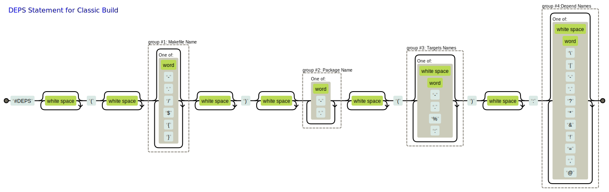
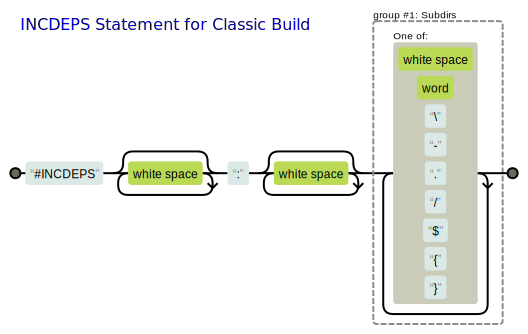
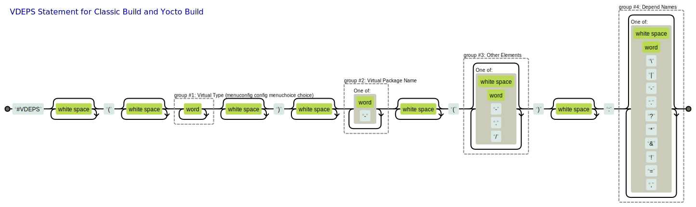

# CBuild-ng 编译系统

[English Edition](./README.md)

## 概述

CBuild-ng是一款由中国开发者打造的高性能编译系统，专为嵌入式Linux及复杂软件栈构建而设计。它以轻量级核心（仅4000行代码）、极简设计和灵活兼容为核心理念，融合传统编译与Yocto模式的优势，提供比Buildroot更强大的功能，同时规避Yocto的复杂性。

* 零门槛上手：无需学习新语言，基于Python/Shell/Makefile脚本实现，配置直观（支持类Linux的`menuconfig`），比Buildroot/Yocto更易理解。
* 双模式驱动：
    * Classic Build：独立构建模式，依赖隔离清晰，支持缓存加速与跨平台部署。
    * Yocto Build：深度封装Yocto，提供 `make` 命令层和图形化配置，简化复杂元数据操作。
* 企业级特性：智能依赖分析、多版本兼容、安全补丁管理，满足工业级开发需求。

CBuild-ng 对比 [CBuild](https://github.com/lengjingzju/cbuild) 最大的区别是 Classic Build 引入了 `WORKDIR` 概念，每个包都在自己的 `WORKDIR` 下的特定目录下准备依赖、编译、安装，包之间的依赖关系和 sysroot 由自动生成的顶层 Makefile 处理。


## 为何选择 CBuild-ng

1️⃣ **极致性能与资源优化**
* 编译速度快：实测300个软件包构建耗时仅5分钟，重编译仅49秒，速度远超Yocto（节省2/3时间）。
* 低资源占用：输出文件系统体积仅为Yocto的1/4（1.8G vs 7.4G），显著降低存储成本。
* 编译缓存机制：支持本地/远程镜像缓存，重复构建直接复用结果，节省90%以上时间。

2️⃣ **零学习曲线的友好设计**
* 无新语言：基于Python/Shell/Makefile，开发者无需学习DSL，开箱即用。
* Kconfig图形化配置：提供类Linux内核的`make menuconfig`界面，依赖关系可视化，配置直观。
* 中文文档支持：项目提供完整中文文档（README_zh-cn.md），降低本土开发者门槛。

3️⃣ **灵活兼容双模式**
* Classic模式：类似Buildroot的独立构建，每个包在独立WORKDIR中处理，依赖隔离清晰。
* Yocto模式：扩展Yocto的元数据层，封装`bitbake`命令，提供菜单配置支持，无缝兼容现有生态。
* 混合编译支持：同一Makefile同时支持交叉编译与本地编译，简化多平台开发流程。

4️⃣ **企业级高级特性**
* 智能依赖管理：自动生成依赖图（支持强弱依赖/冲突检测），一键生成SVG可视化图表。
* 独立软件包分发：类似AppImage的`gen_cpk`工具，自动打包运行时依赖，实现跨系统部署。
* 安全合规支持：自动生成许可证清单（HTML），内置CVE补丁管理，满足企业合规需求。

5️⃣ **开源生态贡献与创新**
* 内核社区认可：项目贡献的Kconfig补丁已合并至Linux 5.19+主线，技术实力获国际认可。
* 全中文技术栈：从文档到社区讨论全面支持中文，降低本土开发者参与门槛。
* 使用方高度评价：某公司在CES2024上称其开发平台为颠覆性创新（Cooper Core 即是 CBuild）。
    * [微信公众号文章](https://mp.weixin.qq.com/s?__biz=MzUxNjUyNjAwNg==&mid=2247485681&idx=1&sn=a40da02663c6d27ea63eb28451095bbf&chksm=f875874e9d244c5cd4e3fec1d0a26469cba18277642af5dd5eb86eda58c3871d3f783f9d78a7&mpshare=1&scene=1&srcid=0112YvuxcOvCqTb2WhEqJGOn&sharer_shareinfo=2ff8614102cab4059235848ebb37a645&sharer_shareinfo_first=c944849c1a53d51b268847a57c945069&exportkey=n_ChQIAhIQC0jysnU80ORUSwbcNGn9TxKfAgIE97dBBAEAAAAAAEWNId2KaLMAAAAOpnltbLcz9gKNyK89dVj0crs1w3S3dkK0YOtHZXXYm26U4Sn7iQnEsI9BaHTDNQJi0z%2F3MgYqf9czIPlkBs%2FnUKwf5Rj5nPqJU5x1WN%2B2%2FBv5oh2YQMBtYk09W3LmEszADTCfJtU78xe6uXnTAXXIPlfXKwOfTGs46tmLVZkffDzww66N%2BaXQm1aikAxWfTw0JilDxvQba4fpYk8nMxuDRUC4GlGYEyNcHYL1Hi518R3T1DK4T2jj1vr%2Fr%2Bkyo2qpp2VpxLOEtsl8Vx1RfTQEnbWflkTB8ImlJKJwN78BHIgbvM4Sra%2BbYrLXWb%2FrhcaoBni5HqyE49AGuDSCULcL1GR%2FfOayftvl&acctmode=0&pass_ticket=ZutZ1C5h7DFNHhjqPfFzxvsZn7AwriXI3P8gmInU67TJ6fAnWGvdPrMDg0epCVbv&wx_header=0#rd)


## 功能组成

CBuild 编译系统主要由三部分组成: 任务分析处理工具、Makefile 编译模板 (IMake)、网络和缓存处理工具。<br>

* 任务分析处理工具: 分析所有任务并自动生成总配置 Kconfig 和执行脚本 Makefile
    * 所有任务由 Python 脚本 `gen_build_chain.py` 分析组装
        * 自动收集所有任务的规则和参数，通过 `make menuconfig` 选择是否执行任务和配置任务参数
    * 每个任务规则由一条依赖语句声明，支持非常多的依赖规则
        * 支持自动生成执行任务的实包和管理任务的虚包的规则
        * 支持普通结构(config)、层次结构(menuconfig)、选择结构(choice) 等自动生成
        * 支持强依赖(depends on)、弱依赖(if...endif)、条件依赖、强选择(select)、弱选择(imply)、或规则(||) 等自动生成
    * 任务是 Makefile 脚本，由 make 执行
    * 支持生成任务依赖关系的图片，并有颜色等属性查看任务是否被选中等 `gen_depends_image.sh`
<br>

* Makefile 编译模板 (IMake): 比肩 `CMake` `Autotools` `Meson` 等的编译工具，比他们更简洁快速，使用 menuconfig 配置参数，缺点是由于是纯粹 Makefile 实现所以不支持 Windows
    * 编译驱动、库、应用的模板，只需填写少数几个变量就可以完成一个超大项目的 Makefile
    * 支持编译生成最新的交叉编译工具链 `process_machine.sh` `toolchain/Makefile`
    * 一个 Makefile 同时支持 Classic Build 模式和 Yocto Build 方式，同时支持本地编译和交叉编译 `inc.env.mk`
    * 一个 Makefile 同时支持生成多个库、可执行文件或驱动
    * 支持自动分析头文件作为编译依赖，支持分别指定源文件的 CFLAGS 等
    * 支持指定编译输出目录(`make O=xxx`)、安装目录(`make DESTDIR=xxx`)、依赖的 sysroot 目录(`make DEPDIR=xxx`)
    * 提供编译静态库、共享库和可执行文件的模板 `inc.app.mk`，支持 C(`*.c`) C++(`*.cc *.cp *.cxx *.cpp *.CPP *.c++ *.C`) 和 汇编(`*.S *.s *.asm`) 混合编译
    * 提供编译驱动的模板 `inc.mod.mk`，支持 C(`*.c`) 和 汇编(`*.S`) 混合编译
    * 提供符合 [GNUInstallDirs](https://www.gnu.org/prep/standards/html_node/Directory-Variables.html) 标准的安装模板 `inc.ins.mk`
    * 提供 Kconfig (menuconfig) 配置参数的模板 `inc.conf.mk`
    * 提供调用原始的 `Makefile` `CMake` `Autotools` `Meson` 编译的模板 `inc.rule.mk`
<br>

* 网络和缓存等处理工具(Classic Build): 处理包的下载、打补丁、编译、安装、打包，支持源码镜像和缓存镜像
    * 提供方便可靠的补丁机制 `exec_patch.sh`
    * 提供自动拉取网络包工具，支持从 http(支持 md5)、git(支持 branch tag revision)或 svn(支持 revision) 下载包，支持镜像下载 `fetch_package.sh`
    * 提供编译缓存工具，再次编译不需要从代码编译，直接从本地缓存或网络缓存拉取 `process_cache.sh`
    * 提供简洁的组装模板，且支持缓存编译 `inc.rule.mk`
    * 提供可靠的安装脚本和 sysroot 处理脚本 `process_sysroot.sh`
    * 提供丰富的开源软件层，开源包不断增加中
    * 提供生成所有包的描述信息的 HTML 文件的脚本 `gen_package_infos.py`
    * 提供生成独立包(打包包含系统依赖)的脚本 `gen_cpk_package.py` `gen_cpk_binary.sh`，功能类似 Snap、AppImage或Flatpak
<br>

* 测试用例可以查看 [examples_zh-cn.md](./examples/examples_zh-cn.md)


## 性能测试

* 测试场景: 某 SDK 的 300 个包 8 线程本地文件系统编译

    | 编译方法                | 首次编译耗时 | 再次编译耗时 | 输出文件系统占用 |
    | ----------------------- | ------------ | ------------ | ---------------- |
    | CBuild-ng Classic Build | 5m1.790s     | 0m49.785s    | 1.8G             |
    | CBuild Classic Build    | 5m13.526s    | 0m59.156s    | 2.7G             |
    | Yocto Build with cache  | 15m42.554s   | 3m31.520s    | 7.4G+            |

* 测试结果: 对比 Yocto Build，CBuild-ng 的 Classic Build 编译耗时减少 2/3，输出文件系统占用减少 3/4


## 笔记

* 如果对 Shell 语法不了解，可以查看 [Shell 笔记](./notes/shell.md)
* 如果对 Makefile 语法不了解，可以查看 [Makefile 笔记](./notes/makefile.md)
* 如果对 Kconfig 语法不了解，可以查看 [Kconfig 笔记](./notes/kconfig.md)


## 开源贡献

本工程目前已向 Linux 内核社区贡献了2次提交，已合并到 Linux 内核主线

* [kconfig: fix failing to generate auto.conf](https://git.kernel.org/pub/scm/linux/kernel/git/masahiroy/linux-kbuild.git/commit/?h=fixes&id=1b9e740a81f91ae338b29ed70455719804957b80)

    ```sh
    commit 1b9e740a81f91ae338b29ed70455719804957b80
    Author: Jing Leng <jleng@ambarella.com>
    Date:   Fri Feb 11 17:27:36 2022 +0800

        kconfig: fix failing to generate auto.conf

        When the KCONFIG_AUTOCONFIG is specified (e.g. export \
        KCONFIG_AUTOCONFIG=output/config/auto.conf), the directory of
        include/config/ will not be created, so kconfig can't create deps
        files in it and auto.conf can't be generated.
    ```

* [kbuild: Fix include path in scripts/Makefile.modpost](https://git.kernel.org/pub/scm/linux/kernel/git/masahiroy/linux-kbuild.git/commit/?h=fixes&id=23a0cb8e3225122496bfa79172005c587c2d64bf)

    ```sh
    commit 23a0cb8e3225122496bfa79172005c587c2d64bf
    Author: Jing Leng <jleng@ambarella.com>
    Date:   Tue May 17 18:51:28 2022 +0800

        kbuild: Fix include path in scripts/Makefile.modpost

        When building an external module, if users don't need to separate the
        compilation output and source code, they run the following command:
        "make -C $(LINUX_SRC_DIR) M=$(PWD)". At this point, "$(KBUILD_EXTMOD)"
        and "$(src)" are the same.

        If they need to separate them, they run "make -C $(KERNEL_SRC_DIR)
        O=$(KERNEL_OUT_DIR) M=$(OUT_DIR) src=$(PWD)". Before running the
        command, they need to copy "Kbuild" or "Makefile" to "$(OUT_DIR)" to
        prevent compilation failure.

        So the kernel should change the included path to avoid the copy operation.
    ```

## 任务分析处理

### 编译架构

* Classic Build 组成:
    * 应用和驱动的编译脚本都是由 Makefile + DEPS-statement 组成
    * 编译链通过 DEPS-statement 定义的依赖关系组装(包级别的依赖)
    * DEPS-statement 基本只需要定义依赖，遵循 CBuild 定义的组装规则
    * 脚本分析所有包的 DEPS-statement 自动生成所有包的编译链，所有包都是一个一个单独编译，可以单独进入包下敲 make 编译
    * 支持 Kconfig 自己管理或托管，托管的 Kconfig 必需放置和 DEPS-statement 语句文件的同目录，无需手动指定父子包含关系，而是由脚本自动分析组装
* Yocto Build 组成:
    * 应用和驱动的编译脚本都是由 Makefile + Recipe 组成
    * 编译链通过在 Recipe 中定义的 DEPENDS / RDEPENDS 和扩展的 EXTRADEPS 依赖关系组装(包级别的依赖)
    * 自定义包的 Recipe 基本只需要定义依赖，遵循 Yocto 定义的组装规则
    * 扩展 Yocto 编译，脚本分析所有包的 Recipe 的文件名和自定义包的 Recipe 的 DEPENDS 变量自动生成所有包的编译链
    * 扩展 Yocto 编译，支持弱依赖，可通过 `make menuconfig` 修改 rootfs (增加包、删除包、修改配置等)

### gen_build_chain.py 命令参数

* 调试说明
    * gen_build_chain.py 有个 `debug_mode` 变量，设为 True 会打印非常多的调试信息，例如循环依赖，未定义包等

* 命令说明
    * 带中括号表示是可选项，否则是必选项
    * Classic Build 只需一步自动生成 Kconfig 和 Makefile
    * Yocto Build 需要两步分别自动生成 Kconfig 和 Image 配方，会自动分析 `conf/local.conf` `conf/bblayers.conf` 和层下的配方文件和配方附加文件

    ```sh
    # Classic Build
    gen_build_chain.py -m MAKEFILE_OUT -k KCONFIG_OUT [-t TARGET_OUT] -d DEP_NAME [-v VIR_NAME] [-c CONF_NAME] -s SEARCH_DIRS [-i IGNORE_DIRS] [-g GO_ON_DIRS] [-l MAX_LAYER_DEPTH] [-w KEYWORDS] [-p PREPEND_FLAG] [-u UNIQUE_PACKAGES]

    # Yocto Build Step1
    gen_build_chain.py -k KCONFIG_OUT -t TARGET_OUT [-v VIR_NAME] [-c CONF_NAME] [-i IGNORE_DIRS] [-l MAX_LAYER_DEPTH] [-w KEYWORDS] [-p PREPEND_FLAG] [-u USER_METAS]

    # Yocto Build Step2
    gen_build_chain.py -t TARGET_PATH -c DOT_CONFIG_NAME -o RECIPE_IMAGE_NAME [-p PATCH_PKG_PATH] [-i IGNORE_RECIPES]
    ```

* Classic Build 命令选项
    * `-m <Makefile Path>`: 指定自动生成的 Makefile 文件路径名
        * 可以使用一个顶层 Makefile 包含自动生成的 Makefile，all 目标调用 `make $(ENV_BUILD_JOBS) MAKEFLAGS= all_targets` 多线程编译所有包
        * 可以统计各个包的编译时间 `make time_statistics`
    * `-k <Kconfig Path>`: 指定自动生成的 Kconfig 文件路径名
    * `-t <Target Path>`: 指定自动生成的存储包名、依赖和源码路径列表的文件路径名
    * `-d <Search Depend Name>`: 指定要搜索的依赖文件名(含有依赖规则语句)，依赖文件中可以包含多条依赖信息，但不建议这么做
    * `-c <Search Kconfig Name>`: 指定要搜索的 Kconfig 配置文件名(含有配置信息)
        * 查找和依赖文件同目录的配置文件，优先查找和配置文件名相同后缀的文件名为包名的配置文件，找不到才查找指定配置文件
    * `-v <Search Virtual Depend Name>`: 指定要搜索的虚拟依赖文件名(含有虚拟依赖规则语句)
    * `-s <Search Directories>`: 指定搜索的目录文件路径名，多个目录使用冒号隔开
    * `-i <Ignore Directories>`: 指定忽略的目录名，不会搜索指定目录名下的依赖文件，多个目录使用冒号隔开
    * `-g <Go On Directories>`: 指定继续搜索的的目录文件路径名，多个目录使用冒号隔开
        * 如果在当前目录下搜索到 `<Search Depend Name>`，当前目录不存在 `continue` 文件且 `<Go On Directories>` 没有指定或当前目录不在它里面，不会再继续搜索当前目录的子目录
    * `-l <Max Layer Depth>`: 设置 menuconfig 菜单的最大层数，0 表示菜单平铺，1表示2层菜单，...
    * `-w <Keyword Directories>`: 设置 menuconfig 菜单的忽略层级名，如果路径中的目录匹配设置值，则这个路径的层数减1，设置的多个目录使用冒号隔开
    * `-p <Prepend Flag>`: 设置生成的 Kconfig 中配置项的前缀，如果用户运行 conf / mconf 时设置了无前缀 `CONFIG_=""`，则运行此脚本需要设置此 flag 为 1
    * `-u <Unique Packages>`: 指定唯一包(即此包作为 native 包的依赖时，此包的形式还是不含 native)，一般是和 arch 无关的包，多个包名使用冒号隔开
<br>

* Yocto Build Step1 命令选项
    * `-k <Kconfig Path>`: 指定自动生成的 Kconfig 文件路径名
    * `-t <Target Path>`: 指定自动生成的存储包名、依赖和源码路径列表的文件路径名
    * `-c <Search Kconfig Name>`: 指定要搜索的 Kconfig 配置文件名(含有配置信息)
        * 优先查找当前目录下的 `配方名.bbconfig` 文件，找不到才在 bbappend 文件中 EXTERNALSRC 变量指定的路径下查找配置文件，优先查找和配置文件名相同后缀的文件名为包名的配置文件，找不到才查找指定配置文件
    * `-v <Search Virtual Depend Name>`: 指定要搜索的虚拟依赖文件名(含有虚拟依赖规则语句)
    * `-i <Ignore Directories>`: 指定忽略的目录名，不会搜索指定目录名下的依赖文件，多个目录使用冒号隔开
    * `-l <Max Layer Depth>`: 设置 menuconfig 菜单的最大层数，0 表示菜单平铺，1表示2层菜单，...
    * `-w <Keyword Directories>`: 设置 menuconfig 菜单的忽略层级名，如果路径中的目录匹配设置值，则这个路径的层数减1，设置的多个目录使用冒号隔开
    * `-p <Prepend Flag>`: 设置生成的 Kconfig 中配置项的前缀，如果用户运行 conf / mconf 时设置了无前缀 `CONFIG_=""`，则运行此脚本需要设置此 flag 为 1
    * `-u <User Metas>`: 指定用户层，多个层使用冒号隔开。只有用户层的包才会: 分析依赖关系，默认选中，托管 Kconfig，支持 `EXTRADEPS` 特殊依赖和虚拟依赖
<br>

* Yocto Build Step2 命令选项
    * `-t <Target Path>`: 指定 Step1 自动生成的存储包名、依赖和源码路径列表的文件路径名
    * `-c <Search Kconfig Path>`: 指定配置文件 .config 的路径名
    * `-o <Output Recipe Path>`: 指定存储 rootfs 安装包列表的文件路径名
    * `-p <Output patch/unpatch Path>`: 指定存储使能的打/去补丁包列表的文件路径名，`prepare-patch` 包 include 此文件
    * `-i <Ignore Recipes>`: 指定的是忽略的配方名，多个配方名使用冒号隔开


### Classic Build 实依赖规则

* 实依赖格式: `#DEPS(Makefile_Name) Target_Name(Other_Target_Names): Depend_Names`

    

* 包含子路径格式: `#INCDEPS: Subdir_Names`

    

* 格式说明
    * Makefile_Name: make 运行的 Makefile 的名称 (可以为空)，不为空时 make 会运行指定的 Makefile (`make -f Makefile_Name`)
        * Makefile 中必须包含 all clean install 三个目标，默认会加入 all install 和 clean 目标的规则
        * Makefile 名称可以包含路径(即斜杠 `/`)，支持直接查找子文件夹下的子包
            * 例如 `test1/` or `test2/wrapper.mk`
            * 也可以使用 INCDEPS-statement 继续查找子文件夹下的依赖文件，支持递归
                * 例如 `#INCDEPS: test1 test2/test22`，通过子文件夹下的依赖文件找到子包
                * Subdir_Names 支持环境变量替换，例如 `${ENV_BUILD_SOC}` 会替换为环境变量 ENV_BUILD_SOC 的值
            * 也可以当前目录添加 `continue` 文件，继续查找子文件夹下的依赖文件
        * Makefile_Name 支持环境变量替换，例如 `${ENV_TOP_DIR}/xxx/Makefile`，此时就不需要将规则文件放在源码目录
    * Target_Name: 当前包的名称ID
        * `ignore` 关键字是特殊的ID，表示此包不是一个包，用来屏蔽当前目录的搜索，一般写成 `#DEPS() ignore():`
    * Other_Target_Names: 当前包的其它目标，多个目标使用空格隔开 (可以为空)，有如下特殊的关键字:
        * 包类型关键字
            * unified   : 主要特征是包的 `all` 目标同时进行了编译和安装
                * 解析到 `include inc.rule.mk` 自动添加，一般无需手动设置
                * `unified` 包自动添加 `singletask` 和 `distclean` 关键字，且支持 `cache` 关键字
            * direct    : 主要特征是包的 `all` 目标只进行了编译
                * 默认包类型，一般无需手动设置
                * 如果未声明 `noisysroot`，`direct` 包默认自动添加 `isysroot` 关键字
            * empty     : 主要特征是包是空包，只定义了依赖关系，没有编译、安装、发布等执行命令
                * 需要手动设置 `empty`
        * 包目标关键字
            * all install clean: 忽略必需的目标，加不加对解析结果没有任何影响
            * distclean : 完全清理编译输出(包含配置)
            * prepare   : 表示 make 前运行 make prepare，一般用于当 .config 不存在时加载默认配置到 .config
            * release   : 表示安装进 fakeroot 时运行 `make release`
                * 此目标不需要安装头文件和静态库文件等
                * release 目标不存在时，安装到 fakeroot rootfs 时运行 `make install`
        * 包属性关键字
            * norelease : 表示该包没有文件安装到 fakeroot，例如包只输出头文件 和/或 静态库
            * psysroot  : 表示在 WORKDIR 准备依赖的 sysroot 而不是使用全局的 sysroot
            * isysroot  : 表示在顶层 Makefile 运行编译任务时进行了编译，同时安装到 `$(WORKDIR)/image`
                * 此时 `gen_build_chain.py` 中的 `dis_isysroot` 要设置为 False
            * noisysroot: 表示在顶层 Makefile 运行编译任务时只进行了编译，没有安装到 `$(WORKDIR)/image`
            * finally   : 表示此包编译顺序在所有其它包之后，一般用于最后生成文件系统和系统镜像
            * native    : 表示同时定义了包的交叉编译包和本地编译包
            * cache     : 表明该包支持缓存机制，解析到 `CACHE_BUIILD=y` 时自动添加，无需手动设置
            * singletask: 表示单线程编译
            * union     : 用于多个包共享一个 Makefile
                * 此时 `prepare all install clean release` 等目标的名字变为 `Target_Name-prepare Target_Name-all Target_Name-install Target_Name-clean Target_Name-release`
        * 特殊语法格式
            * `subtarget1:subtarget2:...::dep1:dep2:...`: 用来显式指定子目标的依赖
                * 双冒号分开子目标列表和依赖列表，子目标之间和依赖之间使用单冒号分隔，依赖列表可以为空
    * Depend_Names: 当前包依赖的其它包的名称ID，多个依赖使用空格隔开 (可以为空)
        * Depend_Names 支持多行，行尾使用 `\` 续行

注:  包的名称ID (Target_Name Depend_Names) 由 **小写字母、数字、短划线** 组成；Other_Target_Names 无此要求，还可以使用 `%` 作为通配符

* Classic Build 命令说明
    * 可以 `make 包名` 先编译某个包的依赖包(有依赖时)再编译这个包
    * 可以 `make 包名_single` 有依赖时才有这类目标，仅仅编译这个包
    * 可以 `make 包名_install_single` 仅仅安装这个包到全局sysroot目录
    * 可以 `make 包名_psysroot_single` 仅仅准备这个包的依赖到私有sysroot目录(需要在 Other_Target_Names 中定义特定目标 psysroot)
    * 可以 `make 包名_目标名` 先编译某个包的依赖包(有依赖时)再编译这个包的特定目标(特定目标需要在 Other_Target_Names 中定义)
    * 可以 `make 包名_目标名_single` 有依赖时才有这类目标，仅仅编译这个包的特定目标(特定目标需要在 Other_Target_Names 中定义)
    * 可以 `make 包名-pkg` 编译并发布包(包含依赖)
    * 可以 `make 包名-cpk` 编译并发布包(包含依赖)，然后打包成独立包(包含系统运行库，例如C库，修改 `rpath` 和 `link interpreter`)


### Yocto Build 实依赖规则

* Yocto Build 的依赖定义在 Recipe 中
* `DEPENDS`: 编译时依赖的包名
    * 注: Yocto 使用一些主机命令，还可能需要指定依赖主机包 `包名-native`，例如 `bash-native`
* `RDEPENDS:${PN}`: 运行时依赖的包名
    * 注: 有动态库的依赖包需要加到此变量，否则编译报错或依赖的包未安装到 rootfs
* `EXTRADEPS: CBuild 扩展的特殊依赖
    * 如果 EXTRADEPS 中含有弱依赖，需要继承类 `inherit weakdep`
        * `weakdep` 类会解析 ENV_CFG_ROOT 目录下的 `.config` 文件，根据是否选中此项来设置 `DEPENDS` 和 `RDEPENDS:${PN}`
* `PACKAGECONFIG`: 动态设置是否依赖安装了 `xxx/usr/lib/pkgconfig/xxx.pc` 的依赖包


### Classic Build / Yocto Build 虚依赖规则

* 虚依赖格式 `#VDEPS(Virtual_Type) Target_Name(Other_Infos): Depend_Names`

    

* Virtual_Type      : 必选，表示虚拟包的类型，目前有 4 种类型
    * `menuconfig`  : 表示生成 `menuconfig` 虚拟包，当前目录(含子目录)下的所有的包强依赖此包，且处于该包的菜单目录下
    * `config`      : 表示生成 `config` 虚拟包
    * `menuchoice`  : 表示生成 `choice` 虚拟包，当前目录(含子目录)下的所有的包会成为 choice 下的子选项
    * `choice`      : 表示生成 `choice` 虚拟包，Other_Infos 下的包列表会成为 choice 下的子选项
* Virtual_Name      : 必选，虚拟包的名称
* Other_Infos       : choice 类型必选，其它类型可选
    * 对所有类型来说，可以出现一个以 `/` 开头的路径名项(可选)，表示作用于指定的子目录而不是当前目录
        * 对 config choice 类型来说，路径名项可以指定一个虚拟路径，例如 `/virtual` (virtual 可以是任意单词)，此时虚拟项在当前目录(而不是上层目录)下显示
    * 对 choice 类型来说，空格分开的包列表会成为 choice 下的子选项，其中第一个包为默认选择的包
    * 对 menuchoice 类型来说，可以指定默认选择的包
* Depend_Names      : 可选，依赖项列表，和 `#DEPS` 语句用法基本相同，例如可以设置 `unselect`，choice 和 menuchoice 类型不支持 select 和 imply
    * Depend_Names 支持多行，行尾使用 `\` 续行

注: 虚依赖是指该包不是实际的包，不会参与编译，只是用来组织管理实际包，Classic Build 和 Yocto Build 编译虚拟包的写法和使用规则相同


### 特殊依赖说明

* 特殊依赖(虚拟包)
    * `*depname`    : 表示此依赖包是虚拟包 depname，去掉 `*` 后 depname 还可以有特殊符，会继续解析，例如 `*&&depname`
<br>

* 特殊依赖(关键字)
    * `unselect`    : 表示此包默认不编译，即 `default n`，否则此包默认编译，即 `default y`
    * `nokconfig`   : 表示此包不含 Kconfig 配置。同一目录有多个包时，此包无需设置 `nokconfig`，而其它包也有配置可以将配置的文件名设为 **包名.配置的后缀** ，否则需要设置 nokconfig
    * `kconfig`     : 表示多个包共享相同的 Kconfig，一般是同一个软件的交叉编译包和本地编译包共享
<br>

* 特殊依赖(特殊符)
    * `!depname`                    : 表示此包和 depname 包冲突，无法同时开启，即 `depends on !depname`
    * `&depname` or `&&depname`     : 表示此包弱/强选中 depname 包，即 `imply depname` / `select depname`
        * 单与号表示此包选中后，imply 的 depname 也被自动选中，此时 depname 也可以手动取消选中
        * 双与号表示此包选中后，select 的 depname 也被自动选中，此时 depname 不可以取消选中
    * `?depname` or `??depname`     : 表示此包弱依赖 depname 包，即 `if .. endif`
        * 弱依赖是指即使 depname 包未选中或不存在，依赖它的包也可以选中和编译成功
        * 单问号表示编译时依赖(依赖包没有安装动态库等)
        * 双问号表示编译时和运行时依赖(依赖包安装了动态库等)
    * `depa|depb` or `depa||depb`   : 表示此包弱依赖 depa depb ...
        * 弱依赖列表中的包至少需要一个 depx 包选中，依赖它的包才可以选中和编译成功
        * 单竖线表示编译时依赖
        * 双竖线表示编译时和运行时依赖
        * 省略 `|` `||` 前面的单词会被隐式推导使用预编译包或源码包中选一，例如 `||libtest` 被隐式推导为 `prebuild-libtest||libtest`
    * `& ?`                         : `&` 可以和 `?` 组合使用，不要求组合顺序，表示选中并弱依赖
        * 例如： `&&??depname` 或 `??&&depname` 等表示强选中弱依赖，`??&depname` 或 `&??depname` 等表示弱依赖弱选中
    * `& |`                         : `&` 可以和 `|` 组合使用，表示选中其中一个包并弱依赖所有实包
        * 适合强选中并弱依赖预编译包和源码包选择其一
        * 省略最后一个 `|` `||` 前面的字符直到 `&`被隐式推导为 `*build-包名 prebuild-包名 包名` 三元组
        * 例如： `&&||libtest` 被隐式推导为 `&&*build-libtest||prebuild-libtest||libtest`
        * 例如： `&&*build-libtest||prebuild-libtest||libtest` 表示强选中这三个包中第一个存在的包，并弱依赖后面两个实包
    * `depname@condition` or `depname@@condition` : condition 为 y 且 depname 选中时，此包才依赖 depname，只用在 Classic Build 中
    * 其它说明:
        * 对 Classic Build 来说，`?` `??` 没有区别，`|` `||` 没有区别，`@` `@@` 没有区别
        * 对 Yocto Build 来说，`?` `|` `@` 中的弱依赖只会设置 `DEPENDS`，`??` `||` `@@` 中的弱依赖会同时设置 `DEPENDS` 和 `RDEPENDS:${PN}`
<br>

* 特殊依赖(环境变量)
    * ENVNAME=val1,val2 : 表示此包依赖环境变量 ENVNAME 的值等于 val1 或等于 val2
    * ENVNAME!=val1,val2: 表示此包依赖环境变量 ENVNAME 的值不等于 val1 且不等于 val2

* 注: 特殊依赖 Classic Build 时设置的是 `#DEPS` 语句的 `Depend_Names` 元素，Yocto Build 时赋值给配方文件的 `EXTRADEPS` 变量


### 生成依赖关系图 gen_depends_image.sh

* `scripts/bin/gen_depends_image.sh` 命令参数
    * 参数1: 包名
    * 参数2: 存储图片的文件夹路径
    * 参数3: 包名列表文件(gen_build_chain.py 的 `-t` 指定的路径)
    * 参数4: 配置文件 .config 的路径
<br>

* 生成图片说明
    * 使用方法 `make 包名-deps`
    * Classic Build
        * 实线：强依赖
        * 虚线：弱依赖
        * 双线：prebuild 和 srcbuild 选其一，或 patch 和 unpatch 选其一
        * 绿线：配置文件 .config 中该包已经被选中
        * 红线：配置文件 .config 中该包没有被选中
        * 顶层包框颜色
            * 绿框：配置文件 .config 中该包已经被选中
            * 红框：配置文件 .config 中该包没有被选中
    * Yocto Build
        * 绿框：用户包，配置文件 .config 中该包已经被选中
        * 红框：用户包，配置文件 .config 中该包没有被选中
        * 篮框：Yocto 等社区的包 (没有在 gen_build_chain.py 的 `-u` 指定的层中)


## 环境设置

* 有 `3x2=6` 种环境导出方式
    * 第一个参数是标志
        * 无标志表示交叉编译，且导出Linux交叉编译相关的环境变量
        * `app` 标志表示交叉编译，不导出Linux交叉编译相关的环境变量，用于应用开发
        * `host` 标志表示本地编译，不导出Linux交叉编译相关的环境变量，不导出交叉编译器
    * board 表示开发板
        * 导出环境不填写开发板时，会跳出序号让用户选择开发板
        * 开发板必须在 `scripts/bin/process_machine.sh` 脚本中有相应的配置项
        * 开发板必须在 `board` 文件夹下有相应的配置文件夹
        * `generic` 比较特殊，`process_machine.sh` 脚本中无配置项，`board` 下有配置文件夹，只用于本地编译

    ```sh
    lengjing@lengjing:~/data/cbuild-ng$ source scripts/build.env
    lengjing@lengjing:~/data/cbuild-ng$ source scripts/build.env <board>
    lengjing@lengjing:~/data/cbuild-ng$ source scripts/build.env app
    lengjing@lengjing:~/data/cbuild-ng$ source scripts/build.env app <board>
    lengjing@lengjing:~/data/cbuild-ng$ source scripts/build.env host
    lengjing@lengjing:~/data/cbuild-ng$ source scripts/build.env host <board>
    ```


### 初始化编译环境

* 初始化编译环境运行如下命令

    ```sh
    lengjing@lengjing:~/data/cbuild-ng$ source scripts/build.env host generic
    ============================================================
    ENV_BUILD_MODE   : classic
    ENV_BUILD_JOBS   : -j8
    ENV_SIMD_TYPE    :
    ENV_TOP_DIR      : /home/lengjing/data/cbuild-ng
    ENV_MAKE_DIR     : /home/lengjing/data/cbuild-ng/scripts/core
    ENV_TOOL_DIR     : /home/lengjing/data/cbuild-ng/scripts/bin
    ENV_DOWN_DIR     : /home/lengjing/data/cbuild-ng/output/mirror-cache/downloads
    ENV_CACHE_DIR    : /home/lengjing/data/cbuild-ng/output/mirror-cache/build-cache
    ENV_MIRROR_URL   : http://127.0.0.1:8888
    ENV_TOP_OUT      : /home/lengjing/data/cbuild-ng/output
    ENV_CROSS_ROOT   : /home/lengjing/data/cbuild-ng/output/x86_64-host
    ENV_CFG_ROOT     : /home/lengjing/data/cbuild-ng/output/x86_64-host/config
    ENV_NATIVE_ROOT  : /home/lengjing/data/cbuild-ng/output/x86_64-native
    ============================================================
    ```

* 还可以通过 soc 名字导出交叉编译环境

    ```sh
    lengjing@lengjing:~/data/cbuild-ng$ source scripts/build.env cortex-a53
    ============================================================
    ENV_BUILD_MODE   : classic
    ENV_BUILD_JOBS   : -j8
    ENV_BUILD_SOC    : cortex-a53
    ENV_SIMD_TYPE    : neon
    ENV_BUILD_TOOL   : /home/lengjing/data/cbuild-ng/output/toolchain/cortex-a53-toolchain-gcc12.2.0-linux5.15/bin/aarch64-linux-gnu-
    ENV_TOP_DIR      : /home/lengjing/data/cbuild-ng
    ENV_MAKE_DIR     : /home/lengjing/data/cbuild-ng/scripts/core
    ENV_TOOL_DIR     : /home/lengjing/data/cbuild-ng/scripts/bin
    ENV_DOWN_DIR     : /home/lengjing/data/cbuild-ng/output/mirror-cache/downloads
    ENV_CACHE_DIR    : /home/lengjing/data/cbuild-ng/output/mirror-cache/build-cache
    ENV_MIRROR_URL   : http://127.0.0.1:8888
    ENV_TOP_OUT      : /home/lengjing/data/cbuild-ng/output
    ENV_CROSS_ROOT   : /home/lengjing/data/cbuild-ng/output/cortex-a53
    ENV_CFG_ROOT     : /home/lengjing/data/cbuild-ng/output/cortex-a53/config
    ENV_NATIVE_ROOT  : /home/lengjing/data/cbuild-ng/output/x86_64-native
    KERNEL_ARCH      : arm64
    KERNEL_VER       : 5.15.88
    KERNEL_SRC       : /home/lengjing/data/cbuild-ng/output/kernel/linux-5.15.88
    KERNEL_OUT       : /home/lengjing/data/cbuild-ng/output/cortex-a53/objects/linux-5.15.88/build
    ============================================================
    ```

* 生成交叉编译工具链

    ```sh
    lengjing@lengjing:~/data/cbuild-ng$ source scripts/build.env cortex-a53
    lengjing@lengjing:~/data/cbuild-ng$ make -C scripts/toolchain
    ```

注: 用户需要自己在 process_machine.sh 中填写 soc 相关的参数，目前该文件中只举例了 cortex-a53 和 cortex-a9 等


### 环境变量说明

* ENV_BUILD_MODE    : 设置编译模式: `classic`, Classic Build，源码和编译输出分离; `yocto`, Yocto Build
* ENV_BUILD_JOBS    : 指定编译线程数
* ENV_BUILD_SOC     : 指定交叉编译的 SOC，根据 SOC 和 process_machine.sh 脚本得到和 SOC 相关的一系列参数
* ENV_BUILD_TOOL    : 指定交叉编译器前缀
<br>

* ENV_SIMD_TYPE     : 设置SIMD加速指令
    * 当选择SOC为 `generic` 时，取变量 `HOST_SIMD_TYPE` 的值
    * SIMD的有效值如下:
        * neon      : aarch64(ARM64)可设置，CFLAGS/CXXFLAGS会自动加上 `-DUSING_NEON`
        * sse4      : X86/X86_64支持SSE4可设置，CFLAGS/CXXFLAGS会自动加上 `-DUSING_SSE128`
        * avx2      : X86_64支持AVX2可设置，CFLAGS/CXXFLAGS会自动加上 `-DUSING_AVX256`
        * avx512    : X86_64支持AVX512BW可设置，CFLAGS/CXXFLAGS会自动加上 `-DUSING_AVX512`
<br>

* KERNEL_ARCH       : 指定交叉编译 linux 模块的 ARCH
* KERNEL_VER        : Linux 内核版本
* KERNEL_SRC        : Linux 内核解压后的目录路径名
* KERNEL_OUT        : Linux 内核编译输出的目录路径名
<br>

* ENV_TOP_DIR       : 工程的根目录
* ENV_MAKE_DIR      : 工程的编译模板目录
* ENV_TOOL_DIR      : 工程的脚本工具目录
* ENV_DOWN_DIR      : 下载包的保存路径
* ENV_CACHE_DIR     : 包的编译缓存保存路径
* ENV_MIRROR_URL    : 下载包的 http 镜像，可用命令 `python -m http.server 端口号` 快速创建 http 服务器
<br>

* ENV_TOP_OUT       : 工程的输出根目录
* ENV_CFG_ROOT      : 工程自动生成文件的保存路径，例如全局 Kconfig 和 Makefile，各种统计文件等
* ENV_CROSS_ROOT    : 交叉编译输出根目录
* ENV_NATIVE_ROOT   : 本地编译输出根目录

注: Yocto Build 时，由于 BitBake 任务无法直接使用当前 shell 的环境变量，所以自定义环境变量应由配方文件导出，不需要 source 这个环境脚本

* MFLAG             : make 时安静模式，全部编译时默认值为 `-s`，单独编译某个包时置为空编译输出更多信息
* TOLOG             : 编译输出信息重定向，MFLAG等于 `-s` 时默认值为 `1>/dev/null`，否则为空输出更多信息


## 编译模板

* 编译模板我也称之为 IMake 编译，他有两层含义:
    * Include Makefile: 包含模板的编译
    * I have the make : 任何有一定基础的人可以完全掌握和修改此编译工具
* 如果用户想把模板放在源码目录，建议用户使用模板 `inc.makes` 并设置 `INC_MAKES` 启用相应的模板
* `inc.makes` 默认只启用 inc.env.mk 和 inc.ins.mk
* `INC_MAKES` 的值可以是 `disenv` `conf` `app` `mod` `disins` 的组合
    * disenv: 不启用 inc.env.mk
    * conf  : 启用 inc.conf.mk
    * app   : 启用 inc.app.mk
    * mod   : 启用 inc.mod.mk
    * disins: 不启用 inc.ins.mk


### 环境模板 inc.env.mk

* 环境模板被应用编译和内核模块编译共用
* Classic Build 时此模板作用是设置编译输出目录 `WORKDIR`，设置并导出交叉编译环境或本地编译环境
* Yocto Build 时编译输出目录和交叉编译环境由 `bitbake` 设置并导出


#### 环境模板的函数说明

* `$(call link_hdrs)`   : 根据 SEARCH_HDRS 变量的值自动生成查找头文件的 CFLAGS
* `$(call link_libs)`   : 自动生成查找库文件的 LDFLAGS
* `$(call install_lics)`: 安装 license 文件到 `/usr/local/license/$(PACKAGE_NAME)`
* `$(eval $(call ft-config,CONFIG配置名,CONFIG配置值y时的配置,CONFIG配置值不为y时的配置))`: 动态特性配置
    * 根据 `.config` 中指定配置名的值设置变量 `FT_CONFIG` 的值
* `$(eval $(call FT-CONFIG,CONFIG配置名,CONFIG配置值y时的配置,CONFIG配置值不为y时的配置))`: 动态特性配置
    * 作用同上，只是 `ft-config` 函数在 `NATIVE_BUILD=y` 时会将 `CONFIG配置名` 改为 `CONFIG配置名_NATIVE`；而 `FT-CONFIG` 函数不会


#### 环境模板的变量说明

* PACKAGE_NAME      : 包的名称 (要和 DEPS语句的包名一致，本地编译的 PACKAGE_NAME 不需要加后缀 `-native`)
* PACKAGE_ID        : 只读，包的实际名称，交叉编译时等于 PACKAGE_NAME 的值，本地编译时会加上后缀 `-native`
* INSTALL_HDR       : 头文件安装的子文件夹，默认值等于 PACKAGE_NAME 的值
* PACKAGE_DEPS      : 包的依赖列表，未来可能会删除
* SEARCH_HDRS       : 查找头文件子目录列表，默认值等于 PACKAGE_DEPS 的值
<br>

* ENV_BUILD_TYPE    : CC 优化等级选项，默认取值是 `optimized`，总共4个选项:
    * debug         : OPTIMIZER_FLAG 默认取值 `-O0 -g -ggdb`
    * minsize       : OPTIMIZER_FLAG 默认取值 `-Os`
    * optimized     : OPTIMIZER_FLAG 默认取值 `-O2`
    * release       : OPTIMIZER_FLAG 默认取值 `-O3`
* OPTIMIZER_FLAG    : 优化等级值
<br>

* WORKDIR           : 工作目录
    * 交叉编译默认值为 `$(ENV_CROSS_ROOT)/objects/$(PACKAGE_NAME)`，本地编译默认值为 `$(ENV_NATIVE_ROOT)/objects/$(PACKAGE_NAME)`
    * OBJ_PREFIX / INS_PREFIX / DEP_PREFIX / PATH_PREFIX 的默认定义都在此目录下
* OBJ_PREFIX        : 顶层编译输出目录
* OBJ_SUBDIR        : 编译输出子目录，一般用于有多个独立子模块组成的 Makefile
    * 可以使用 `make O=xxx` 改变默认值
* INS_PREFIX        : 顶层编译安装目录，默认取值 `$(WORKDIR)/image`
    * 可以使用 `make DESTDIR=xxx` 改变默认值
    * Classic Build 时自动生成的顶层 Makefile 执行安装到全局 sysroot、准备依赖和安装到 rootfs 时，会改变此值
* INS_TOPDIR        : Classic Build 的首次安装目录，默认取值 `$(WORKDIR)/image`
    * Classic Build 时第一次安装到 `INS_TOPDIR`，再次安装时(安装到全局 sysroot、准备依赖和安装到 rootfs 时)从 `INS_TOPDIR` 安装到改变后的 `INS_PREFIX`
* INS_SUBDIR        : Classic Build 使用 `CMake` `Autotools` `Meson` 编译时的安装子目录，默认值为 `/usr`，则真正的安装目录为 `$(INS_TOPDIR)$(INS_SUBDIR)`
* DEP_PREFIX        : 顶层依赖查找目录
    * 可以使用 `make DEPDIR=xxx` 改变默认值
* PATH_PREFIX       : 顶层本地工具查找目录
* SYS_PREFIX        : Classic Build 全局的顶层编译输出和安装的目录
<br>

* NATIVE_DEPEND     : 交叉编译包依赖本地编译包时需要设置为 y，由 `gen_build_chain.by` 自动设置或由 Recipe (`cbuild.bbclass`) 导出
* NATIVE_BUILD      : 设置为 y 时表示本地编译(native-compilation)，由 `gen_build_chain.by` 自动设置或由 Recipe 导出
* GLOBAL_SYSROOT    : 仅用于 Classic Build，设置为 y 时表示使用全局依赖目录，DEP_PREFIX / PATH_PREFIX 会设置为 SYS_PREFIX 的值，由 `gen_build_chain.by` 自动设置
* PREPARE_SYSROOT   : Classic Build 时在 WORKDIR 目录准备 sysroot, 命令是 `$(MAKE) $(PREPARE_SYSROOT)`
* DIS_PC_EXPORT     : 是否禁止导出 [pkg-config](https://manpages.debian.org/testing/pkg-config/pkg-config.1.en.html) 的环境变量
* CC_TOOL           : 如果设置为 clang，将使用 clang 编译链编译(初步支持)，否则默认使用 gcc 编译


### 安装模板 inc.ins.mk

* 安装模板被应用编译和内核模块编译共用
* 安装模板的安装目录基本符合 [GNUInstallDirs](https://www.gnu.org/prep/standards/html_node/Directory-Variables.html) 标准
    * `base_*dir` 和 `hdrdir` 不属于 GNUInstallDirs 的标准
    * 安装的根目录是 `$(INS_PREFIX)`


#### 安装模板的目标和变量说明

* `$(eval $(call install_obj,<ID名>))`: 生成安装到指定目录的 Makefile 规则
    * ID名: 目录名去掉 `dir`
    *  Makefile 规则的目标: `install_<小写id名>s`
    * 要安装的源文件集的变量名: `INSTALL_<大写ID名>S`

* 已定义的 Makefile 规则
    * 目录名在 `inc.env.mk` 中定义

    | 目录名           | 目录定义(目标文件夹)          | 要安装的源文件集          | Makefile 规则的目标    |
    | ---------------- | ----------------------------- | ------------------------- | ---------------------- |
    | `base_bindir`    | `/bin`                        | `$(INSTALL_BASE_BINS)`    | `install_base_bins`    |
    | `base_sbindir`   | `/sbin`                       | `$(INSTALL_BASE_SBINS)`   | `install_base_sbins`   |
    | `base_libdir`    | `/lib`                        | `$(INSTALL_BASE_LIBS)`    | `install_base_libs`    |
    | `bindir`         | `/usr/bin`                    | `$(INSTALL_BINS)`         | `install_bins`         |
    | `sbindir`        | `/usr/sbin`                   | `$(INSTALL_SBINS)`        | `install_sbins`        |
    | `libdir`         | `/usr/lib`                    | `$(INSTALL_LIBS)`         | `install_libs`         |
    | `libexecdir`     | `/usr/libexec`                | `$(INSTALL_LIBEXECS)`     | `install_libexecs`     |
    | `hdrdir`         | `/usr/include/$(INSTALL_HDR)` | `$(INSTALL_HDRS)`         | `install_hdrs`         |
    | `includedir`     | `/usr/include`                | `$(INSTALL_INCLUDES)`     | `install_includes`     |
    | `datadir`        | `/usr/share`                  | `$(INSTALL_DATAS)`        | `install_datas`        |
    | `infodir`        | `$(datadir)/info`             | `$(INSTALL_INFOS)`        | `install_infos`        |
    | `localedir`      | `$(datadir)/locale`           | `$(INSTALL_LOCALES)`      | `install_locales`      |
    | `mandir`         | `$(datadir)/man`              | `$(INSTALL_MANS)`         | `install_mans`         |
    | `docdir`         | `$(datadir)/doc`              | `$(INSTALL_DOCS)`         | `install_docs`         |
    | `sysconfdir`     | `/etc`                        | `$(INSTALL_SYSCONFS)`     | `install_sysconfs`     |
    | `servicedir`     | `/srv`                        | `$(INSTALL_SERVICES)`     | `install_services`     |
    | `sharedstatedir` | `/com`                        | `$(INSTALL_SHAREDSTATES)` | `install_sharedstates` |
    | `localstatedir`  | `/var`                        | `$(INSTALL_LOCALSTATES)`  | `install_localstates`  |
    | `runstatedir`    | `/run`                        | `$(INSTALL_RUNSTATES)`    | `install_runstates`    |

* 变量默认值定义
    * 编译应用时 `inc.app.mk`，编译生成的可执行文件会加入到 `BIN_TARGETS` 变量，`INSTALL_BINARIES` 已默认赋值为 `$(BIN_TARGETS)`
    * 编译应用时 `inc.app.mk`，编译生成的库文件会加入到 `LIB_TARGETS` 变量，`INSTALL_LIBRARIES` 已默认赋值为 `$(LIB_TARGETS)`

    ``` makefile
    INSTALL_BASE_BINARIES  ?= $(INSTALL_BINARIES)
    INSTALL_BASE_BINS      ?= $(INSTALL_BASE_BINARIES)
    INSTALL_BINS           ?= $(INSTALL_BINARIES)
    INSTALL_BASE_LIBRARIES ?= $(INSTALL_LIBRARIES)
    INSTALL_BASE_LIBS      ?= $(INSTALL_BASE_LIBRARIES)
    INSTALL_LIBS           ?= $(INSTALL_LIBRARIES)
    INSTALL_HDRS           ?= $(INSTALL_HEADERS)
    ```

* `$(eval $(call install_ext,<ID名>))`: 生成安装到指定目录的指定子目录的 Makefile 模式规则
    * ID名: 目录名去掉 `dir`
    *  Makefile 模式规则的目标: `install_<小写id名>s_%`，`%` 匹配小写字符
    * 要安装的源文件集和目标子文件夹的变量名: `INSTALL_<大写ID名>S_xxx`，`xxx` 和目标中的模式匹配部分的字符串相同
        * 定义的值前面部分是要安装的源文件集，最后一项是以斜杆 `/` 开头的指定子目录

* 已定义的 Makefile 模式规则
    * 模式规则 `install_todir_xxx` 和 `install_tofile_xxx` 不是由 `install_ext` 定义的
        * `install_todir_xxx`: 安装到根目录的指定子目录的 Makefile 模式规则
        * `install_tofile_xxx`: 安装到根目录的指定文件的 Makefile 模式规则，用于安装文件并重命名

    | 目录名           | 目标文件夹                    | 设置安装的变量名            | Makefile 规则的模式目标 |
    | ---------------- | ----------------------------- | --------------------------- | ----------------------- |
    | `includedir`     | `/usr/include<指定子目录>`    | `$(INSTALL_INCLUDES_<xxx>)` | `install_includes_%`    |
    | `datadir`        | `/usr/share<指定子目录>`      | `$(INSTALL_DATAS_<xxx>)`    | `install_datas_%`       |
    | `sysconfdir`     | `/etc<指定子目录>`            | `$(INSTALL_SYSCONFS_<xxx>)` | `install_sysconfs_%`    |
    | ` `              | `<指定子目录>`                | `$(INSTALL_TODIR_<xxx>)`    | `install_todir_%`       |
    | ` `              | `<指定子文件>`                | `$(INSTALL_TOFILE_<xxx>)`   | `install_tofile_%`      |

* 模式规则例子
    * 创建2个空白文件 testa 和 testb，Makefile 内容如下:

        ```makefile
        INSTALL_DATAS_test = testa testb /testa/testb
        INSTALL_TODIR_test = testa testb /usr/local/bin
        INSTALL_TOFILE_testa = testa /etc/a.conf
        INSTALL_TOFILE_testb = testa /etc/b.conf

        all: install_datas_test install_todir_test install_tofile_testa install_tofile_testb
        include $(ENV_MAKE_DIR)/inc.ins.mk
        ```

    * 运行 make 安装后的文件树

        ```
        image
        ├── etc
        │   ├── a.conf
        │   └── b.conf
        └── usr
            ├── local
            │   └── bin
            │       ├── testa
            │       └── testb
            └── share
                └── testa
                    └── testb
                        ├── testa
                        └── testb
        ```


### 应用模板 inc.app.mk

* 应用模板用于编译动态库、静态库和可执行文件

#### 应用模板的目标说明

* LIBA_NAME: 编译单个静态库时需要设置静态库名
    * 编译生成的静态库文件路径会加入到 `LIB_TARGETS` 变量
* LIBSO_NAME: 编译单个动态库时需要设置动态库名
    * LIBSO_NAME 可以设置为 `库名 主版本号 次版本号 补丁版本号` 格式，例如
        * `LIBSO_NAME = libtest.so 1 2 3` 编译生成动态库 libtest.so.1.2.3，并创建符号链接 libtest.so 和 libtest.so.1
        * `LIBSO_NAME = libtest.so 1 2`   编译生成动态库 libtest.so.1.2  ，并创建符号链接 libtest.so 和 libtest.so.1
        * `LIBSO_NAME = libtest.so 1`     编译生成动态库 libtest.so.1    ，并创建符号链接 libtest.so
        * `LIBSO_NAME = libtest.so`       编译生成动态库 libtest.so
    * 如果 LIBSO_NAME 带版本号，默认指定的 soname 是 `libxxxx.so.x`，可以通过 LDFLAGS 覆盖默认值
        * 例如 `LDFLAGS += -Wl,-soname=libxxxx.so`
    * 编译生成的动态库文件路径和符号链接路径会加入到 `LIB_TARGETS` 变量
* BIN_NAME: 编译单个可执行文件时需要设置可执行文件名
    * 编译生成的可执行文件会加入到 `BIN_TARGETS` 变量


#### 应用模板的函数说明

* compile_obj: 创建一组编译c/cxx/asm源文件规则
    * `$(eval $(call compile_obj,源文件后缀,编译器))`
    * 一般不会被用户调用，除非有新的C++源文件后缀
* compile_vobj: 创建一条自定义编译源文件规则
    * `$(eval $(call compile_vobj,源文件后缀,编译器,虚拟源文件,真实源文件))` (虚拟源文件需要加入到变量VSRCS)
    * 一般用于一个源文件根据不同的CFLAGS编译出不同的.o文件，例子见 [JCore](https://github.com/lengjingzju/jcore) 的Makefile
* compile_oobj: 创建一组自定义编译输出目录的源文件规则
    * `$(eval $(call compile_oobj,源文件后缀,编译器,虚拟源文件列表))` (虚拟源文件需要加入到变量VSRCS)
    * 一般用于生成在输出目录的源文件的编译，例如kconfig的编译
<br>

* add-liba-build: 创建一条编译静态库规则
    * `$(eval $(call add-liba-build,静态库名,源文件列表))`
    * `$(eval $(call add-liba-build,静态库名,源文件列表,依赖的静态库路径列表))`
        * 打包新静态库时会将依赖的静态库追加到这个生成的新静态库
    * `$(eval $(call add-liba-build,静态库名,源文件列表,依赖的静态库路径列表,私有的CFLAGS参数))`
    * `$(eval $(call add-liba-build,静态库名,源文件列表,依赖的静态库路径列表,私有的CFLAGS参数,额外的依赖列表))`
* add-libso-build: 创建一条编译动态库规则
    * `$(eval $(call add-libso-build,动态库名,源文件列表))`
        * 动态库名可以设置为 `库名 主版本号 次版本号 补丁版本号` 格式，参考 LIBSO_NAME 的说明
    * `$(eval $(call add-libso-build,动态库名,源文件列表,链接参数))`
        * 注意函数中有逗号要用变量覆盖，例如 `$(eval $(call add-libso-build,动态库名,源文件列表,-Wl$(comma)-soname=libxxxx.so))`
    * `$(eval $(call add-libso-build,动态库名,源文件列表,链接参数,私有的CFLAGS参数))`
    * `$(eval $(call add-libso-build,动态库名,源文件列表,链接参数,私有的CFLAGS参数,额外的依赖列表))`
* add-libso-build: 创建一条编译可执行文件规则
    * `$(eval $(call add-bin-build,可执行文件名,源文件列表))`
    * `$(eval $(call add-bin-build,可执行文件名,源文件列表,链接参数))`
    * `$(eval $(call add-bin-build,可执行文件名,源文件列表,链接参数,私有的CFLAGS参数))`
    * `$(eval $(call add-bin-build,可执行文件名,源文件列表,链接参数,私有的CFLAGS参数,额外的依赖列表))`
<br>

* set_flags: 单独为指定源码集合设置编译标记
    * `$(call set_flags,标记名称,源文件列表,标记值)`
        * 编译标志可以是C/C++编译标记(CFLAGS)或汇编标记(AFLAGS)
        * 例如 `$(call set_flags,CFLAGS,main.c src/read.c src/write.c,-D_FILE_OFFSET_BITS=64 -D_LARGEFILE_SOURCE -D_LARGEFILE64_SOURCE)`
* set_links: 设置链接库，加上 `-l`，此函数用于一个库同时提供静态库和动态库时，强制链接它的静态库
    * `$(call set_links,静态库列表)`
    * `$(call set_links,静态库列表,动态库列表)`

注: 提供上述函数的原因是可以在一个 Makefile 中编译出多个库或可执行文件


#### 应用模板的可设置变量说明

* SRC_PATH: 包中源码所在的目录，默认值(`.`)是包的根目录，也有的包将源码放在 src 下
    * 也可以指定包下多个(不交叉)目录的源码，例如 `SRC_PATH = src1 src2 src3`
* IGNORE_PATH: 查找源码文件时，忽略搜索的目录名集合，默认已忽略 `.git scripts output` 文件夹
* REG_SUFFIX: 支持查找的源码文件的后缀名，默认查找以 `c cpp S` 为后缀的源码文件
    * 可以修改为其它类型的文件，从 c 和 CXX_SUFFIX / ASM_SUFFIX 定义的类型中选择
        * CXX_SUFFIX: C++类型的文件后缀名，默认定义为 `cc cp cxx cpp CPP c++ C`
        * ASM_SUFFIX: 汇编类型的文件后缀名，默认定义为 `S s asm`
    * 如果支持非 CXX_SUFFIX / ASM_SUFFIX 默认定义类型的文件，只需要修改 REG_SUFFIX 和 CXX_SUFFIX / ASM_SUFFIX ，并定义函数
    * 例如增加 cxx 类型的支持(CXX_SUFFIX 已有定义 cxx)：
        ```makefile
        REG_SUFFIX = c cpp S cxx
        include $(ENV_MAKE_DIR)/inc.app.mk
        ```
    * 例如增加 CXX 类型的支持(CXX_SUFFIX 还未定义 CXX)：
        ```makefile
        REG_SUFFIX = c cpp S CXX
        CXX_SUFFIX = cc cp cxx cpp CPP c++ C CXX
        include $(ENV_MAKE_DIR)/inc.app.mk
        $(eval $(call compile_obj,CXX,$$(CXX)))
        ```
* USING_CXX_BUILD_C: 设置为 y 时 `*.c` 文件也用 CXX 编译，`$(CCC)` 指定了具体的C编译器
* SRCS: 所有的源码文件，默认是 SRC_PATH 下的所有的 `*.c *.cpp *.S` 文件
    * 如果用户指定了 SRCS，也可以设置 SRC_PATH，将 SRC_PATH 和 SRC_PATH 下的 include 加入到头文件搜索的目录
    * 如果用户指定了 SRCS，忽略 IGNORE_PATH 的值
* VSRCS: 虚拟的源码文件，和函数 `compile_vobj` 或 `compile_oobj` 共用，用于编译输出目录的 `.o` 编译文件对应的源码目录虚拟源码文件
* ASRCS: 附加的源码文件，可能是由脚本生成在输出目录，直接设置此变量，不用使用 `compile_oobj` ，方法更简单
<br>

* CPFLAGS: 用户可以设置C和C++共有的一些全局编译标记
* CFLAGS: 用户可以设置C的一些全局编译标记
* CXXFLAGS: 用户可以设置C++的一些全局编译标记
* AFLAGS: 用户可以设置一些全局汇编标记
* LDFLAGS: 用户可以设置一些全局链接标记
* IMAKE_CPFLAGS: 用户可以从make或环境传入C和C++共有的一些全局编译标记
* IMAKE_LDFLAGS: 用户可以从make或环境传入一些全局链接标记


### 配置模板 inc.conf.mk

* 配置模板提供 Kongfig　配置参数

#### 配置模板的目标说明

* loadconfig: 如果 .config 不存在，加载 DEF_CONFIG 指定的默认配置
* defconfig: 还原当前配置为 DEF_CONFIG 指定的默认配置
* menuconfig: 图形化配置工具
* cleanconfig: 清理配置文件
* xxx_config: 将 CONF_SAVE_PATH 下的 xxx_config 作为当前配置
* xxx_saveconfig: 将当前配置保存到 CONF_SAVE_PATH 下的 xxx_config
* xxx_defonfig: 将 CONF_SAVE_PATH 下的 xxx_defconfig 作为当前配置
* xxx_savedefconfig: 将当前配置保存到 CONF_SAVE_PATH 下的 xxx_defconfig


#### 配置模板的可设置变量说明

* CONF_WORKDIR: 编译输出目录，保持默认即可
* CONF_SRC: kconfig 工具的源码目录，目前是在 `$(ENV_TOP_DIR)/scripts/kconfig`，和实际一致即可
* CONF_PATH: kconfig 工具的安装目录，和实际一致即可
* CONF_PREFIX: 设置 conf 运行的变量，主要是下面两个设置
    * `srctree=path_name`: Kconfig 文件中 source 其它配置参数文件的相对的目录是 srctree 指定的目录，如果不指定，默认是运行 `conf/mconf` 命令的目录
    * `CONFIG_=""` : 设置生成的 .config 和 config.h 文件中的选项名称(对比 Kconfig 对应的选项名称)的前缀，不设置时，默认值是 `CONFIG_`，本例的设置是无前缀
* CONF_HEADER: 设置生成的 config.h 中使用的包含宏，默认值是 `__大写包名_CONFIG_H__`
    * kconfig 生成的头文件默认不包含宏 `#ifndef xxx ... #define xxx ... #endif`，本模板使用 sed 命令添加了宏
* KCONFIG: 配置参数文件，默认是包下的 Kconfig 文件
* CONF_SAVE_PATH: 配置文件的获取和保存目录，默认是包下的 config 目录
* CONF_APPEND_CMD: config 改变时追加运行的命令

注: 目录下的 [Kconfig](./examples/test-conf/Kconfig) 文件也说明了如何写配置参数


#### scripts/kconfig 工程说明

* 源码完全来自 linux-6.12.28 内核的 `scripts/kconfig`
* 在原始代码的基础上增加了命令传入参数 `CONFIG_PATH` `AUTOCONFIG_PATH` `AUTOHEADER_PATH` `RUSTCCFG_PATH`，原先这些参数要作为环境变量传入
* Makefile 是完全重新编写的


### 驱动模板 inc.mod.mk

* 驱动模板用于编译外部内核模块

#### 驱动模板的 Makefile 部分说明 (KERNELRELEASE 为空时)

* 支持的目标
    * modules: 编译驱动
    * modules_clean: 清理内核模块的编译输出
    * modules_install: 安装内核模块
        * 驱动默认的安装路径为 `$(INS_PREFIX)/lib/modules/<kernel_release>/extra/`
    * symvers_install: 安装 Module.symvers 符号文件到指定位置(已设置此目标为 `install_hdrs` 目标的依赖)
<br>

* 可设置的变量
    * MOD_PATH: 模块Kbuild的文件路径，默认值是当前目录
    * MOD_MAKES: 用户指定一些模块自己的信息，例如 XXXX=xxxx
    * KERNEL_SRC: Linux 内核源码目录 (必须）
    * KERNEL_OUT: Linux 内核编译输出目录 （`make -O $(KERNEL_OUT)` 编译内核的情况下必须）


#### 驱动模板的 Kbuild 部分说明 (KERNELRELEASE 有值时)

* 支持的目标
    * MOD_NAME: 模块名称，可以是多个模块名称使用空格隔开
<br>

* 可设置的变量
    * IGNORE_PATH: 查找源码文件时，忽略搜索的目录名集合，默认已忽略 `.git scripts output` 文件夹
    * SRCS: 所有的 C 和汇编源码文件，默认是当前目录下的所有的 `*.c *.S` 文件
    * `ccflags-y` `asflags-y` `ldflags-y`: 分别对应内核模块编译、汇编、链接时的参数
    * IMAKE_CCFLAGS: 用户可以从make或环境传入内核模块编译的一些全局编译标记
<br>

* 提供的函数
    * `$(call translate_obj,源码文件集)`: 将源码文件集名字转换为 KBUILD 需要的 `*.o` 格式，不管源码是不是以 `$(src)/` 开头
    * `$(call set_flags,标记名称,源文件列表,标记值)`: 单独为指定源码集合设置编译标记(CFLAGS)或汇编标记(AFLAGS)
<br>

* 其它说明
    * 如果 MOD_NAME 含有多个模块名称，需要用户自己填写各个模块下的对象，例如

        ```makefile
        MOD_NAME = mod1 mod2
        mod1-y = a1.o b1.o c1.o
        mod2-y = a2.o b2.o c2.o
        ```

    * 使用源码和编译输出分离时， 需要先将 Kbuild 或 Makefile 复制到 `OBJ_PREFIX` 目录下，如果不想复制，需要修改内核源码的 `scripts/Makefile.modpost`，linux-5.19 内核和最新版本的 LTS 内核已合并此补丁

        ```makefile
        -include $(if $(wildcard $(KBUILD_EXTMOD)/Kbuild), \
        -             $(KBUILD_EXTMOD)/Kbuild, $(KBUILD_EXTMOD)/Makefile)
        +include $(if $(wildcard $(src)/Kbuild), $(src)/Kbuild, $(src)/Makefile)
        ```


## 下载、打补丁、编译和缓存处理

* 仅适用于 Classic Build，使用规则模板 `inc.rule.mk` 统一处理

### 下载 fetch_package.sh

* 用法 `fetch_package.sh <method> <urls> <package> [outdir] [outname]`
    * method: 包下载方式，目前支持 4 种方式
        * tar: 可用 `tar` 命令解压的包，使用 `wget` 下载包，后缀名为 `tar.gz` `tar.bz2` `tar.xz` `tar` 等
        * zip: 使用 `unzip` 命令解压的包，使用 `wget` 下载包，后缀名为 `gz` `zip` 等
        * git: 使用 `git clone` 下载包
        * svn: 使用 `svn checkout` 下载包
    * urls: 下载链接
        * tar/zip: 最好同时设置 md5, 例如:
            * `https://xxx/xxx.tar.xz;md5=yyy`
            * `https://xxx/xxx.gz;md5=yyy`
        * git: 最好同时设置 branch / tag / rev(revision)，tag 和 rev 不要同时设置，例如:
            * `https://xxx/xxx.git;branch=xxx;tag=yyy`
            * `https://xxx/xxx.git;branch=xxx;rev=yyy`
            * `https://xxx/xxx.git;tag=yyy`
            * `https://xxx/xxx.git;rev=yyy`
        * svn: 最好同时设置 rev, 例如:
            * `https://xxx/xxx;rev=yyy`
    * package: tar zip 是保存的文件名，git svn 是保存的文件夹名，保存的目录是 `ENV_DOWN_DIR`
    * outdir: 解压或复制到的目录，用于编译
    * outname: outdir 中包的文件夹名称
    * 注: 下载包优先尝试 `ENV_MIRROR_URL` 指定的镜像 URL 下载包，下载失败时才从原始的 URL 下载
    * 注: outdir outname 不指定时只下载包，不复制或解压到输出
<br>

* inc.rule.mk 涉及的变量
    * FETCH_METHOD  : 下载包的方式，可选择 `tar zip git svn`，默认值为 tar
    * SRC_URLS      : 下载包的 URLs，包含 branch / revision / tag / md5 等信息，默认值根据下面设置的变量生成
        * SRC_URL   : 裸的 URL
        * SRC_BRANCH: git 的 branch
        * SRC_TAG   : git 的 tag
        * SRC_REV   : git 或 svn 的 revision
        * SRC_MD5   : tar 或 zip 的 MD5
    * SRC_PATH      : 包的源码路径
        * 网络下载源码时
            * git/svn 时 `SRC_SHARED` 默认为 y，可设置为n，默认取变量 `$(ENV_DOWN_DIR)/$(SRC_DIR)` 设置的值
            * tar/zip 时 `SRC_SHARED` 固定为 n，默认取变量 `$(WORKDIR)/$(SRC_DIR)` 设置的值
            * `SRC_SHARED` 为 y 时，不用复制源码到输出目录，可节省存储空间，提供类似 repo 的开发管理手段
        * 本地源码时
            * 此时 `SRC_URL` 的值是空，SRC_PATH 的默认值是当前目录
    * WORKDIR       : 解压或复制到的目录
    * SRC_NAME      : 下载保存的文件名或文件夹名
<br>

* inc.rule.mk 涉及的函数
    * do_fetch      : 如果设置了 SRC_URL，开始编译时自动从网络拉取代码并解压到输出目录
<br>

* inc.rule.mk 涉及的目标
    * dofetch       : 仅下载源码
    * setdev        : 设置开发模式
        * 开发模式下如果编译输出文件夹下存在源码目录，不会将 `output/mirror-cache/download` 中的源码复制到编译输出文件夹，这样开发时可以在编译输出文件夹修改源码调试
        * 如果有缓存编译，开发模式也请运行 `setforce` 目标，不要缓存编译
    * unsetdev      : 取消开发模式
    * status        : 获取当前包状态，如果下载类型是git的包，还获取git包的路径、分支、最后一次提交、当前修改状态
        * dev: 开发模式；force: 强制编译模式


### 打补丁 exec_patch.sh

* 用法 `exec_patch.sh <method> <patch_srcs> <patch_dst>`
    * method: 只有两个值: patch 打补丁，unpatch 去补丁
    * patch_srcs: 补丁的文件或存储的目录的路径名，可以是多个项目
    * patch_dst: 要打补丁的源码路径名
<br>

* inc.rule.mk 涉及的变量
    * PATCH_FOLDER  : 补丁存放路径
    * SRC_PATH      : 要打补丁的包的源码路径
<br>

* inc.rule.mk 涉及的函数
    * do_patch      : 如果设置了 PATCH_FOLDER，开始编译时自动打上补丁
<br>

* 扩展: 选择是否打补丁的方法
    * 每类补丁建立两个包，打补丁包和去补丁包，包名格式必须为 `源码包名-patch-补丁ID名` 和 `源码包名-unpatch-补丁ID名`
    * 源码包弱依赖这两个包，源码包的 `#DEPS` 语句的 Depend_Names 加上 `xxx-patch-xxx|xxx-unpatch-xxx`
    * 建立虚依赖规则文件 `#VDEPS(choice) xxx-patch-xxx-choice(xxx-unpatch-xxx xxx-patch-xxx):`
    * 源码包的所有补丁包共用一个 Makefile，示例如下:
        * PATCH_PACKAGE : 源码包名
        * PATCH_TOPATH  : 源码路径
        * PATCH_FOLDER  : 补丁存放路径
        * PATCH_NAME_补丁ID名 : 补丁名，可以是多个补丁

    ```makefile
    PATCH_SCRIPT        := $(ENV_TOOL_DIR)/exec_patch.sh
    PATCH_PACKAGE       := xxx
    PATCH_TOPATH        := xxx

    PATCH_FOLDER        := xxx
    PATCH_NAME_xxx      := 0001-xxx.patch
    PATCH_NAME_yyy      := 0001-yyy.patch 0002-yyy.patch

    $(PATCH_PACKAGE)-unpatch-all:
    	@$(PATCH_SCRIPT) unpatch $(PATCH_FOLDER) $(PATCH_TOPATH)
    	@echo "Unpatch $(PATCH_TOPATH) Done."

    $(PATCH_PACKAGE)-patch-%-all:
    	@$(PATCH_SCRIPT) patch "$(patsubst %,$(PATCH_FOLDER)/%,$(PATCH_NAME_$(patsubst $(PATCH_PACKAGE)-patch-%-all,%,$@)))" $(PATCH_TOPATH)
    	@echo "Build $(patsubst %-all,%,$@) Done."

    $(PATCH_PACKAGE)-unpatch-%-all:
    	@$(PATCH_SCRIPT) unpatch "$(patsubst %,$(PATCH_FOLDER)/%,$(PATCH_NAME_$(patsubst $(PATCH_PACKAGE)-unpatch-%-all,%,$@)))" $(PATCH_TOPATH)
    	@echo "Build $(patsubst %-all,%,$@) Done."

    %-clean:
    	@

    %-install:
    	@
    ```


### 编译安装

* inc.rule.mk 涉及的变量
    * BUILD_JOBS        : 多线程编译参数，默认值为 `$(ENV_BUILD_JOBS)`
    * MAKE_FNAME        : 当前 Makefile 的名字，默认值为 `mk.deps`
    * MAKE_FLAGS        : 可设置额外的 `make` / `ninja` 命令参数(meson 编译使用 ninja)
    * COMPILE_TOOL      : 编译方式，可选值为: `autotools` `cmake` `meson` 或 空
        * autotools     :  make 命令前运行 `configure` 命令，有如下相关变量:
            * AUTOTOOLS_FLAGS   : 可设置额外的 `configure` 命令参数
            * AUTOTOOLS_CROSS   : 提供额外的 `configure` 命令交叉编译参数
        * cmake         :  make 命令前运行 `cmake` 命令，有如下相关变量:
            * CMAKE_FLAGS       : 可设置额外的 `cmake` 命令参数
            * CMAKE_CROSS       : 提供额外的 `cmake` 命令交叉编译参数
        * meson         :  ninja 命令前运行 `meson` 命令，有如下相关变量和函数:
            * MESON_FLAGS       : 可设置额外的 `meson` 命令参数
            * do_meson_cfg      : meson 使用 ini 文件配置交叉编译，用户可以定义 do_meson_cfg 函数追加或修改默认的配置
            * MESON_WRAP_MODE   : 设置了默认值 `--wrap-mode=nodownload`，表示禁止 meson 下载依赖包编译
    * INS_CHOICE        : `autotools` `cmake` `meson` 的安装目录的配置
    * INS_FULLER        : 表示是否详细设置 `autotools` `cmake` `meson` 的安装目录，安装的文件有 `/etc` 等时需要设置为 `y`
    * INS_HASRUN        : 表示是否设置 run 的安装目录，安装的文件有 `/run` 时需要设置为 `y`
<br>

* inc.rule.mk 涉及的目标
    * psysroot          : 在 WORKDIR 目录准备 sysroot
        * 当前包的 `Other_Target_Names` 中声明了 `psysroot` 才会在 `make all` 前运行此目标
    * all               : 默认目标
        * all 调用 cachebuild 或 nocachebuild，然后他们再调用 build
    * nocachebuild      : 没有缓存机制的编译
    * cachebuild        : 有缓存机制的编译，当前包必须设置 `CACHE_BUIILD=y`
    * build             : 下载、补丁、配置、编译、安装到 `$(WORKDIR)/image` 等全过程
        * `prepend` `compile` `append` 是它的子项目
        * 如果 `CUSTOM_TARGETS` 包含 `build`，将运行用户定义的 build 目标
    * prepend           : 编译前置操作
        * 如果 `CUSTOM_TARGETS` 包含 `prepend`，将运行用户定义的 prepend 目标
    * compile           : 编译安装操作
        * 如果 `CUSTOM_TARGETS` 包含 `compile`，将运行用户定义的 compile 目标
    * append            : 编译追加操作
        * 如果 `CUSTOM_TARGETS` 包含 `append`，将运行用户定义的 append 目标
    * clean             : 清除操作
        * 如果 `CUSTOM_TARGETS` 包含 `clean`，将运行用户定义的 clean 目标
    * distclean         : 完全清除操作
        * 如果 `CUSTOM_TARGETS` 包含 `distclean`，将运行用户定义的 distclean 目标
    * install           : 安装操作
        * 如果 `CUSTOM_TARGETS` 包含 `install`，将运行用户定义的 install 目标


### 缓存处理 process_cache.sh

* `process_cache.sh -h` 查看命令帮助
* 作用原理
    * 对对包编译结果有影响的元素做校验当做缓存文件的名字的一部分
    * 影响包编译的元素有: 编译脚本、补丁、依赖包的输出、包的压缩包文件或本地源码文件
    * 注意绝不要把编译后输出的文件加入到校验
<br>

* inc.rule.mk 涉及的变量
    * CACHE_BUILD       : 当设置为 y 时，表明该包支持缓存机制
    * CACHE_SRCFILE     : 网络下载保存的文件名或文件夹名，如果定义了下载但没有定义下载版本信息时，默认取变量 `$(SRC_NAME)` 设置的值
        * 指定了此变量会自动对下载的文件校验，指定了下载文件的校验属性也不会设置此变量
    * CACHE_OUTPATH     : 包的输出目录，会在此目录生成校验文件和 log 文件等，默认取变量 `$(WORKDIR)` 设置的值
    * CACHE_INSPATH     : 包的安装目录，默认取变量 `$(INS_TOPDIR)` 设置的值
    * CACHE_STATUS      : 缓存匹配时新建的文件名
    * CACHE_GRADE       : 缓存级别，默认取 2，决定了编译缓存文件的前缀
        * 缓存一般有4个级别, 分别是 `soc_name` `cpu_name` `arch_name` `cpu_family`
            * 例如: 我有一颗 cortex-a55 的 soc 名字叫做 v9，那么缓存级别数组为 `v9 cortex-a55 armv8-a aarch64`
    * CACHE_CHECKSUM  : 额外需要校验的文件或目录，多个项目使用空格分开，默认加上当前目录的 mk.deps 文件
        * 目录支持如下语法: `搜索的目录路径:搜索的字符串:忽略的文件夹名:忽略的字符串`，其中子项目可以使用竖线 `|` 隔开
            * 例如: `"srca|srcb:*.c|*.h|Makefile:test:*.o|*.d"`, `"src:*.c|*.h|*.cpp|*.hpp"`
    * CACHE_DEPENDS     : 手动指定包的依赖，默认值为空(即自动分析依赖)
        * 如果包没有依赖可以设置为 `none`
        * 如果不指定依赖会自动分析 `${ENV_CFG_ROOT}` 中的 Target 和 .config 文件获取依赖
    * CACHE_APPENDS     : 增加额外的校验字符串，例如动态变化的配置，自动夹上了下载文件的校验属性
    * CACHE_URL         : 指定网络下载的 URL，如果设置了 SRC_URLS，默认取变量 `[$(FETCH_METHOD)]$(SRC_URLS)` 设置的值
        * 格式需要是 `[download_method]urls`，例如 `[tar]urls` `[zip]urls` `[git]urls` `[svn]urls`
    * CACHE_VERBOSE     : 是否生成 log 文件，默认取 1， 生成 log 文件是 `$(CACHE_OUTPATH)/$(CACHE_PACKAGE)-cache.log`
<br>

* inc.rule.mk 涉及的目标
    * checksum          : 检查缓存是否匹配，匹配则新建文件 `$(CACHE_STATUS)`
    * setforce          : 设置强制编译
    * set1force         : 设置强制编译一次
    * unsetforce        : 取消强制编译，并会删除编译cache


### 许可证处理 gen_package_infos.py

* `gen_package_infos.py -h` 查看命令帮助
<br>

* 涉及的变量
    * PACKAGE_NAME: 包的名字
    * LICENSE: 包的 license ID
    * VERSION: 包的版本，获取包版本有3种写法方式
        * 直接写上真正的版本字符串
        * 写在 process_machine.sh 脚本中通过运行脚本获取，写法类似 `VERSION = $(shell $(MACHINE_SCRIPT) gcc_version)`，解析时判断的关键字是 `包名_version`
        * 通过 menuconfig 配置，支持多个版本，写法类似 `VERSION = $(shell echo $(CONFIG_GCC_VERSION))`，解析时判断的关键字是 `VERSION`
    * HOMEPAGE: 包的官网 URL
        * 若没有定义 HOMEPAGE，表示是本地包，描述信息将显示 `Location` 栏
    * DESCRIPTION: 包的描述信息
    * LICFILE: license 描述文件地址，总共有4种类型
        * undefined: 若 LICENSE 符合 [SPDX](https://spdx.org/licenses/) 的许可证列表，将链接到 SPDX 对应的 license 描述界面
        * `https://xxx` or `http://xxx`: 将链接到指定 URL 对应的界面
        * `common://xxx`: 将链接到安装的共有的 license 文件夹
        * `file://xxx` or `file:xxx;line=m-n;dst=xxx`: 安装源码中的特定文件到 `/usr/share/license/$(PACKAGE_NAME)` 目录
            * 此种类型可以同时指定多个文件
            * `line=m-n` 表示提取 m 到 n 行安装而不是安装整个文件 (可选)
            * `dst=xxx` 表示将安装的 license 文件重命名为 xxx (可选)
    * LICPATH: `file` 类型查找的源文件的起始目录，默认取值 `$(SRC_PATH)`
    * LICDEST: 安装 license 的根目录，默认取值 `$(INS_PREFIX)`


### 打包成独立包 gen_cpk_package.py gen_cpk_binary.sh

* 打包 gen_cpk_package.py 主要做了3件事
    * 从系统复制rootfs缺失的共享库到rootfs下的syslib目录
    * 修改RPATH路径为相对路径
    * 修改动态库加载器(interpreter)的路径为绝对路径(Linux不支持相对路径的动态库加载器)

```makefile
python3 $(ENV_TOOL_DIR)/gen_cpk_package.py -r $(ENV_CROSS_ROOT)/packages/$(patsubst %-cpk,%,$@) \
    -i include:share:etc:srv:com:var:run \
    -c $(ENV_BUILD_TOOL)gcc -t $(ENV_BUILD_TOOL)readelf $(if $(CPK_EXTRA_PATH),-e $(CPK_EXTRA_PATH))
```

* 参数
    * `-r <rootfs>`   : 指定要打包成独立包的 rootfs(必须指定的选项)
    * `-i <ignore>`   : 指定rootfs中不需要处理的目录(即不包含动态库和可执行文件的目录)，多个目录使用冒号隔开
    * `-c <compiler>` : 指定编译器的名称，不指定时默认为 `gcc`
    * `-t <elftool>`  : 指定ELF读取工具的名称，不指定时默认为 `readelf`
    * `-e <extra>`    : 指定动态库的目录，多个目录使用冒号隔开
        * 在 `-r` 指定的rootfs和 `-c` 指定的编译器的搜索目录都找不到某些动态库时，需要指定此选项
        * 命令: `make 包名-cpk CPK_EXTRA_PATH=附加的目录`
    * `-o <y or n>`   : 指定是否生成 `update.sh`，用于嵌入式系统，此时打包时不会修改ld.so

注: 由于Linux不支持链接器 `interpreter` 的相对路径，所以在目标机上解压或移动位置后首次运行独立包的可执行文件需要先运行 `update.sh`。

* 自解压包处理 gen_cpk_binary.sh
    * 压缩成自解压包命令： `$(ENV_TOOL_DIR)/gen_cpk_binary.sh pack <要打包的rootfs>`
        * 用户可以修改自解压包头部的脚本，修改自解压的行为
    * 自解压包解压：  `<自解压包> <安装路径> <是否删除原有包后再安装>`
        * "安装路径"和"是否删除原有包后再安装"是可选选项，不传输时会交互式让用户输入


## 配置 CBuild-ng 的编译环境

编译环境可选主机环境或 docker 环境，以 `Ubuntu 20.04` 为例。


### 使用主机环境

* 主机安装以下软件包即可

```sh
$ sudo apt install gcc binutils gdb clang llvm cmake automake autotools-dev autoconf \
    pkg-config bison flex yasm libncurses-dev libtool graphviz python3-pip \
    git subversion curl wget rsync vim gawk texinfo gettext openssl libssl-dev autopoint
$ sudo pip3 install meson -i https://pypi.tuna.tsinghua.edu.cn/simple
$ sudo pip3 install ninja -i https://pypi.tuna.tsinghua.edu.cn/simple
$ sudo pip3 install requests -i https://pypi.tuna.tsinghua.edu.cn/simple
```


### 使用 Docker 环境

* 安装 docker(宿主机)
    * 最新版：https://get.docker.com
    * 测试版：https://test.docker.com

    ```sh
    $ curl -fsSL https://test.docker.com -o docker.sh
    $ sudo sh docker.sh
    $ sudo usermod -aG docker $USER
    ```

* 拉取并测试 Ubuntu 20.04 的 docker(宿主机)
    * 也可以使用命令 `sudo docker pull ubuntu:20.04` 只拉取

    ```sh
    $ sudo docker run ubuntu:20.04 /bin/echo "Hello world"
    ```

* 进入交互式 Ubuntu 20.04 的 docker(宿主机)
    * -i：允许和容器进行命令交互
    * -t：指定一个伪终端或终端
    * -v <主机目录>:<容器目录>：映射主机目录
    * -u <用户名>：以指定用户ID运行 docker
    * --add-host=host.docker.internal:host-gateway：映射主机网络（需要 Docker v20.10 及更高版本）
        * 此时 docker 系统的 `/etc/hosts` 可以看到 `172.17.0.1      host.docker.internal`
    * --name "xxx"：指定 docker 中容器的名字
    * ubuntu:20.04：docker 镜像的 `REPOSITORY` 名和 `TAG`，也可以使用`IMAGE ID`

    ```sh
    $ MAPDIR=`pwd` # cbuild编译系统根目录
    $ sudo docker run -i -t -v $MAPDIR:$MAPDIR --add-host=host.docker.internal:host-gateway ubuntu:20.04 bash
    ```

* 配置docker机一些便利的操作(docker机)
    * 建立id为 `1000` 的用户 `cbuild`(1000通常是主机设置用户的id)

        ```sh
        $ groupadd -r -g 1000 cbuild
        $ useradd -r -m -g 1000 -u 1000 cbuild
        ```

    * tab命令补全，还需要在 `/etc/bash.bashrc` 中搜索bash-completion，去掉注释

        ```sh
        $ apt install bash-completion
        ```

    * 解决中文乱码

        ```sh
        apt install locales
        locale-gen en_US.UTF-8
        locale-gen zh_CN.UTF-8
        echo "export LANG=en_US.UTF-8" >> ~/.bashrc
        ```

* 安装 CBuild-ng 编译环境(docker机)

    ```sh
    $ apt install gcc binutils gdb clang llvm cmake automake autotools-dev autoconf \
        pkg-config bison flex yasm libncurses-dev libtool graphviz time python3-pip \
        git subversion curl wget rsync vim gawk texinfo gettext openssl libssl-dev autopoint
    $ pip3 install meson -i https://pypi.tuna.tsinghua.edu.cn/simple
    $ pip3 install ninja -i https://pypi.tuna.tsinghua.edu.cn/simple
    $ pip3 install requests -i https://pypi.tuna.tsinghua.edu.cn/simple
    ```

* 提交保存 docker 镜像(宿主机)
    * -a 名字：指定提交者的名字
    * -m 信息：填写本次提交的描述信息
    * ca69951b2455：运行 `docker ps` 列出的容器ID
    * cbuild:0.0.1：保存的 `REPOSITORY` 和 `TAG`
    * 注：保存时 docker 机不要退出

    ```sh
    $ sudo docker ps
    CONTAINER ID   IMAGE          COMMAND   CREATED       STATUS       PORTS     NAMES
    ca69951b2455   ubuntu:20.04   "bash"    3 hours ago   Up 3 hours             hopeful_mayer
    $ sudo docker commit -a "lengjing" -m "cbuild based on Ubuntu 20.04" ca69951b2455 cbuild:0.0.1
    $ sudo docker images
    REPOSITORY   TAG       IMAGE ID       CREATED             SIZE
    cbuild       0.0.1     664510d1047d   4 hours ago         1.21GB
    ubuntu       20.04     83a4bf3bb050   2 weeks ago         72.8MB
    ```

* 退出 docker 机再次进入(宿主机)
    * 退出 docker机，在 docker 机输入 `exit` 或使用快捷键 `Ctrl+D`
    * 此时 docker 使用刚才提交的 `REPOSITORY` 和 `TAG`

    ```sh
    $ MAPDIR=`pwd` # cbuild编译系统根目录
    $ sudo docker run -i -t -v $MAPDIR:$MAPDIR --add-host=host.docker.internal:host-gateway -u cbuild cbuild:0.0.1 bash
    ```

* 测试 CBuild-ng 编译系统(docker机)

    ```sh
    $ cd $MAPDIR
    $ source scripts/build.env
    $ make menuconfig
    ```

* 导出导入 docker 镜像(宿主机)
    * `docker save <REPOSITORY>:<TAG> -o <导出的文件名>`：导出
    * `docker load -i <前面导出的docker镜像文件>`：导入

    ```sh
    $ sudo docker save cbuild:0.0.1 -o cbuild_0.0.1.img
    $ sudo docker load -i cbuild_0.0.1.img
    ```


## Classic Build 编译开源软件层

* 开源软件层的包不断增加中，目前已有50多个包
* CBuild 较早之前编译缓存演示 demo [cache_demo](https://www.bilibili.com/video/BV15R4y1C7e6)
* 编译命令
    * `make time_statistics` 是一个一个包编译过去(包内可能是多线程编译)，获取每个包的编译时间
        * 每个开源软件包有三行: 第1行是准备依赖的 sysroot，第2行是编译，第3行是安装到全局 sysroot
    * `make` 是不仅是包内可能是多线程编译，多个包也是同时编译，不统计编译时间
    * `make all_fetches` 只下载所有指定网络下载SRC_URL的包的源码
        *
注: 第一次编译前最好选中支持缓存的包后下载所有的源码 `make all_fetchs`，防止源码无法一次下载成功导致其它问题
    * `make all_caches` 下载并编译所有选中的支持缓存的包的源码
    * `make all_statuses` 查看所有下载类型为git包的路径、分支、最后一次提交、当前修改状态

* 编译交叉编译工具链，举例 cortex-a78

    ```sh
    lengjing@lengjing:~/data/cbuild-ng$ source scripts/build.env cortex-a78
    ...
    lengjing@lengjing:~/data/cbuild-ng$ make toolchain
    make[1]: Entering directory '/home/lengjing/data/cbuild-ng/scripts/toolchain'
    make[2]: Entering directory '/home/lengjing/data/cbuild-ng/scripts/toolchain'
    /home/lengjing/data/cbuild-ng/scripts/bin/fetch_package.sh tar "http://ftp.gnu.org/gnu/gmp/gmp-6.2.1.tar.xz" gmp-6.2.1.tar.xz /home/lengjing/data/cbuild-ng/output/x86_64-native/toolchain/cortex-a78-toolchain-gcc12.2.0-linux5.15/srcs gmp-6.2.1
    wget http://ftp.gnu.org/gnu/gmp/gmp-6.2.1.tar.xz to /home/lengjing/data/cbuild-ng/output/mirror-cache/downloads/gmp-6.2.1.tar.xz
    untar /home/lengjing/data/cbuild-ng/output/mirror-cache/downloads/gmp-6.2.1.tar.xz to /home/lengjing/data/cbuild-ng/output/x86_64-native/toolchain/cortex-a78-toolchain-gcc12.2.0-linux5.15/srcs
    /home/lengjing/data/cbuild-ng/scripts/bin/fetch_package.sh tar "http://ftp.gnu.org/gnu/mpfr/mpfr-4.2.0.tar.xz" mpfr-4.2.0.tar.xz /home/lengjing/data/cbuild-ng/output/x86_64-native/toolchain/cortex-a78-toolchain-gcc12.2.0-linux5.15/srcs mpfr-4.2.0
    wget http://ftp.gnu.org/gnu/mpfr/mpfr-4.2.0.tar.xz to /home/lengjing/data/cbuild-ng/output/mirror-cache/downloads/mpfr-4.2.0.tar.xz
    untar /home/lengjing/data/cbuild-ng/output/mirror-cache/downloads/mpfr-4.2.0.tar.xz to /home/lengjing/data/cbuild-ng/output/x86_64-native/toolchain/cortex-a78-toolchain-gcc12.2.0-linux5.15/srcs
    /home/lengjing/data/cbuild-ng/scripts/bin/fetch_package.sh tar "http://ftp.gnu.org/gnu/mpc/mpc-1.3.1.tar.gz" mpc-1.3.1.tar.gz /home/lengjing/data/cbuild-ng/output/x86_64-native/toolchain/cortex-a78-toolchain-gcc12.2.0-linux5.15/srcs mpc-1.3.1
    wget http://ftp.gnu.org/gnu/mpc/mpc-1.3.1.tar.gz to /home/lengjing/data/cbuild-ng/output/mirror-cache/downloads/mpc-1.3.1.tar.gz
    untar /home/lengjing/data/cbuild-ng/output/mirror-cache/downloads/mpc-1.3.1.tar.gz to /home/lengjing/data/cbuild-ng/output/x86_64-native/toolchain/cortex-a78-toolchain-gcc12.2.0-linux5.15/srcs
    /home/lengjing/data/cbuild-ng/scripts/bin/exec_patch.sh patch patch/mpc /home/lengjing/data/cbuild-ng/output/x86_64-native/toolchain/cortex-a78-toolchain-gcc12.2.0-linux5.15/srcs/mpc-1.3.1
    patching file src/mpc.h
    Patch patch/mpc/0001-mpc-Fix-configuring-gcc-failed.patch to /home/lengjing/data/cbuild-ng/output/x86_64-native/toolchain/cortex-a78-toolchain-gcc12.2.0-linux5.15/srcs/mpc-1.3.1 Done.
    /home/lengjing/data/cbuild-ng/scripts/bin/fetch_package.sh tar "http://libisl.sourceforge.io/isl-0.25.tar.xz" isl-0.25.tar.xz /home/lengjing/data/cbuild-ng/output/x86_64-native/toolchain/cortex-a78-toolchain-gcc12.2.0-linux5.15/srcs isl-0.25
    wget http://libisl.sourceforge.io/isl-0.25.tar.xz to /home/lengjing/data/cbuild-ng/output/mirror-cache/downloads/isl-0.25.tar.xz
    untar /home/lengjing/data/cbuild-ng/output/mirror-cache/downloads/isl-0.25.tar.xz to /home/lengjing/data/cbuild-ng/output/x86_64-native/toolchain/cortex-a78-toolchain-gcc12.2.0-linux5.15/srcs
    /home/lengjing/data/cbuild-ng/scripts/bin/fetch_package.sh tar "http://cdn.kernel.org/pub/linux/kernel/v5.x/linux-5.15.88.tar.xz" linux-5.15.88.tar.xz /home/lengjing/data/cbuild-ng/output/x86_64-native/toolchain/cortex-a78-toolchain-gcc12.2.0-linux5.15/srcs linux-5.15.88
    wget http://cdn.kernel.org/pub/linux/kernel/v5.x/linux-5.15.88.tar.xz to /home/lengjing/data/cbuild-ng/output/mirror-cache/downloads/linux-5.15.88.tar.xz
    untar /home/lengjing/data/cbuild-ng/output/mirror-cache/downloads/linux-5.15.88.tar.xz to /home/lengjing/data/cbuild-ng/output/x86_64-native/toolchain/cortex-a78-toolchain-gcc12.2.0-linux5.15/srcs
    /home/lengjing/data/cbuild-ng/scripts/bin/fetch_package.sh tar "http://ftp.gnu.org/gnu/binutils/binutils-2.40.tar.xz" binutils-2.40.tar.xz /home/lengjing/data/cbuild-ng/output/x86_64-native/toolchain/cortex-a78-toolchain-gcc12.2.0-linux5.15/srcs binutils-2.40
    wget http://ftp.gnu.org/gnu/binutils/binutils-2.40.tar.xz to /home/lengjing/data/cbuild-ng/output/mirror-cache/downloads/binutils-2.40.tar.xz
    untar /home/lengjing/data/cbuild-ng/output/mirror-cache/downloads/binutils-2.40.tar.xz to /home/lengjing/data/cbuild-ng/output/x86_64-native/toolchain/cortex-a78-toolchain-gcc12.2.0-linux5.15/srcs
    /home/lengjing/data/cbuild-ng/scripts/bin/fetch_package.sh tar "http://ftp.gnu.org/gnu/gcc/gcc-12.2.0/gcc-12.2.0.tar.xz" gcc-12.2.0.tar.xz /home/lengjing/data/cbuild-ng/output/x86_64-native/toolchain/cortex-a78-toolchain-gcc12.2.0-linux5.15/srcs gcc-12.2.0
    wget http://ftp.gnu.org/gnu/gcc/gcc-12.2.0/gcc-12.2.0.tar.xz to /home/lengjing/data/cbuild-ng/output/mirror-cache/downloads/gcc-12.2.0.tar.xz
    untar /home/lengjing/data/cbuild-ng/output/mirror-cache/downloads/gcc-12.2.0.tar.xz to /home/lengjing/data/cbuild-ng/output/x86_64-native/toolchain/cortex-a78-toolchain-gcc12.2.0-linux5.15/srcs
    sed -i 's@print-multi-os-directory@print-multi-directory@g' \
        `find /home/lengjing/data/cbuild-ng/output/x86_64-native/toolchain/cortex-a78-toolchain-gcc12.2.0-linux5.15/srcs/gcc-12.2.0 -name configure -o -name configure.ac -o -name Makefile.in | xargs`
    /home/lengjing/data/cbuild-ng/scripts/bin/fetch_package.sh tar "http://ftp.gnu.org/gnu/glibc/glibc-2.36.tar.xz" glibc-2.36.tar.xz /home/lengjing/data/cbuild-ng/output/x86_64-native/toolchain/cortex-a78-toolchain-gcc12.2.0-linux5.15/srcs glibc-2.36
    wget http://ftp.gnu.org/gnu/glibc/glibc-2.36.tar.xz to /home/lengjing/data/cbuild-ng/output/mirror-cache/downloads/glibc-2.36.tar.xz
    untar /home/lengjing/data/cbuild-ng/output/mirror-cache/downloads/glibc-2.36.tar.xz to /home/lengjing/data/cbuild-ng/output/x86_64-native/toolchain/cortex-a78-toolchain-gcc12.2.0-linux5.15/srcs
    /home/lengjing/data/cbuild-ng/scripts/bin/fetch_package.sh tar "http://ftp.gnu.org/gnu/gdb/gdb-13.1.tar.xz" gdb-13.1.tar.xz /home/lengjing/data/cbuild-ng/output/x86_64-native/toolchain/cortex-a78-toolchain-gcc12.2.0-linux5.15/srcs gdb-13.1
    wget http://ftp.gnu.org/gnu/gdb/gdb-13.1.tar.xz to /home/lengjing/data/cbuild-ng/output/mirror-cache/downloads/gdb-13.1.tar.xz
    untar /home/lengjing/data/cbuild-ng/output/mirror-cache/downloads/gdb-13.1.tar.xz to /home/lengjing/data/cbuild-ng/output/x86_64-native/toolchain/cortex-a78-toolchain-gcc12.2.0-linux5.15/srcs
    mkdir -p /home/lengjing/data/cbuild-ng/output/x86_64-native/toolchain/cortex-a78-toolchain-gcc12.2.0-linux5.15/objs/gmp && cd /home/lengjing/data/cbuild-ng/output/x86_64-native/toolchain/cortex-a78-toolchain-gcc12.2.0-linux5.15/objs/gmp; \
        /home/lengjing/data/cbuild-ng/output/x86_64-native/toolchain/cortex-a78-toolchain-gcc12.2.0-linux5.15/srcs/gmp-6.2.1/configure --prefix=/home/lengjing/data/cbuild-ng/output/toolchain/cortex-a78-toolchain-gcc12.2.0-linux5.15/host --disable-shared && \
        make -j8 && make -j8 install
    checking build system type... nehalem-pc-linux-gnu
    ...
    rm -rf /home/lengjing/data/cbuild-ng/output/toolchain/cortex-a78-toolchain-gcc12.2.0-linux5.15/host
    rm -f /home/lengjing/data/cbuild-ng/output/toolchain/cortex-a78-toolchain-gcc12.2.0-linux5.15/bin/aarch64-linux-gnu-c++
    ln -sf aarch64-linux-gnu-g++ /home/lengjing/data/cbuild-ng/output/toolchain/cortex-a78-toolchain-gcc12.2.0-linux5.15/bin/aarch64-linux-gnu-c++
    rm -f /home/lengjing/data/cbuild-ng/output/toolchain/cortex-a78-toolchain-gcc12.2.0-linux5.15/bin/aarch64-linux-gnu-gcc-12.2.0
    ln -sf aarch64-linux-gnu-gcc /home/lengjing/data/cbuild-ng/output/toolchain/cortex-a78-toolchain-gcc12.2.0-linux5.15/bin/aarch64-linux-gnu-gcc-12.2.0
    rm -f /home/lengjing/data/cbuild-ng/output/toolchain/cortex-a78-toolchain-gcc12.2.0-linux5.15/bin/aarch64-linux-gnu-ld.bfd
    ln -sf aarch64-linux-gnu-ld /home/lengjing/data/cbuild-ng/output/toolchain/cortex-a78-toolchain-gcc12.2.0-linux5.15/bin/aarch64-linux-gnu-ld.bfd
    rm -f /home/lengjing/data/cbuild-ng/output/toolchain/cortex-a78-toolchain-gcc12.2.0-linux5.15/aarch64-linux-gnu/bin/ld.bfd
    ln -sf ld /home/lengjing/data/cbuild-ng/output/toolchain/cortex-a78-toolchain-gcc12.2.0-linux5.15/aarch64-linux-gnu/bin/ld.bfd
    make[2]: Leaving directory '/home/lengjing/data/cbuild-ng/scripts/toolchain'
    Push cortex-a78-toolchain-gcc12.2.0-linux5.15 Cache to /home/lengjing/data/cbuild-ng/output/mirror-cache/build-cache.
    Build cortex-a78-toolchain-gcc12.2.0-linux5.15 Done.
    make[1]: Leaving directory '/home/lengjing/data/cbuild-ng/scripts/toolchain'
    lengjing@lengjing:~/data/cbuild-ng$ ./output/toolchain/cortex-a78-toolchain-gcc12.2.0-linux5.15/bin/aarch64-linux-gnu-gcc -v
    Using built-in specs.
    COLLECT_GCC=./output/toolchain/cortex-a78-toolchain-gcc12.2.0-linux5.15/bin/aarch64-linux-gnu-gcc
    COLLECT_LTO_WRAPPER=/home/lengjing/data/cbuild-ng/output/toolchain/cortex-a78-toolchain-gcc12.2.0-linux5.15/libexec/gcc/aarch64-linux-gnu/12.2.0/lto-wrapper
    Target: aarch64-linux-gnu
    Configured with: /home/lengjing/data/cbuild-ng/output/x86_64-native/toolchain/cortex-a78-toolchain-gcc12.2.0-linux5.15/srcs/gcc-12.2.0/configure --target=aarch64-linux-gnu --prefix=/home/lengjing/data/cbuild-ng/output/toolchain/cortex-a78-toolchain-gcc12.2.0-linux5.15 --with-gmp=/home/lengjing/data/cbuild-ng/output/toolchain/cortex-a78-toolchain-gcc12.2.0-linux5.15/host --with-mpfr=/home/lengjing/data/cbuild-ng/output/toolchain/cortex-a78-toolchain-gcc12.2.0-linux5.15/host --with-mpc=/home/lengjing/data/cbuild-ng/output/toolchain/cortex-a78-toolchain-gcc12.2.0-linux5.15/host --with-isl=/home/lengjing/data/cbuild-ng/output/toolchain/cortex-a78-toolchain-gcc12.2.0-linux5.15/host --with-sysroot=/home/lengjing/data/cbuild-ng/output/toolchain/cortex-a78-toolchain-gcc12.2.0-linux5.15/aarch64-linux-gnu/libc --with-build-sysroot=/home/lengjing/data/cbuild-ng/output/toolchain/cortex-a78-toolchain-gcc12.2.0-linux5.15/aarch64-linux-gnu/libc --with-toolexeclibdir=/home/lengjing/data/cbuild-ng/output/toolchain/cortex-a78-toolchain-gcc12.2.0-linux5.15/aarch64-linux-gnu/libc/lib --enable-languages=c,c++ --enable-shared --enable-threads=posix --enable-checking=release --with-arch=armv8.2-a --with-tune=cortex-a78 --with-cpu=cortex-a78+crypto+dotprod+fp16+rcpc --disable-bootstrap --disable-multilib --enable-multiarch --enable-nls --without-included-gettext --enable-clocale=gnu --enable-lto --enable-linker-build-id --enable-gnu-unique-object --enable-libstdcxx-debug --enable-libstdcxx-time=yes
    Thread model: posix
    Supported LTO compression algorithms: zlib zstd
    gcc version 12.2.0 (GCC)
    ```

* 清理下载后，统计各个包的编译时间，只选中如下几个具有代表性的包测试
    * busybox: 使用 menuconfig 配置参数
    * cjson: 使用 CMake 编译
    * libpcap: 使用 Autotools 编译
    * ljson: 自定义 Makefile 编译
    * lua: 对源码打了补丁
    * ncurses: 依赖自己 native 包的工具
    * tcpdump: 依赖 libpcap 包

    ```sh
    lengjing@lengjing:~/data/cbuild-ng$ rm -rf output/cortex-a78 output/mirror-cache/downloads
    lengjing@lengjing:~/data/cbuild-ng$ make test_config
    Generate /home/lengjing/data/cbuild-ng/output/cortex-a78/config/Kconfig OK.
    Generate /home/lengjing/data/cbuild-ng/output/cortex-a78/config/Target OK.
    Generate /home/lengjing/data/cbuild-ng/output/cortex-a78/config/auto.mk OK.
    ....
    Load /home/lengjing/data/cbuild-ng/configs/test_config to .config
    lengjing@lengjing:~/data/cbuild-ng$ make time_statistics
    Generate /home/lengjing/data/cbuild-ng/output/cortex-a78/config/Kconfig OK.
    Generate /home/lengjing/data/cbuild-ng/output/cortex-a78/config/Target OK.
    Generate /home/lengjing/data/cbuild-ng/output/cortex-a78/config/auto.mk OK.
    wget http://www.busybox.net/downloads/busybox-1.36.0.tar.bz2 to /home/lengjing/data/cbuild-ng/output/mirror-cache/downloads/busybox-1.36.0.tar.bz2
    untar /home/lengjing/data/cbuild-ng/output/mirror-cache/downloads/busybox-1.36.0.tar.bz2 to /home/lengjing/data/cbuild-ng/output/cortex-a78/objects/busybox
    /home/lengjing/data/cbuild-ng/output/cortex-a78/objects/busybox/busybox-1.36.0/applets/usage.c: In function 'main':
    /home/lengjing/data/cbuild-ng/output/cortex-a78/objects/busybox/busybox-1.36.0/applets/usage.c:52:3: warning: ignoring return value of 'write', declared with attribute warn_unused_result [-Wunused-result]
    ...
    Push busybox Cache to /home/lengjing/data/cbuild-ng/output/mirror-cache/build-cache.
    Build busybox Done.
    wget http://github.com/DaveGamble/cJSON/archive/refs/tags/v1.7.15.tar.gz to /home/lengjing/data/cbuild-ng/output/mirror-cache/downloads/cJSON-1.7.15.tar.gz
    untar /home/lengjing/data/cbuild-ng/output/mirror-cache/downloads/cJSON-1.7.15.tar.gz to /home/lengjing/data/cbuild-ng/output/cortex-a78/objects/cjson
    Push cjson Cache to /home/lengjing/data/cbuild-ng/output/mirror-cache/build-cache.
    Build cjson Done.
    wget http://www.tcpdump.org/release/libpcap-1.10.3.tar.gz to /home/lengjing/data/cbuild-ng/output/mirror-cache/downloads/libpcap-1.10.3.tar.gz
    untar /home/lengjing/data/cbuild-ng/output/mirror-cache/downloads/libpcap-1.10.3.tar.gz to /home/lengjing/data/cbuild-ng/output/cortex-a78/objects/libpcap
    configure: WARNING: using cross tools not prefixed with host triplet
    configure: WARNING: We couldn't find DPDK with pkg-config.  If
    you want DPDK support, make sure that pkg-config is installed,
    that DPDK 18.02.2 or later is installed, and that DPDK provides a
    .pc file.
    Push libpcap Cache to /home/lengjing/data/cbuild-ng/output/mirror-cache/build-cache.
    Build libpcap Done.
    git clone https://github.com/lengjingzju/json.git to /home/lengjing/data/cbuild-ng/output/mirror-cache/downloads/ljson
    Cloning into '/home/lengjing/data/cbuild-ng/output/mirror-cache/downloads/ljson'...
    remote: Enumerating objects: 39, done.
    remote: Counting objects: 100% (2/2), done.
    remote: Compressing objects: 100% (2/2), done.
    remote: Total 39 (delta 1), reused 0 (delta 0), pack-reused 37
    Unpacking objects: 100% (39/39), done.
    copy /home/lengjing/data/cbuild-ng/output/mirror-cache/downloads/ljson to /home/lengjing/data/cbuild-ng/output/cortex-a78/objects/ljson
    Push ljson Cache to /home/lengjing/data/cbuild-ng/output/mirror-cache/build-cache.
    Build ljson Done.
    wget http://www.lua.org/ftp/lua-5.4.4.tar.gz to /home/lengjing/data/cbuild-ng/output/mirror-cache/downloads/lua-5.4.4.tar.gz
    untar /home/lengjing/data/cbuild-ng/output/mirror-cache/downloads/lua-5.4.4.tar.gz to /home/lengjing/data/cbuild-ng/output/cortex-a78/objects/lua
    patching file Makefile
    patching file src/Makefile
    Patch /home/lengjing/data/cbuild-ng/package/lua/patch/0001-lua-Support-dynamic-library-compilation.patch to /home/lengjing/data/cbuild-ng/output/cortex-a78/objects/lua/lua-5.4.4 Done.
    patching file src/lparser.c
    Patch /home/lengjing/data/cbuild-ng/package/lua/patch/CVE-2022-28805.patch to /home/lengjing/data/cbuild-ng/output/cortex-a78/objects/lua/lua-5.4.4 Done.
    Push lua Cache to /home/lengjing/data/cbuild-ng/output/mirror-cache/build-cache.
    Build lua Done.
    wget http://ftp.gnu.org/pub/gnu/ncurses/ncurses-6.4.tar.gz to /home/lengjing/data/cbuild-ng/output/mirror-cache/downloads/ncurses-6.4.tar.gz
    untar /home/lengjing/data/cbuild-ng/output/mirror-cache/downloads/ncurses-6.4.tar.gz to /home/lengjing/data/cbuild-ng/output/x86_64-native/objects/ncurses
    configure: WARNING: expected --with-xterm-kbs=DEL for linux-gnu
    ...
    Push ncurses-native Cache to /home/lengjing/data/cbuild-ng/output/mirror-cache/build-cache.
    Build ncurses-native Done.
    untar /home/lengjing/data/cbuild-ng/output/mirror-cache/downloads/ncurses-6.4.tar.gz to /home/lengjing/data/cbuild-ng/output/cortex-a78/objects/ncurses
    configure: WARNING: If you wanted to set the --build type, don't use --host.
        If a cross compiler is detected then cross compile mode will be used.
    ...
    Push ncurses Cache to /home/lengjing/data/cbuild-ng/output/mirror-cache/build-cache.
    Build ncurses Done.
    wget http://www.tcpdump.org/release/tcpdump-4.99.3.tar.gz to /home/lengjing/data/cbuild-ng/output/mirror-cache/downloads/tcpdump-4.99.3.tar.gz
    untar /home/lengjing/data/cbuild-ng/output/mirror-cache/downloads/tcpdump-4.99.3.tar.gz to /home/lengjing/data/cbuild-ng/output/cortex-a78/objects/tcpdump
    configure: WARNING: using cross tools not prefixed with host triplet
    Push tcpdump Cache to /home/lengjing/data/cbuild-ng/output/mirror-cache/build-cache.
    Build tcpdump Done.
    Build cbuild Done.
    Install Packages:
    ----------------------------------------
        busybox
        cjson
        libpcap
        ljson
        lua
        ncurses
        tcpdump
        glibc from /home/lengjing/data/cbuild-ng/output/toolchain/cortex-a78-toolchain-gcc12.2.0-linux5.15/aarch64-linux-gnu/libc
    ----------------------------------------
    Strip ELFs ...
    Build rootfs Done.
    Build done!
    lengjing@lengjing:~/data/cbuild-ng$ cat output/cortex-a78/config/time_statistics
    real		user		sys		package
    0.04		0.04		0.00		deps
    0.06		0.04		0.01		busybox
    55.03		68.33		14.54		busybox
    0.55		0.52		0.11		busybox
    0.05		0.05		0.00		cjson
    5.25		1.69		0.51		cjson
    0.04		0.03		0.01		cjson
    0.05		0.04		0.00		libpcap
    13.08		9.12		1.29		libpcap
    0.05		0.04		0.01		libpcap
    0.05		0.04		0.01		ljson
    5.12		1.18		0.12		ljson
    0.02		0.01		0.00		ljson
    0.05		0.05		0.01		lua
    8.04		7.34		0.42		lua
    0.04		0.03		0.00		lua
    0.06		0.06		0.00		ncurses-native
    31.97		81.35		14.58		ncurses-native
    0.11		0.09		0.02		ncurses-native
    0.18		0.16		0.04		ncurses
    33.91		119.06		19.01		ncurses
    0.11		0.10		0.02		ncurses
    0.11		0.10		0.02		tcpdump
    17.45		36.48		4.41		tcpdump
    0.01		0.01		0.00		tcpdump
    0.02		0.02		0.00		cbuild-native
    0.05		0.04		0.00		cbuild-native
    8.45		8.88		1.63		rootfs
    0.00		0.00		0.00		rootfs
    180.05		335.03		56.89		total_time
    ```

* 再次编译，直接从本地缓存取了，没有重新从代码编译

    ```sh
    lengjing@lengjing:~/data/cbuild-ng$ make toolchain
    make[1]: Entering directory '/home/lengjing/data/cbuild-ng/scripts/toolchain'
    Use cortex-a78-toolchain-gcc12.2.0-linux5.15 Cache in /home/lengjing/data/cbuild-ng/output/mirror-cache/build-cache.
    Build cortex-a78-toolchain-gcc12.2.0-linux5.15 Done.
    make[1]: Leaving directory '/home/lengjing/data/cbuild-ng/scripts/toolchain'
    lengjing@lengjing:~/data/cbuild-ng$ make time_statistics
    Generate /home/lengjing/data/cbuild-ng/output/cortex-a78/config/Kconfig OK.
    Generate /home/lengjing/data/cbuild-ng/output/cortex-a78/config/Target OK.
    Generate /home/lengjing/data/cbuild-ng/output/cortex-a78/config/auto.mk OK.
    Use busybox Cache in /home/lengjing/data/cbuild-ng/output/mirror-cache/build-cache.
    Build busybox Done.
    Use cjson Cache in /home/lengjing/data/cbuild-ng/output/mirror-cache/build-cache.
    Build cjson Done.
    Use libpcap Cache in /home/lengjing/data/cbuild-ng/output/mirror-cache/build-cache.
    Build libpcap Done.
    Use ljson Cache in /home/lengjing/data/cbuild-ng/output/mirror-cache/build-cache.
    Build ljson Done.
    Use lua Cache in /home/lengjing/data/cbuild-ng/output/mirror-cache/build-cache.
    Build lua Done.
    Use ncurses-native Cache in /home/lengjing/data/cbuild-ng/output/mirror-cache/build-cache.
    Build ncurses-native Done.
    Use ncurses Cache in /home/lengjing/data/cbuild-ng/output/mirror-cache/build-cache.
    Build ncurses Done.
    Use tcpdump Cache in /home/lengjing/data/cbuild-ng/output/mirror-cache/build-cache.
    Build tcpdump Done.
    Build cbuild Done.
    Install Packages:
    ----------------------------------------
        busybox
        cjson
        libpcap
        ljson
        lua
        ncurses
        tcpdump
        glibc from /home/lengjing/data/cbuild-ng/output/toolchain/cortex-a78-toolchain-gcc12.2.0-linux5.15/aarch64-linux-gnu/libc
    ----------------------------------------
    Strip ELFs ...
    Build rootfs Done.
    Build done!
    lengjing@lengjing:~/data/cbuild-ng$ cat output/cortex-a78/config/time_statistics
    real		user		sys		package
    0.04		0.03		0.00		deps
    0.04		0.04		0.00		busybox
    0.07		0.06		0.01		busybox
    0.57		0.55		0.10		busybox
    0.04		0.03		0.01		cjson
    0.06		0.07		0.00		cjson
    0.04		0.03		0.01		cjson
    0.04		0.03		0.01		libpcap
    0.07		0.07		0.00		libpcap
    0.06		0.05		0.00		libpcap
    0.04		0.04		0.00		ljson
    0.07		0.07		0.00		ljson
    0.02		0.01		0.00		ljson
    0.05		0.05		0.00		lua
    0.07		0.07		0.01		lua
    0.04		0.03		0.00		lua
    0.06		0.05		0.01		ncurses-native
    0.08		0.08		0.01		ncurses-native
    0.13		0.10		0.04		ncurses-native
    0.07		0.07		0.01		ncurses
    0.10		0.09		0.02		ncurses
    0.12		0.11		0.02		ncurses
    0.05		0.05		0.01		tcpdump
    0.08		0.08		0.00		tcpdump
    0.01		0.01		0.00		tcpdump
    0.02		0.02		0.00		cbuild-native
    0.05		0.04		0.00		cbuild-native
    8.57		8.92		1.73		rootfs
    0.00		0.00		0.00		rootfs
    10.78		10.98		2.14		total_time
    ```

* 另启一个终端，启动镜像服务器

    ```sh
    lengjing@lengjing:~/data/cbuild-ng$ cd output
    lengjing@lengjing:~/data/cbuild-ng/output$ mv mirror-cache mirror
    lengjing@lengjing:~/data/cbuild-ng/output$ cd mirror
    lengjing@lengjing:~/data/cbuild-ng/output/mirror$ rm -rf downloads/lock downloads/checksum
    lengjing@lengjing:~/data/cbuild-ng/output/mirror$ tree
    .
    ├── build-cache
    │   ├── cortex-a78--busybox--5a9ba182810246e3ef88f6a4304cbd84.tar.gz
    │   ├── cortex-a78--cjson--0084dbce5c330914b1bc2e7e464fddf7.tar.gz
    │   ├── cortex-a78--libpcap--78037355bc63e1223a1b4cf824b719da.tar.gz
    │   ├── cortex-a78--ljson--63b18b37e44719b592983e6bb289e693.tar.gz
    │   ├── cortex-a78--lua--d1e572a28e61a06ece48f2fcb552083f.tar.gz
    │   ├── cortex-a78--ncurses--2ffe9c30f4067951508597db301f6f40.tar.gz
    │   ├── cortex-a78--tcpdump--ee3d0fe4f2172aac780acad29181669c.tar.gz
    │   ├── x86_64--cortex-a78-toolchain-gcc12.2.0-linux5.15-native--2e5b5abe663d08564d5b94291f7eec61.tar.gz
    │   └── x86_64--ncurses-native--1d44d017e5988e03641ac72980c61b7d.tar.gz
    └── downloads
        ├── busybox-1.36.0.tar.bz2
        ├── cJSON-1.7.15.tar.gz
        ├── libpcap-1.10.3.tar.gz
        ├── ljson
        │   ├── json.c
        │   ├── json.h
        │   ├── json_test.c
        │   ├── json_test.png
        │   ├── LICENSE
        │   └── README.md
        ├── ljson-git-br.-rev.7b2f6ae6cf7011e94682b073669f5ff8f69095cc.tar.gz
        ├── lua-5.4.4.tar.gz
        ├── ncurses-6.4.tar.gz
        └── tcpdump-4.99.3.tar.gz

    3 directories, 22 files
    lengjing@lengjing:~/data/cbuild-ng/output/mirror$ python3 -m http.server 8888
    Serving HTTP on 0.0.0.0 port 8888 (http://0.0.0.0:8888/) ...
    ```

* 原终端删除所有编译输出和缓存，开始全新编译，直接从网络缓存取了，没有重新从代码编译

    ```sh
    lengjing@lengjing:~/data/cbuild-ng$ rm -rf output/cortex-a78 output/mirror-cache output/toolchain
    lengjing@lengjing:~/data/cbuild-ng$ make test_config
    Generate /home/lengjing/data/cbuild-ng/output/cortex-a78/config/Kconfig OK.
    Generate /home/lengjing/data/cbuild-ng/output/cortex-a78/config/Target OK.
    Generate /home/lengjing/data/cbuild-ng/output/cortex-a78/config/auto.mk OK.
    Load /home/lengjing/data/cbuild-ng/configs/test_config to .config
    lengjing@lengjing:~/data/cbuild-ng$ make toolchain
    make[1]: Entering directory '/home/lengjing/data/cbuild-ng/scripts/toolchain'
    wget http://127.0.0.1:8888/build-cache/x86_64--cortex-a78-toolchain-gcc12.2.0-linux5.15-native--2e5b5abe663d08564d5b94291f7eec61.tar.gz to /home/lengjing/data/cbuild-ng/output/mirror-cache/build-cache/x86_64--cortex-a78-toolchain-gcc12.2.0-linux5.15-native--2e5b5abe663d08564d5b94291f7eec61.tar.gz
    Use cortex-a78-toolchain-gcc12.2.0-linux5.15 Cache in /home/lengjing/data/cbuild-ng/output/mirror-cache/build-cache.
    Build cortex-a78-toolchain-gcc12.2.0-linux5.15 Done.
    make[1]: Leaving directory '/home/lengjing/data/cbuild-ng/scripts/toolchain'
    lengjing@lengjing:~/data/cbuild-ng$ make time_statistics
    Generate /home/lengjing/data/cbuild-ng/output/cortex-a78/config/Kconfig OK.
    Generate /home/lengjing/data/cbuild-ng/output/cortex-a78/config/Target OK.
    Generate /home/lengjing/data/cbuild-ng/output/cortex-a78/config/auto.mk OK.
    wget http://127.0.0.1:8888/build-cache/cortex-a78--busybox--5a9ba182810246e3ef88f6a4304cbd84.tar.gz to /home/lengjing/data/cbuild-ng/output/mirror-cache/build-cache/cortex-a78--busybox--5a9ba182810246e3ef88f6a4304cbd84.tar.gz
    Use busybox Cache in /home/lengjing/data/cbuild-ng/output/mirror-cache/build-cache.
    Build busybox Done.
    wget http://127.0.0.1:8888/build-cache/cortex-a78--cjson--0084dbce5c330914b1bc2e7e464fddf7.tar.gz to /home/lengjing/data/cbuild-ng/output/mirror-cache/build-cache/cortex-a78--cjson--0084dbce5c330914b1bc2e7e464fddf7.tar.gz
    Use cjson Cache in /home/lengjing/data/cbuild-ng/output/mirror-cache/build-cache.
    Build cjson Done.
    wget http://127.0.0.1:8888/build-cache/cortex-a78--libpcap--78037355bc63e1223a1b4cf824b719da.tar.gz to /home/lengjing/data/cbuild-ng/output/mirror-cache/build-cache/cortex-a78--libpcap--78037355bc63e1223a1b4cf824b719da.tar.gz
    Use libpcap Cache in /home/lengjing/data/cbuild-ng/output/mirror-cache/build-cache.
    Build libpcap Done.
    wget http://127.0.0.1:8888/build-cache/cortex-a78--ljson--63b18b37e44719b592983e6bb289e693.tar.gz to /home/lengjing/data/cbuild-ng/output/mirror-cache/build-cache/cortex-a78--ljson--63b18b37e44719b592983e6bb289e693.tar.gz
    Use ljson Cache in /home/lengjing/data/cbuild-ng/output/mirror-cache/build-cache.
    Build ljson Done.
    wget http://127.0.0.1:8888/build-cache/cortex-a78--lua--d1e572a28e61a06ece48f2fcb552083f.tar.gz to /home/lengjing/data/cbuild-ng/output/mirror-cache/build-cache/cortex-a78--lua--d1e572a28e61a06ece48f2fcb552083f.tar.gz
    Use lua Cache in /home/lengjing/data/cbuild-ng/output/mirror-cache/build-cache.
    Build lua Done.
    wget http://127.0.0.1:8888/build-cache/x86_64--ncurses-native--1d44d017e5988e03641ac72980c61b7d.tar.gz to /home/lengjing/data/cbuild-ng/output/mirror-cache/build-cache/x86_64--ncurses-native--1d44d017e5988e03641ac72980c61b7d.tar.gz
    Use ncurses-native Cache in /home/lengjing/data/cbuild-ng/output/mirror-cache/build-cache.
    Build ncurses-native Done.
    wget http://127.0.0.1:8888/build-cache/cortex-a78--ncurses--2ffe9c30f4067951508597db301f6f40.tar.gz to /home/lengjing/data/cbuild-ng/output/mirror-cache/build-cache/cortex-a78--ncurses--2ffe9c30f4067951508597db301f6f40.tar.gz
    Use ncurses Cache in /home/lengjing/data/cbuild-ng/output/mirror-cache/build-cache.
    Build ncurses Done.
    wget http://127.0.0.1:8888/build-cache/cortex-a78--tcpdump--ee3d0fe4f2172aac780acad29181669c.tar.gz to /home/lengjing/data/cbuild-ng/output/mirror-cache/build-cache/cortex-a78--tcpdump--ee3d0fe4f2172aac780acad29181669c.tar.gz
    Use tcpdump Cache in /home/lengjing/data/cbuild-ng/output/mirror-cache/build-cache.
    Build tcpdump Done.
    Build cbuild Done.
    Install Packages:
    ----------------------------------------
        busybox
        cjson
        libpcap
        ljson
        lua
        ncurses
        tcpdump
        glibc from /home/lengjing/data/cbuild-ng/output/toolchain/cortex-a78-toolchain-gcc12.2.0-linux5.15/aarch64-linux-gnu/libc
    ----------------------------------------
    Strip ELFs ...
    Build rootfs Done.
    Build done!
    lengjing@lengjing:~/data/cbuild-ng$ cat output/cortex-a78/config/time_statistics
    real		user		sys		package
    0.04		0.03		0.00		deps
    0.06		0.06		0.00		busybox
    0.09		0.08		0.01		busybox
    0.54		0.51		0.11		busybox
    0.06		0.05		0.01		cjson
    0.08		0.07		0.01		cjson
    0.04		0.03		0.01		cjson
    0.06		0.05		0.01		libpcap
    0.10		0.09		0.02		libpcap
    0.05		0.04		0.01		libpcap
    0.06		0.06		0.00		ljson
    0.09		0.07		0.01		ljson
    0.02		0.01		0.00		ljson
    0.06		0.06		0.01		lua
    0.09		0.09		0.00		lua
    0.04		0.03		0.00		lua
    0.10		0.06		0.03		ncurses-native
    0.21		0.17		0.06		ncurses-native
    0.12		0.10		0.02		ncurses-native
    0.08		0.08		0.01		ncurses
    0.20		0.16		0.06		ncurses
    0.11		0.09		0.02		ncurses
    0.07		0.07		0.01		tcpdump
    0.11		0.11		0.01		tcpdump
    0.01		0.01		0.00		tcpdump
    0.02		0.02		0.00		cbuild-native
    0.05		0.05		0.00		cbuild-native
    8.48		8.91		1.59		rootfs
    0.00		0.00		0.00		rootfs
    11.14		11.27		2.16		total_time
    ```

* 设置强制编译，总是从代码编译

    ```sh
    lengjing@lengjing:~/data/cbuild-ng$ make lua
    WARNING: Force Build lua.
    WARNING: Force Build lua.
    wget http://127.0.0.1:8888/downloads/lua-5.4.4.tar.gz to /home/lengjing/data/cbuild-ng/output/mirror-cache/downloads/lua-5.4.4.tar.gz
    untar /home/lengjing/data/cbuild-ng/output/mirror-cache/downloads/lua-5.4.4.tar.gz to /home/lengjing/data/cbuild-ng/output/cortex-a78/objects/lua
    patching file Makefile
    patching file src/Makefile
    Patch /home/lengjing/data/cbuild-ng/package/lua/patch/0001-lua-Support-dynamic-library-compilation.patch to /home/lengjing/data/cbuild-ng/output/cortex-a78/objects/lua/lua-5.4.4 Done.
    patching file src/lparser.c
    Patch /home/lengjing/data/cbuild-ng/package/lua/patch/CVE-2022-28805.patch to /home/lengjing/data/cbuild-ng/output/cortex-a78/objects/lua/lua-5.4.4 Done.
    Push lua Cache to /home/lengjing/data/cbuild-ng/output/mirror-cache/build-cache.
    Build lua Done.
    lengjing@lengjing:~/data/cbuild-ng$ make lua
    WARNING: Force Build lua.
    WARNING: Force Build lua.
    Push lua Cache to /home/lengjing/data/cbuild-ng/output/mirror-cache/build-cache.
    Build lua Done.
    ```

* 取消强制编译，再次编译直接从缓存取了，没有重新从代码编译(没有网络缓存时需要重新从代码编译一次)

    ```sh
    lengjing@lengjing:~/data/cbuild-ng$ make lua_unsetforce
    Unset lua Force Build.
    lengjing@lengjing:~/data/cbuild-ng$ make lua
    wget http://127.0.0.1:8888/build-cache/cortex-a78--lua--d1e572a28e61a06ece48f2fcb552083f.tar.gz to /home/lengjing/data/cbuild-ng/output/mirror-cache/build-cache/cortex-a78--lua--d1e572a28e61a06ece48f2fcb552083f.tar.gz
    Use lua Cache in /home/lengjing/data/cbuild-ng/output/mirror-cache/build-cache.
    Build lua Done.
    lengjing@lengjing:~/data/cbuild-ng$ make lua
    Use lua Cache in /home/lengjing/data/cbuild-ng/output/mirror-cache/build-cache.
    Build lua Done.
    ```

* 修改加入到校验的文件，从代码编译了一次

    ```sh
    lengjing@lengjing:~/data/cbuild-ng$ make ljson
    wget http://127.0.0.1:8888/downloads/ljson-git-br.-rev.7b2f6ae6cf7011e94682b073669f5ff8f69095cc.tar.gz to /home/lengjing/data/cbuild-ng/output/mirror-cache/downloads/ljson-git-br.-rev.7b2f6ae6cf7011e94682b073669f5ff8f69095cc.tar.gz
    copy /home/lengjing/data/cbuild-ng/output/mirror-cache/downloads/ljson to /home/lengjing/data/cbuild-ng/output/cortex-a78/objects/ljson
    Push ljson Cache to /home/lengjing/data/cbuild-ng/output/mirror-cache/build-cache.
    Build ljson Done.
    lengjing@lengjing:~/data/cbuild-ng$ make ljson
    Use ljson Cache in /home/lengjing/data/cbuild-ng/output/mirror-cache/build-cache.
    Build ljson Done.
    ```

* 修改代码的 config，设置了强制编译，总是从代码编译

    ```sh
    lengjing@lengjing:~/data/cbuild-ng$ make busybox_menuconfig
    wget http://127.0.0.1:8888/downloads/busybox-1.36.0.tar.bz2 to /home/lengjing/data/cbuild-ng/output/mirror-cache/downloads/busybox-1.36.0.tar.bz2
    untar /home/lengjing/data/cbuild-ng/output/mirror-cache/downloads/busybox-1.36.0.tar.bz2 to /home/lengjing/data/cbuild-ng/output/cortex-a78/objects/busybox
      GEN     /home/lengjing/data/cbuild-ng/output/cortex-a78/objects/busybox/build/Makefile
    #
    # using defaults found in .config
    #


    *** End of configuration.
    *** Execute 'make' to build the project or try 'make help'.

    Set busybox Force Build.
    lengjing@lengjing:~/data/cbuild-ng$ make busybox
    WARNING: Force Build busybox.
    WARNING: Force Build busybox.
    /home/lengjing/data/cbuild-ng/output/cortex-a78/objects/busybox/busybox-1.36.0/applets/usage.c: In function 'main':
    /home/lengjing/data/cbuild-ng/output/cortex-a78/objects/busybox/busybox-1.36.0/applets/usage.c:52:3: warning: ignoring return value of 'write', declared with attribute warn_unused_result [-Wunused-result]
    ...
    Push busybox Cache to /home/lengjing/data/cbuild-ng/output/mirror-cache/build-cache.
    Build busybox Done.
    lengjing@lengjing:~/data/cbuild-ng$ make busybox
    WARNING: Force Build busybox.
    WARNING: Force Build busybox.
    Push busybox Cache to /home/lengjing/data/cbuild-ng/output/mirror-cache/build-cache.
    Build busybox Done.
    ```

* 还原代码的默认 config，取消设置了强制编译，直接从缓存取了，没有重新从代码编译

    ```sh
    lengjing@lengjing:~/data/cbuild-ng$ make busybox_defconfig
      GEN     /home/lengjing/data/cbuild-ng/output/cortex-a78/objects/busybox/build/Makefile
    *
    * Busybox Configuration
    ...
    Unset busybox Force Build.
    lengjing@lengjing:~/data/cbuild-ng$ make busybox
    wget http://127.0.0.1:8888/build-cache/cortex-a78--busybox--5a9ba182810246e3ef88f6a4304cbd84.tar.gz to /home/lengjing/data/cbuild-ng/output/mirror-cache/build-cache/cortex-a78--busybox--5a9ba182810246e3ef88f6a4304cbd84.tar.gz
    Use busybox Cache in /home/lengjing/data/cbuild-ng/output/mirror-cache/build-cache.
    Build busybox Done.
    lengjing@lengjing:~/data/cbuild-ng$ make busybox
    Use busybox Cache in /home/lengjing/data/cbuild-ng/output/mirror-cache/build-cache.
    Build busybox Done.
    ```

* 修改依赖包的加入到校验的文件，依赖包和依赖它的包都重新编译了

    ```sh
    lengjing@lengjing:~/data/cbuild-ng$ make tcpdump
    wget http://127.0.0.1:8888/downloads/libpcap-1.10.3.tar.gz to /home/lengjing/data/cbuild-ng/output/mirror-cache/downloads/libpcap-1.10.3.tar.gz
    untar /home/lengjing/data/cbuild-ng/output/mirror-cache/downloads/libpcap-1.10.3.tar.gz to /home/lengjing/data/cbuild-ng/output/cortex-a78/objects/libpcap
    configure: WARNING: using cross tools not prefixed with host triplet
    configure: WARNING: We couldn't find DPDK with pkg-config.  If
    you want DPDK support, make sure that pkg-config is installed,
    that DPDK 18.02.2 or later is installed, and that DPDK provides a
    .pc file.
    Push libpcap Cache to /home/lengjing/data/cbuild-ng/output/mirror-cache/build-cache.
    Build libpcap Done.
    wget http://127.0.0.1:8888/downloads/tcpdump-4.99.3.tar.gz to /home/lengjing/data/cbuild-ng/output/mirror-cache/downloads/tcpdump-4.99.3.tar.gz
    untar /home/lengjing/data/cbuild-ng/output/mirror-cache/downloads/tcpdump-4.99.3.tar.gz to /home/lengjing/data/cbuild-ng/output/cortex-a78/objects/tcpdump
    configure: WARNING: using cross tools not prefixed with host triplet
    Push tcpdump Cache to /home/lengjing/data/cbuild-ng/output/mirror-cache/build-cache.
    Build tcpdump Done.
    ```

* 生成 gcc / harfbuzz 的依赖图片

    ```sh
    lengjing@lengjing:~/data/cbuild-ng$ make def_config
    Generate /home/lengjing/data/cbuild-ng/output/cortex-a78/config/Kconfig OK.
    Generate /home/lengjing/data/cbuild-ng/output/cortex-a78/config/Target OK.
    Generate /home/lengjing/data/cbuild-ng/output/cortex-a78/config/auto.mk OK.
    Load /home/lengjing/data/cbuild-ng/configs/def_config to .config
    lengjing@lengjing:~/data/cbuild-ng$ make gcc-deps
    Note: gcc.dot gcc.svg and gcc.png are generated in the /home/lengjing/data/cbuild-ng/output/cortex-a78/config/depends folder.
    lengjing@lengjing:~/data/cbuild-ng$ make harfbuzz-deps
    Note: harfbuzz.dot harfbuzz.svg and harfbuzz.png are generated in the /home/lengjing/data/cbuild-ng/output/cortex-a78/config/depends folder.
    ```

## Yocto Build 测试 menuconfig 层和 make 层

* 设置编译环境

    ```sh
    lengjing@lengjing:~/data/cbuild-ng$ source scripts/yocto.env generic
    ============================================================
    ENV_BUILD_MODE   : yocto
    ENV_TOP_DIR      : /home/lengjing/data/cbuild-ng
    ENV_MAKE_DIR     : /home/lengjing/data/cbuild-ng/scripts/core
    ENV_TOOL_DIR     : /home/lengjing/data/cbuild-ng/scripts/bin
    ENV_DOWN_DIR     : /home/lengjing/data/cbuild-ng/build/mirror-cache/downloads
    ENV_CACHE_DIR    : /home/lengjing/data/cbuild-ng/build/mirror-cache/sstate-cache
    ENV_MIRROR_URL   : http://127.0.0.1:8888
    ENV_TOP_OUT      : /home/lengjing/data/cbuild-ng/build
    ENV_CFG_ROOT     : /home/lengjing/data/cbuild-ng/build/qemux86-64/config
    ============================================================
    git clone git://git.yoctoproject.org/poky to /home/lengjing/data/cbuild-ng/build/mirror-cache/downloads/poky
    Cloning into '/home/lengjing/data/cbuild-ng/build/mirror-cache/downloads/poky'...
    remote: Enumerating objects: 594847, done.
    remote: Counting objects: 100% (629/629), done.
    remote: Compressing objects: 100% (472/472), done.
    remote: Total 594847 (delta 348), reused 258 (delta 154), pack-reused 594218
    Receiving objects: 100% (594847/594847), 189.90 MiB | 823.00 KiB/s, done.
    Resolving deltas: 100% (433016/433016), done.
    copy /home/lengjing/data/cbuild-ng/build/mirror-cache/downloads/poky to /home/lengjing/data/cbuild-ng/build
    You had no conf/local.conf file. This configuration file has therefore been
    created for you from /home/lengjing/data/cbuild-ng/build/poky/meta-poky/conf/local.conf.sample
    You may wish to edit it to, for example, select a different MACHINE (target
    hardware). See conf/local.conf for more information as common configuration
    options are commented.

    You had no conf/bblayers.conf file. This configuration file has therefore been
    created for you from /home/lengjing/data/cbuild-ng/build/poky/meta-poky/conf/bblayers.conf.sample
    To add additional metadata layers into your configuration please add entries
    to conf/bblayers.conf.

    The Yocto Project has extensive documentation about OE including a reference
    manual which can be found at:
        https://docs.yoctoproject.org

    For more information about OpenEmbedded see the website:
        https://www.openembedded.org/

    ### Shell environment set up for builds. ###

    You can now run 'bitbake <target>'

    Common targets are:
        core-image-minimal
        core-image-full-cmdline
        core-image-sato
        core-image-weston
        meta-toolchain
        meta-ide-support

    You can also run generated qemu images with a command like 'runqemu qemux86'

    Other commonly useful commands are:
     - 'devtool' and 'recipetool' handle common recipe tasks
     - 'bitbake-layers' handles common layer tasks
     - 'oe-pkgdata-util' handles common target package tasks
    NOTE: Starting bitbake server...
    ```

* 查看 local.conf 和 bblayers.conf 中的修改

    ```sh
    lengjing@lengjing:~/data/cbuild-ng/build/qemux86-64$ cat conf/local.conf | tail -20

    # Setting the machine in the "meta-xxx/conf/machine/"
    MACHINE = "qemux86-64"

    # Setting the save path of downloads and sstate-cache
    DL_DIR = "/home/lengjing/data/cbuild-ng/build/mirror-cache/downloads"
    SSTATE_DIR = "/home/lengjing/data/cbuild-ng/build/mirror-cache/sstate-cache"

    # Setting the mirror of downloads and sstate-cache
    #BB_HASHSERVE = "http://127.0.0.1:8888"
    SSTATE_MIRRORS = "file://.* http://127.0.0.1:8888/sstate-cache/PATH;downloadfilename=PATH"
    SOURCE_MIRROR_URL = "http://127.0.0.1:8888/downloads"
    INHERIT += "own-mirrors"

    # Do not create symlinks oe-workdir/oe-logs in the src dir
    EXTERNALSRC_SYMLINKS = ""

    # Setting the customized envionment variables of Cbuild
    ENV_TOP_DIR = "/home/lengjing/data/cbuild-ng"
    ENV_CFG_ROOT = "/home/lengjing/data/cbuild-ng/build/qemux86-64/config"
    ENV_BUILD_MODE = "yocto"
    lengjing@lengjing:~/data/cbuild-ng/build/qemux86-64$ cat conf/bblayers.conf
    # POKY_BBLAYERS_CONF_VERSION is increased each time build/conf/bblayers.conf
    # changes incompatibly
    POKY_BBLAYERS_CONF_VERSION = "2"

    BBPATH = "${TOPDIR}"
    BBFILES ?= ""

    BBLAYERS ?= " \
      /home/lengjing/data/cbuild-ng/build/poky/meta \
      /home/lengjing/data/cbuild-ng/build/poky/meta-poky \
      /home/lengjing/data/cbuild-ng/build/poky/meta-yocto-bsp \
      /home/lengjing/data/cbuild-ng/scripts/meta-cbuild \
      "
    ```

* 编译 core-image-minimal

    ```sh
    lengjing@lengjing:~/data/cbuild-ng/build/qemux86-64$ bitbake core-image-minimal
    ```

* 测试 menuconfig 配置安装到 rootfs 的包，选中 busybox 等

    ```sh
    lengjing@lengjing:~/data/cbuild-ng/build/qemux86-64$ bitbake-layers add-layer ${ENV_TOP_DIR}/examples/meta-example
    NOTE: Starting bitbake server...
    lengjing@lengjing:~/data/cbuild-ng/build/qemux86-64$ make menuconfig
    WARNING: You are using a local hash equivalence server but have configured an sstate mirror. This will likely mean no sstate will match from the mirror. You may wish to disable the hash equivalence use (BB_HASHSERVE), or use a hash equivalence server alongside the sstate mirror.
    Loading cache: 100% |####################################################################################################################################| Time: 0:00:00
    Loaded 1648 entries from dependency cache.
    Parsing recipes: 100% |##################################################################################################################################| Time: 0:00:00
    Parsing of 893 .bb files complete (884 cached, 9 parsed). 1657 targets, 44 skipped, 0 masked, 0 errors.
    NOTE: Resolving any missing task queue dependencies

    Build Configuration:
    BB_VERSION           = "2.0.0"
    BUILD_SYS            = "x86_64-linux"
    NATIVELSBSTRING      = "universal"
    TARGET_SYS           = "x86_64-poky-linux"
    MACHINE              = "qemux86-64"
    DISTRO               = "poky"
    DISTRO_VERSION       = "4.0.8"
    TUNE_FEATURES        = "m64 core2"
    TARGET_FPU           = ""
    meta
    meta-poky
    meta-yocto-bsp       = "kirkstone:30656ea54de82cabb818f07af711b96211421c95"
    meta-cbuild
    meta-example         = "master:c094a2d0fa9f5457527c4afe085da1e777a03b26"

    Initialising tasks: 100% |###############################################################################################################################| Time: 0:00:00
    Sstate summary: Wanted 0 Local 0 Mirrors 0 Missed 0 Current 26 (0% match, 100% complete)
    NOTE: Executing Tasks
    NOTE: kconfig-native: compiling from external source tree /home/lengjing/data/cbuild-ng/scripts/kconfig
    NOTE: Tasks Summary: Attempted 125 tasks of which 117 didn't need to be rerun and all succeeded.

    Summary: There was 1 WARNING message.
    Search Layer: /home/lengjing/data/cbuild-ng/build/poky/meta
    Search Layer: /home/lengjing/data/cbuild-ng/build/poky/meta-poky
    Search Layer: /home/lengjing/data/cbuild-ng/build/poky/meta-yocto-bsp
    Search Layer: /home/lengjing/data/cbuild-ng/scripts/meta-cbuild
    Search Layer: /home/lengjing/data/cbuild-ng/examples/meta-example
    Generate /home/lengjing/data/cbuild-ng/build/qemux86-64/config/Kconfig OK.
    Load /home/lengjing/data/cbuild-ng/configs/yocto_config to .config
    configuration written to /home/lengjing/data/cbuild-ng/build/qemux86-64/config/.config

    *** End of the configuration.
    *** Execute 'make' to start the build or try 'make help'.
    ```

* 查看手动选中的在 rootfs 中安装的包

    ```sh
    lengjing@lengjing:~/data/cbuild-ng/build/qemux86-64$ make incs
    Search Layer: /home/lengjing/data/cbuild-ng/build/poky/meta
    Search Layer: /home/lengjing/data/cbuild-ng/build/poky/meta-poky
    Search Layer: /home/lengjing/data/cbuild-ng/build/poky/meta-yocto-bsp
    Search Layer: /home/lengjing/data/cbuild-ng/scripts/meta-cbuild
    Search Layer: /home/lengjing/data/cbuild-ng/examples/meta-example
    Generate /home/lengjing/data/cbuild-ng/build/qemux86-64/config/Kconfig OK.
    Generate /home/lengjing/data/cbuild-ng/build/qemux86-64/config/cbuild-image.inc OK.
    Generate /home/lengjing/data/cbuild-ng/build/qemux86-64/config/prepare-patch.inc OK.
    lengjing@lengjing:~/data/cbuild-ng/build/qemux86-64$ cat config/cbuild-image.inc
    IMAGE_INSTALL:append = " \
                busybox \
                test-app1 \
                test-app2 \
                test-app3 \
                test-conf \
                test-hello \
                test-hello-add \
                test-hello-sub \
                test-two-mods \
                "
    ```

* 编译 cbuild-image

    ```sh
    lengjing@lengjing:~/data/cbuild-ng/build/qemux86-64$ make
    ...
    Initialising tasks: 100% |###############################################################################################################################| Time: 0:00:01
    Sstate summary: Wanted 7 Local 0 Mirrors 0 Missed 7 Current 1203 (0% match, 99% complete)
    NOTE: Executing Tasks
    NOTE: test-hello-sub: compiling from external source tree /home/lengjing/data/cbuild-ng/examples/test-mod/test-hello-sub
    NOTE: test-hello-add: compiling from external source tree /home/lengjing/data/cbuild-ng/examples/test-mod/test-hello-add
    NOTE: test-app1: compiling from external source tree /home/lengjing/data/cbuild-ng/examples/test-app/test-app1
    NOTE: test-two-mods: compiling from external source tree /home/lengjing/data/cbuild-ng/examples/test-mod/test-two-mods
    NOTE: test-app3: compiling from external source tree /home/lengjing/data/cbuild-ng/examples/test-app/test-app3
    NOTE: test-app2: compiling from external source tree /home/lengjing/data/cbuild-ng/examples/test-app/test-app2
    NOTE: test-hello: compiling from external source tree /home/lengjing/data/cbuild-ng/examples/test-mod/test-hello
    NOTE: test-conf: compiling from external source tree /home/lengjing/data/cbuild-ng/examples/test-conf
    NOTE: Tasks Summary: Attempted 3278 tasks of which 3189 didn't need to be rerun and all succeeded.

    Summary: There was 1 WARNING message.
    Build done!
    ```

* 查看 test-app2 的依赖关系

    ```sh
    lengjing@lengjing:~/data/cbuild-ng/build/qemux86-64$ make test-app2-deps
    WARNING: You are using a local hash equivalence server but have configured an sstate mirror. This will likely mean no sstate will match from the mirror. You may wish to disable the hash equivalence use (BB_HASHSERVE), or use a hash equivalence server alongside the sstate mirror.
    Loading cache: 100% |####################################################################################################################################| Time: 0:00:00
    Loaded 1648 entries from dependency cache.
    Parsing recipes: 100% |##################################################################################################################################| Time: 0:00:00
    Parsing of 893 .bb files complete (884 cached, 9 parsed). 1657 targets, 44 skipped, 0 masked, 0 errors.
    NOTE: Resolving any missing task queue dependencies
    NOTE: PN build list saved to 'pn-buildlist'
    NOTE: Task dependencies saved to 'task-depends.dot'

    Summary: There was 1 WARNING message.
    Note: test-app2.dot test-app2.svg and test-app2.png are generated in the /home/lengjing/data/cbuild-ng/build/qemux86-64/config/depends folder.
    ```


## 联系方式

* Phone: +86 18368887550
* wx/qq: 1083936981
* Email: lengjingzju@163.com 3090101217@zju.edu.cn
